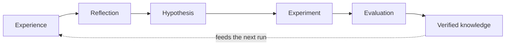

# AI-Researcher

**Experience-driven AI for AI research.**

AI-Researcher is an experimental framework for turning research runs into
reusable, verified knowledge. It combines scientific discovery agents with
modular skills, staged execution, evaluation guardrails, runtime supervision,
and memory primitives.

> Based on [HKUDS/AI-Researcher](https://github.com/HKUDS/AI-Researcher), the
> original framework by Jiabin Tang, Lianghao Xia, Zhonghang Li, and Chao Huang
> at HKU Data Science Lab. See [Citation](#citation).

## Why AI for AI?

Today's AI systems are remarkably good at solving tasks with existing
knowledge. They are much less capable of improving their future decisions
through the experience of solving those tasks.

This project explores a different definition of self-improving AI. The goal is
not merely to update model parameters or expand the context window. It is to
build a system that can repeatedly:



A model architecture search, inference optimization, or systems experiment may
look different on the surface, but the underlying loop is the same: learn from
evidence, identify patterns, form a hypothesis, test it, evaluate the result,
and retain what survives verification.

## Core Thesis

### Information density matters more than context length

Only a small fraction of the information available to an agent is relevant to
the decision in front of it. Indefinitely expanding the context window often
adds noise and computation rather than insight.

AI-Researcher therefore treats retrieval and tool discovery as information
selection problems:

- retrieve the most information-dense evidence for the current problem;
- discover relationships between apparently unrelated knowledge;
- expose only the skills and tools needed for the current stage;
- retain provenance so conclusions can be traced back to evidence.

### Memory is for generalization, not exhaustive storage

The purpose of memory is not to remember everything. It is to enable
association, abstraction, and ultimately generalization.

Raw messages and artifacts are useful as experience, but they should not all
become durable knowledge. The intended progression is:

```text
run events -> episodes -> reflection -> consolidated facts -> reusable knowledge
```

### Verification is the boundary between output and knowledge

An agent response is not automatically knowledge. Plans, implementations, and
experimental claims must pass explicit criteria before they can influence
future runs. This is why the runtime uses required artifacts, stage guardrails,
judge feedback, and goal-driven evaluation.

## What Exists Today

This fork extends the upstream research workflow with:

- **Staged research runtime** — `prepare → survey → plan → implement → judge →
  submit → analyze`, with artifact validation at every boundary.
- **Goal-driven evaluation** — evidence coverage, plan executability, traces,
  failure reasons, and suggested next actions.
- **Long-run supervision** — heartbeats, stall detection, restart support,
  structured failure reports, and lifecycle hooks.
- **Skill architecture** — discoverable `SKILL.md` bundles, lazy loading, JSON
  Schema tool descriptions, semantic search, lifecycle events, and A2A Agent
  Card export.
- **Memory primitives** — typed session state, agent namespaces, episode
  storage, append-only event logs, RAG-backed memory, and fact consolidation.
- **Isolated experimentation** — Docker and browser environments for code,
  dataset, training, and evaluation workflows.
- **Verified experience loop** — immutable attempts and Verification Records,
  deterministic Knowledge promotion, bounded cited recall, and recoverable
  cross-run feedback.
- **Paired scientific evaluation** — three executable Scientist-Bench task
  contracts, provider-request pairing, counterbalanced trials, and
  evaluator-owned scores with complete provenance.

The conceptual loop maps to the current implementation as follows:

| Loop stage | Current implementation | Maturity |
| --- | --- | --- |
| Experience | Run traces, stage artifacts, event logs, agent episodes | Implemented |
| Reflection | Judge feedback, analysis stage, memory consolidation | Partial |
| Hypothesis | Idea, survey, and planning agents | Implemented |
| Experiment | Docker-backed implementation and training workflow | Implemented, environment-dependent |
| Evaluation | Stage guardrails, goal-driven metrics, judge reports | Implemented |
| Knowledge | Verification-gated positive/negative records plus legacy memory stores | Implemented in the experimental loop; legacy stores remain partial |
| Feedback | Bounded cited recall in later iterations and runs | Implemented in explicit `recall` and `closed-loop` modes |

## Project Status

AI-Researcher is an **alpha research prototype**, not a production-ready
autonomous scientist.

The framework can orchestrate and supervise a complete research workflow, but
it does not guarantee that every generated implementation is scientifically
correct or that every experiment completes successfully. The verified loop is
explicit and bounded rather than universally enabled across every legacy
memory path. The current focus is expanding executable task coverage and
separating memory gain from later candidate-search gain.

## Project Structure

```text
research_agent/
  runtime/                  # Stage criteria, supervision, heartbeats, hooks
  inno/
    core.py                 # MetaChain agent loop
    evals/                  # Goal-driven metrics, traces, benchmark runner
    skills/                 # Skill discovery, search, events, Agent Cards
    memory/                 # Session, episodic, semantic, code and paper memory
    agents/                 # Research agent implementations
    tools/                  # Research, code, browser and terminal tools
    environment/            # Docker and browser execution environments
    workflow/               # Cached workflow graph
paper_agent/                # Paper composition pipeline
benchmark/                  # Research benchmark instances and datasets
benchmark_collection/       # Benchmark collection utilities
tests/                      # Unit and integration test suite
```

## Quick Start

### Requirements

- Python 3.11 or newer
- Docker for isolated code execution
- Playwright browser dependencies for browser-backed tools
- An API key for the selected model provider

### Installation

```bash
git clone https://github.com/LIHUA919/AI-Researcher.git
cd AI-Researcher

python -m venv .venv
source .venv/bin/activate

pip install -e .
playwright install
```

For a reproducible development environment, use the committed lockfile:

```bash
uv sync --locked --extra full --extra dev
uv run --locked --extra full --extra dev pytest -q
```

The default installation contains the core runtime. Install feature profiles
only when needed: `research`, `browser`, `documents`, `media`, `ui`, or `full`.

### Configuration

The project uses LiteLLM-compatible model names. For example:

```bash
export OPENAI_API_KEY=your_key
export COMPLETION_MODEL=openai/gpt-4o
export CHEEP_MODEL=openai/gpt-4o-mini
export GITHUB_AI_TOKEN=your_github_token
```

`ANTHROPIC_API_KEY` and an Anthropic model name can be used instead. The
`CHEEP_MODEL` spelling is retained for compatibility with the existing runtime.

### Level 1: Generate Research Ideas

```bash
docker pull tjbtech1/metachain:amd64_latest

cd research_agent
export BASE_IMAGES=tjbtech1/metachain:amd64_latest
export DOCKER_WORKPLACE_NAME=workplace_paper

python run_infer_idea.py \
  --instance_path ../benchmark/final/vq/one_layer_vq.json \
  --container_name paper_eval \
  --model "$COMPLETION_MODEL" \
  --workplace_name workplace \
  --cache_path cache \
  --port 12372 \
  --max_iter_times 0 \
  --category vq
```

### Level 2: Plan and Execute an Idea

```bash
python run_infer_plan.py \
  --instance_path ../benchmark/final/vq/one_layer_vq.json \
  --container_name test_eval \
  --task_level task1 \
  --model "$COMPLETION_MODEL" \
  --workplace_name workplace \
  --cache_path cache \
  --port 12380 \
  --max_iter_times 0 \
  --category vq
```

### CLI Smoke Test

```bash
ai-researcher agent \
  --model openai/gpt-4o \
  --agent_func get_dummy_agent \
  --query "Hello"
```

## Skills

Skills are modular tool bundles discovered from `SKILL.md` manifests:

```python
from research_agent.inno.skills import skill_registry

skill_registry.loader.scan()
print(skill_registry.list_available())

skill_registry.load_and_register("arxiv_search")
results = skill_registry.search_tools("find academic papers")

card = skill_registry.to_agent_card(name="AI-Researcher")
print(card.to_json())
```

The included pilot skills cover paper search, code search, file operations,
experiment planning, and memory tools.

## Memory

Memory can be added to MetaChain without changing its core loop:

```python
from research_agent.inno.core import MetaChain
from research_agent.inno.memory.store import MemoryStore
from research_agent.inno.memory.meta_chain_wrapper import MemoryAwareMetaChain

store = MemoryStore(project_path="/workspace")
chain = MemoryAwareMetaChain(MetaChain(), store)

store.session.set("topic", "GNN", agent_name="IdeaAgent")
store.add_episode(
    agent_name="IdeaAgent",
    messages=[{"role": "user", "content": "Explore robust GNN training"}],
    summary="Investigated robustness failures in message-passing GNNs.",
)
```

Memory is intentionally opt-in while retrieval quality, consolidation, and
cross-run feedback are being hardened.

## Validation

```bash
ruff check \
  research_agent paper_agent benchmark_collection tests \
  main_ai_researcher.py web_ai_researcher.py global_state.py

pytest -q
```

Current local baseline:

- 318 tests passing, plus 24 real-Docker evaluator and privacy-boundary checks
- 46 dynamically registered tools
- 5 dynamically registered agents

Some dependency deprecation warnings remain and are tracked separately from
functional test failures.

## Verified Experience Loop (Experimental)

Both research entrypoints support four explicit modes:

- `off` — preserve the legacy one-run behavior;
- `record` — independently verify and persist the attempt;
- `recall` — retrieve scoped verified knowledge without recording;
- `closed-loop` — recall, run, verify, promote eligible knowledge, and iterate
  within the configured budget.

Recording modes require a task-specific evaluator contract:

```bash
python research_agent/run_infer_plan.py \
  --instance_path benchmark/gnn.json \
  --experience-mode closed-loop \
  --experience-store .ai_researcher/experience.sqlite3 \
  --evaluation-contract path/to/task/contract.yaml \
  --evaluation-runner container \
  --max-loop-iterations 3 \
  --cache-policy reuse
```

Container evaluation is the default. Evaluator images are never pulled during
the timed verification transaction: pin the image digest in the contract and
prepare it before the run, for example:

```bash
docker pull \
  python:3.11-alpine@sha256:25976e9d34a0fab1f278cae931f34c8303d97bf0c0d7f85b6b4dcf641d7702a4
```

Use `--evaluation-runner command` only for trusted local evaluator development.
Container evaluation disables networking, places evaluator code in a read-only
Docker named volume, mounts private inputs read-only, drops Linux capabilities,
executes candidate code under an unprivileged UID, and copies only the
verification result back into the attempt directory.

The checked-in deterministic contract under
`benchmark/evaluators/deterministic_score/` is a local integration fixture, not
evidence of improvement on Scientist-Bench.

### Paired behavioral validation

The repository includes two non-scientific paired benchmarks. Both compare
`record` (memory-off) and `closed-loop` with identical seeds, model, evaluator,
and two-attempt budget:

```bash
# Deterministic causal check: 5 paired seeds.
python -m benchmark.run_local_experience_benchmark \
  --output-root .ai_researcher/benchmarks/local-experience-gain

# Optional real-model smoke check against any OpenAI-compatible endpoint.
python -m benchmark.run_model_experience_smoke \
  --model YOUR_MODEL \
  --base-url https://your-provider.example/v1 \
  --api-key-env YOUR_PROVIDER_API_KEY \
  --output-root .ai_researcher/benchmarks/model-experience-smoke
```

Observed on 2026-07-25:

| Check | Pairs | Memory-off mean | Closed-loop mean | Experience Gain | Valid rate |
| --- | ---: | ---: | ---: | ---: | ---: |
| Deterministic policy | 5 | 0.0106 | 1.0000 | +0.9894 | 100% / 100% |
| GLM-4.7-Flash model smoke | 3 | 0.5238 | 1.0000 | +0.4762 | 100% / 100% |

The model smoke also reduced repeated-failure rate from 0.3333 to 0 under this
small controlled task. Reports retain each paired trial, token/wall-time cost,
failure signature, and artifact references. These checks demonstrate that
verified recall changes later behavior; they do **not** establish scientific
improvement or generalization.

### Scientist-Bench Phase 3 evidence

The verified benchmark Module now exposes task Adapters for Immiscible
Diffusion, Finite Scalar Quantization (FSQ), and Exphormer task1. Candidate
models generate code only; an isolated evaluator owns validity and score.
Paired modes reuse the byte-identical first provider response, counterbalance
execution order, share a two-attempt budget, and retain every attempt even when
an earlier valid result is selected.

The checked-in V5 run used three seeds with
`Qwen3-Coder-30B-A3B-Instruct`:

| Task | Memory-off mean | Closed-loop mean | Experience Gain |
| --- | ---: | ---: | ---: |
| Immiscible Diffusion task1 | 0.9000 | 0.7667 | -0.1333 |
| FSQ task1 | 0.3424 | 0.5030 | +0.1606 |
| Exphormer task1 | 0.5833 | 0.6500 | +0.0667 |

Mean repeated-failure rate fell from 0.2222 to 0.1111, while the selected
result valid rate remained 100% in both modes. This meets the aggregate Phase 3
criteria on the bounded subset, but the Immiscible regression is retained as a
counterexample. The evidence supports CPU functional conformance only—not
paper-scale training, FID, model quality, accuracy, throughput, scalability,
or state-of-the-art claims.

See the
[sanitized V5 evidence bundle](benchmark/results/scientist_bench_phase3_v5/README.md)
and the
[causal pairing decision](docs/adr/0003-causally-paired-scientist-bench.md).

## Remaining Validation Roadmap

1. Expand each contract from CPU functional task1 behavior to paper-level
   training and quality metrics where reproducible infrastructure permits.
2. Add scheduled Docker/GPU benchmark execution outside normal pull-request CI.
3. Add a ResearchClawBench Adapter now that the internal subset is stable.
4. Add Phase 4 candidate search and validate search gain separately from
   memory gain.
5. Increase models, tasks, and repetitions before making generalization claims.

The implementation contracts, module seams, rollout phases, and acceptance
criteria are defined in the
[Experience-Driven Research Loop Design](docs/design/experience-driven-research-loop.md).

The target is not the AI with the longest context window. It is the AI that
learns the most from experience.

## Benchmark

Benchmark data from the upstream project is included under `benchmark/`,
covering VQ, GNN, diffusion/flow, recommendation, and reasoning tasks.

## Citation

If you use this project, please cite the original AI-Researcher paper:

```tex
@misc{airesearcher,
      title={{AI-Researcher: Autonomous Scientific Innovation}},
      author={Jiabin Tang and Lianghao Xia and Zhonghang Li and Chao Huang},
      year={2025},
      eprint={2505.18705},
      archivePrefix={arXiv},
      primaryClass={cs.AI},
      url={https://arxiv.org/abs/2505.18705},
}
```

## License

Apache-2.0. See [LICENSE](./LICENSE). Original copyright HKUDS.
