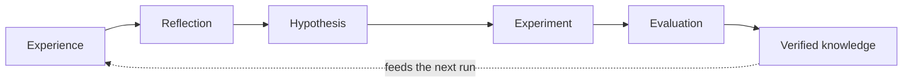

# AI-Researcher

**Experience-driven AI for AI research.**

AI-Researcher is an experimental framework for turning research runs into
reusable, verified knowledge. It combines scientific discovery agents with
modular skills, staged execution, evaluation guardrails, runtime supervision,
and memory primitives.

> Based on [HKUDS/AI-Researcher](https://github.com/HKUDS/AI-Researcher), the
> original framework by Jiabin Tang, Lianghao Xia, Zhonghang Li, and Chao Huang
> at HKU Data Science Lab. See [Citation](#citation).

## Why AI for AI?

Today's AI systems are remarkably good at solving tasks with existing
knowledge. They are much less capable of improving their future decisions
through the experience of solving those tasks.

This project explores a different definition of self-improving AI. The goal is
not merely to update model parameters or expand the context window. It is to
build a system that can repeatedly:



A model architecture search, inference optimization, or systems experiment may
look different on the surface, but the underlying loop is the same: learn from
evidence, identify patterns, form a hypothesis, test it, evaluate the result,
and retain what survives verification.

## Core Thesis

### Information density matters more than context length

Only a small fraction of the information available to an agent is relevant to
the decision in front of it. Indefinitely expanding the context window often
adds noise and computation rather than insight.

AI-Researcher therefore treats retrieval and tool discovery as information
selection problems:

- retrieve the most information-dense evidence for the current problem;
- discover relationships between apparently unrelated knowledge;
- expose only the skills and tools needed for the current stage;
- retain provenance so conclusions can be traced back to evidence.

### Memory is for generalization, not exhaustive storage

The purpose of memory is not to remember everything. It is to enable
association, abstraction, and ultimately generalization.

Raw messages and artifacts may supply evidence, but they should not all become
durable knowledge. The intended governed progression is:

```text
immutable evidence -> comparative verification -> untrusted candidate
-> governed semantic/procedural record -> bounded decision-point recall
-> recorded use -> independently verified outcome
```

### Verification is the boundary between output and knowledge

An agent response is not automatically knowledge. Plans, implementations, and
experimental claims must pass explicit criteria before they can influence
future runs. This is why the runtime uses required artifacts, stage guardrails,
judge feedback, and goal-driven evaluation.

## What Exists Today

This fork extends the upstream research workflow with:

- **Staged research runtime** — `prepare → survey → plan → implement → judge →
  submit → analyze`, with artifact validation at every boundary.
- **Goal-driven evaluation** — evidence coverage, plan executability, traces,
  failure reasons, and suggested next actions.
- **Long-run supervision** — heartbeats, stall detection, restart support,
  structured failure reports, and lifecycle hooks.
- **Skill architecture** — discoverable `SKILL.md` bundles, lazy loading, JSON
  Schema tool descriptions, semantic search, lifecycle events, and A2A Agent
  Card export.
- **Legacy memory primitives** — typed session state, agent namespaces, episode
  storage, event logs, and source RAG. These are working/session/reference
  mechanics; their summaries and consolidated facts are not trusted Research
  Knowledge.
- **Isolated experimentation** — Docker and browser environments for code,
  dataset, training, and evaluation workflows.

The conceptual loop maps to the current implementation as follows:

| Loop stage | Current implementation | Maturity |
| --- | --- | --- |
| Experience | Run traces, stage artifacts, event logs, agent episodes | Implemented |
| Reflection | Judge feedback, analysis stage, legacy consolidation | Partial; candidate input only |
| Hypothesis | Idea, survey, and planning agents | Implemented |
| Experiment | Docker-backed implementation and training workflow | Implemented, environment-dependent |
| Evaluation | Stage guardrails, goal-driven metrics, judge reports | Implemented |
| Knowledge | Verified Experience ledger and proposed governed Knowledge/Procedure records | Ledger implemented; governed memory proposed |
| Feedback | Reuse of retrieved memory in later decisions | Opt-in; not yet a fully automatic cross-run loop |

## Project Status

AI-Researcher is an **alpha research prototype**, not a production-ready
autonomous scientist.

The framework can orchestrate and supervise a complete research workflow, but
it does not yet guarantee that every generated implementation is scientifically
correct or that every experiment completes successfully. Durable knowledge
feedback across runs is also still partial. The current focus is making each
transition observable, resumable, and verifiable before closing the
self-improvement loop.

In particular, the current supervisor/restart primitives do **not** yet provide
the proposed durable semantic continuation contract (RPO=0 committed state,
fenced takeover, effect reconciliation, and stage-level resume). Phase A does
provide governed executable Interventions and Trial Provenance, but no accepted
experiment has yet demonstrated an AI-for-AI capability gain.

## Project Structure

```text
research_agent/
  runtime/                  # Stage criteria, supervision, heartbeats, hooks
  inno/
    core.py                 # MetaChain agent loop
    evals/                  # Goal-driven metrics, traces, benchmark runner
    skills/                 # Skill discovery, search, events, Agent Cards
    memory/                 # Session, episodic, semantic, code and paper memory
    agents/                 # Research agent implementations
    tools/                  # Research, code, browser and terminal tools
    environment/            # Docker and browser execution environments
    workflow/               # Cached workflow graph
paper_agent/                # Paper composition pipeline
benchmark/                  # Research benchmark instances and datasets
benchmark_collection/       # Benchmark collection utilities
tests/                      # Unit and integration test suite
```

## Quick Start

### Requirements

- Python 3.11 or newer
- Docker for isolated code execution
- Playwright browser dependencies for browser-backed tools
- An API key for the selected model provider

### Installation

```bash
git clone https://github.com/LIHUA919/AI-Researcher.git
cd AI-Researcher

python -m venv .venv
source .venv/bin/activate

pip install -e .
playwright install
```

### Configuration

The project uses LiteLLM-compatible model names. For example:

```bash
export OPENAI_API_KEY=your_key
export COMPLETION_MODEL=openai/gpt-4o
export CHEEP_MODEL=openai/gpt-4o-mini
export GITHUB_AI_TOKEN=your_github_token
```

`ANTHROPIC_API_KEY` and an Anthropic model name can be used instead. The
`CHEEP_MODEL` spelling is retained for compatibility with the existing runtime.

### Level 1: Generate Research Ideas

```bash
docker pull tjbtech1/metachain:amd64_latest

cd research_agent
export BASE_IMAGES=tjbtech1/metachain:amd64_latest
export DOCKER_WORKPLACE_NAME=workplace_paper

python run_infer_idea.py \
  --instance_path ../benchmark/final/vq/one_layer_vq.json \
  --container_name paper_eval \
  --model "$COMPLETION_MODEL" \
  --workplace_name workplace \
  --cache_path cache \
  --port 12372 \
  --max_iter_times 0 \
  --category vq
```

### Level 2: Plan and Execute an Idea

```bash
python run_infer_plan.py \
  --instance_path ../benchmark/final/vq/one_layer_vq.json \
  --container_name test_eval \
  --task_level task1 \
  --model "$COMPLETION_MODEL" \
  --workplace_name workplace \
  --cache_path cache \
  --port 12380 \
  --max_iter_times 0 \
  --category vq
```

### CLI Smoke Test

```bash
ai-researcher agent \
  --model openai/gpt-4o \
  --agent_func get_dummy_agent \
  --query "Hello"
```

## Skills

Skills are modular tool bundles discovered from `SKILL.md` manifests:

Today, production Agents still send stage-static callable lists;
`search_tools()` below is not yet used to construct the next production model
request. The governed per-turn migration is specified in the
[Context-Aware Tool Use Design](docs/design/context-aware-tool-use.md).

```python
from research_agent.inno.skills import skill_registry

skill_registry.loader.scan()
print(skill_registry.list_available())

skill_registry.load_and_register("arxiv_search")
results = skill_registry.search_tools("find academic papers")

card = skill_registry.to_agent_card(name="AI-Researcher")
print(card.to_json())
```

The included pilot skills cover paper search, code search, file operations,
experiment planning, and memory tools.

## Memory

The following compatibility example adds process-level/session memory to
MetaChain without changing its core loop:

```python
from research_agent.inno.core import MetaChain
from research_agent.inno.memory.store import MemoryStore
from research_agent.inno.memory.meta_chain_wrapper import MemoryAwareMetaChain

store = MemoryStore(project_path="/workspace")
chain = MemoryAwareMetaChain(MetaChain(), store)

store.session.set("topic", "GNN", agent_name="IdeaAgent")
store.add_episode(
    agent_name="IdeaAgent",
    messages=[{"role": "user", "content": "Explore robust GNN training"}],
    summary="Investigated robustness failures in message-passing GNNs.",
)
```

This legacy Interface is intentionally opt-in. Episodes and consolidated facts
from it cannot enter the trusted Knowledge Snapshot or confirmatory Recall
Context. The target system uses comparative distillation, typed Decision Points,
bounded Evidence Cards, Recall Decision Outcomes, and independently verified outcome
gates.

## Validation

```bash
ruff check \
  research_agent paper_agent benchmark_collection tests \
  main_ai_researcher.py web_ai_researcher.py global_state.py

pytest -q
```

Current local baseline:

- 490 tests passing
- 45 dynamically registered tools
- 5 dynamically registered agents

Some dependency deprecation warnings remain and are tracked separately from
functional test failures.

## Verified Experience Loop (Experimental; legacy recall compatibility)

Both research entrypoints support four explicit modes:

- `off` — execute one legacy Research Run without Experience Loop recall/recording;
- `record` — independently verify and persist the Experiment Attempt;
- `recall` — retrieve scoped legacy schema-v1 lesson records without recording;
- `closed-loop` — use that legacy recall path, run, independently verify, apply
  the legacy KnowledgeGate, and iterate within the configured budget.

These modes do **not** yet implement canonical Verified Research Memory.
Schema-v1 lessons/`RecallContext` map to the implementation plan's
`legacy_recall` compatibility profile; they are not governed Knowledge Records,
Evidence Cards, or canonical Decision-Intent Recall Contexts.

Recording modes require a task-specific evaluator contract:

```bash
python research_agent/run_infer_plan.py \
  --instance_path benchmark/gnn.json \
  --experience-mode closed-loop \
  --experience-store .ai_researcher/experience.sqlite3 \
  --evaluation-contract path/to/task/contract.yaml \
  --max-loop-iterations 3 \
  --cache-policy reuse
```

The checked-in deterministic contract under
`benchmark/evaluators/deterministic_score/` is a local integration fixture, not
evidence of improvement on Scientist-Bench.

The task-aligned `one_layer_vq` evidence contract under
`benchmark/evaluators/one_layer_vq_smoke/` independently recomputes codebook
utilization, perplexity, reconstruction MSE, and PSNR from raw arrays, and
verifies the canonical CIFAR-10 test-image prefix by pixel digest. The local
real-data runner is under `benchmark/real_smoke/one_layer_vq/`. It is an
execution/evidence smoke contract with a zero baseline, not a scientific
improvement threshold. The checked three-seed method-smoke report found no mean
utilization improvement for the SimVQ-style variant. See
[`docs/implementation/one-layer-vq-real-test.md`](docs/implementation/one-layer-vq-real-test.md) for
the mechanics calibration and retired V2 paired protocol; current confirmatory
gates live in the memory effectiveness evaluation protocol above.

In `closed-loop` mode, each Experiment Attempt receives an isolated stage and
agent cache under `<cache>/attempts/iteration-NNN`. The legacy schema-v1
`RecallContext` is rendered as cited compatibility guidance for the next
Experiment Attempt, so a later
Experiment Attempt cannot silently reuse the previous Experiment Attempt's
completed implementation and submission stages. Evaluator inputs are copied
into immutable per-attempt evidence snapshots before verification, preventing a
later Experiment Attempt from overwriting an earlier Observation's artifacts.

## Remaining Validation Roadmap

1. Calibrate versioned task-specific Evaluation Contracts on independent real
   runs for a representative Scientist-Bench subset.
2. Run paired no-recall and closed-loop Research Run arms on more than one real task.
3. Add scheduled Docker/GPU benchmark execution outside normal pull-request CI.
4. Add a ResearchClawBench Adapter after the internal subset is stable.
5. Validate memory gain separately from the implemented governed Intervention
   proposal/execution mechanism; neither gain is yet established by accepted
   scientific evidence.

The implementation contracts, module seams, rollout phases, and acceptance
criteria are defined in the
[Experience-Driven Research Loop Design](docs/design/experience-driven-research-loop.md).
Canonical domain terms are defined in the [domain glossary](CONTEXT.md).
The governed memory data plane is defined in the
[Verified Research Memory Design](docs/design/verified-research-memory.md), its
[implementation plan](docs/implementation/verified-research-memory-plan.md), and
[effectiveness evaluation protocol](docs/implementation/memory-effectiveness-evaluation.md).
The proposed durable execution and continuation architecture is defined in the
[Durable Research Runtime Design](docs/design/durable-research-runtime.md) and its
[implementation/acceptance plan](docs/implementation/durable-research-runtime-plan.md).
Per-turn capability selection, governed tool Effects, migration, and acceptance
are defined in the
[Context-Aware Tool Use Design](docs/design/context-aware-tool-use.md) and its
[implementation plan](docs/implementation/context-aware-tool-use-plan.md).
The complete design and implementation document index is maintained in
[`docs/README.md`](docs/README.md).

The target is not the AI with the longest context window. It is the AI that
learns the most from experience.

## Benchmark

Benchmark data from the upstream project is included under `benchmark/`,
covering VQ, GNN, diffusion/flow, recommendation, and reasoning tasks.

## Citation

If you use this project, please cite the original AI-Researcher paper:

```tex
@misc{airesearcher,
      title={{AI-Researcher: Autonomous Scientific Innovation}},
      author={Jiabin Tang and Lianghao Xia and Zhonghang Li and Chao Huang},
      year={2025},
      eprint={2505.18705},
      archivePrefix={arXiv},
      primaryClass={cs.AI},
      url={https://arxiv.org/abs/2505.18705},
}
```

## License

Apache-2.0. See [LICENSE](./LICENSE). Original copyright HKUDS.
