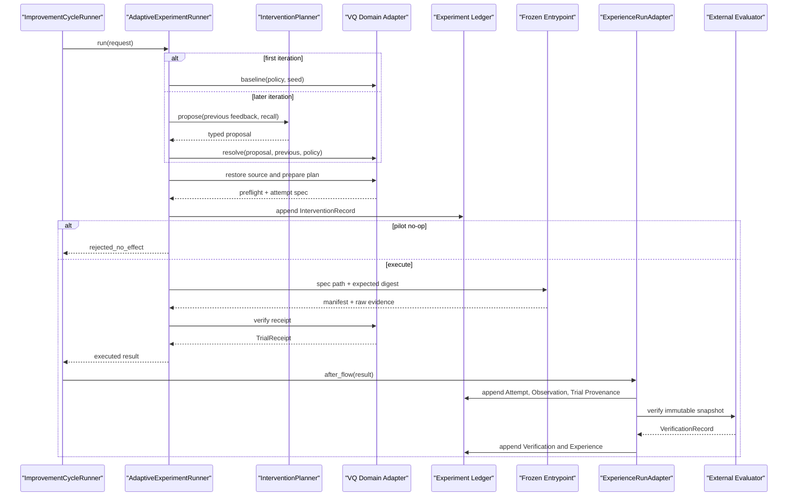

# Experience Gain V3 Phase A 代码级实施规格

> 状态：Ready for implementation
> 范围：仅 Phase A——打通可执行 Intervention、Manipulation Check 与 Trial Provenance
> 预计工作量：2–3 engineer-days
> 依据：[下一轮改进计划](NEXT_ROUND_EXPERIENCE_GAIN_PLAN.md)、[领域语言](../CONTEXT.md)、[经验驱动研究循环设计](../docs/design/experience-driven-research-loop.md)

## 1. 实施结论

本 Phase 的目标不是再次运行 A/B，也不是证明 Experience Gain，而是让下一轮实验第一次满足以下因果链：

```text
Recall Context
  -> schema-valid Intervention proposal
  -> system-resolved executable config
  -> pre-run Manipulation Check
  -> frozen runner consumes the same config
  -> manifest attests the same digests
  -> independent evaluator recomputes and verifies them
  -> immutable sidecar provenance binds Attempt and Observation
```

实现采用以下架构决定：

1. 对调用方只暴露一个有 Depth 的 `AdaptiveExperimentRunner.run()` Interface。
2. `prepare -> execute -> finalize` 生命周期保留为 Module 内部 Implementation，不让 `run_infer_plan.py` 手工编排。
3. 只建立两个真实 Seam：
   - `InterventionPlanner`：模型规划与固定规划确实会变化；
   - `ExperimentDomainAdapter`：VQ 与廉价 synthetic response surface 确实有不同的 config、source、dataset 和 evidence 语义。
4. 首轮始终由系统生成 baseline，不调用 LLM；第二轮起 planner 同时看到上一轮经验证的即时反馈。Treatment 额外看到 Recall Context，Control 不看到 semantic memory。
5. Phase A 仅允许每次改变一个旋钮：
   - `projection_lr_multiplier`
   - `commitment_weight`
6. 旧 `ExperimentAttempt`、`Observation`、`ExperienceRecord` 的持久 JSON 一字不改。新 Intervention 与 Trial Provenance 使用 sidecar model 和新表。
7. V2 contract、launcher、manifest schema 1 保留为历史重现路径；V3 使用独立 contract、evaluator、launcher 和 manifest schema 2。
8. V3 launcher 强制 `--cache-policy disabled`。digest-aware 跨 Attempt cache 不在 Phase A 内。

完成后可以声称的是：

> 系统已经能证明一条 recalled rule 是否导致了合法、非 no-op、被实际 runner 和 evaluator 共同观察到的配置变化。

完成后仍不能声称：

> semantic memory 已经带来统计显著的研究收益。

后者仍需 Phase B 的响应面校准、Phase C 的知识治理以及 Phase D/E 的 Pilot 和确认性实验。

## 2. 当前代码事实与必须修复的问题

### 2.1 当前调用链

当前 VQ Attempt 的关键路径如下：

1. [`setup_project_scaffold`](../research_agent/inno/environment/utils.py) 校验/解压 CIFAR-10，只在目标文件不存在时复制 `train.py -> protocol.py` 和固定入口，并写 `.experiment_seed`。
2. [`ImprovementCycleRunner.run`](../research_agent/runtime/improvement_cycle.py) 每轮只传 `RecallContext`，不保留上一轮执行 config 或 verified feedback。
3. [`InnoFlow.forward`](../research_agent/run_infer_plan.py) 把 recall 渲染成 prose，并完整重跑 prepare、survey、plan、implement、judge。
4. `FROZEN_VQ_TEMPLATES` 在 submit 前恢复 `protocol.py` 与 `run_training_testing.py`。
5. `run_frozen_vq_protocol` 无 config 输入，直接执行固定入口。
6. [`run_training_testing.py`](process/dataset_candidate/vq/run_training_testing.py) 只从 `.experiment_seed` 读取 seed，其余训练参数写死。
7. [`train.py`](real_smoke/one_layer_vq/train.py) 使用单一 `Adam(model.parameters(), lr=...)`；manifest schema 1 只摘要当前 `protocol.py`，并用无 framing 的数组拼接生成 evidence digest。
8. [`ExperienceRunAdapter._record_result`](../research_agent/runtime/experience_adapter.py) 在执行后扫描整个 project tree 作为 `code_revision`，再构造 Attempt 和 Observation。
9. [`CommandVerifier`](../research_agent/inno/experience/evaluation.py) 运行 evaluator，但 evaluator 只检查固定预算与 raw arrays，不检查 proposal、config、source 和 manifest 的 provenance chain。

### 2.2 当前 provenance 的具体错误

| 当前字段或行为 | 实际含义 | 问题 | V3 权威替代 |
|---|---|---|---|
| `ExperimentAttempt.code_revision` | post-run project tree digest | 会混入 data、cache、pyc、log 和输出 | `TrialProvenanceRecord.source_digest` |
| `dataset_digest=_digest("vq")` | 类别字符串 digest | 不是 CIFAR-10 或样本选择身份 | `TrialProvenanceRecord.dataset_digest` |
| `model_config_digest=_digest(model)` | 研究 LLM 名称 digest | 不是训练 config | 保留原语义；训练 config 用 `config_digest` |
| `environment_fingerprint` | Python/platform 可读字符串 | 不完整、未 canonicalize | `environment_digest` |
| manifest `source_sha256` | 单个 `protocol.py` | 未覆盖入口和 helper | `source_digest` |
| manifest `evidence_digest` | 三个数组 bytes 直接拼接 | 无 name/dtype/shape framing | `evidence_payload_digest` |
| contract `task_id` | `one_layer_vq:task1` | ledger 当前写 `one_layer_vq` | V3 一律使用 contract task ID |
| Attempt `dataset_id` | 当前传 `vq` | domain 被当成 dataset | V3 写 `cifar10` |

### 2.3 不可变 Ledger 的兼容约束

[`ImmutableModel`](../research_agent/inno/experience/models.py) 使用 `extra="forbid"`、`frozen=True`，SQLite 的 `_append()` 又比较 canonical JSON 的精确字节。

因此禁止给旧持久模型增加带默认值的 provenance 字段。否则会发生：

1. 旧 JSON 被新 model load；
2. Pydantic 自动补默认字段；
3. 同一 record ID 被再次 append；
4. 新 canonical JSON 与数据库原字节不同；
5. 抛出 `ImmutableRecordError`。

本规格的硬约束是：

- 不修改 `ExperimentAttempt` 字段；
- 不修改 `Observation` 字段；
- 不修改嵌入上述对象的 `ExperienceRecord` 字段；
- 不重新序列化或 backfill 任何旧 `payload_json`；
- provenance 只能通过 sidecar 查询；
- 旧记录显示 `legacy_unavailable`，不能根据现有 project tree 猜测历史执行条件。

## 3. Phase A 范围

### 3.1 必须交付

- schema 化的 Intervention Proposal；
- contract-owned Intervention Catalog；
- 系统解析出的完整 effective config；
- 首轮 baseline 与后续单旋钮 change；
- pre-run no-op / duplicate Manipulation Check；
- source/config/dataset/environment/contract/evaluator 分离摘要；
- 每个 Attempt 独立 raw evidence 目录；
- runner 消费的 `attempt_spec.json`；
- manifest schema 2 的 provenance 回执；
- evaluator 对 config 和 digest 的独立重算；
- Intervention 与 Trial Provenance sidecar persistence；
- SQLite schema migration 0 → 2；
- verified feedback 回传下一轮；
- V3 dry-run；
- unit、integration、migration、tamper tests。

### 3.2 明确不做

- 不实现 comparative knowledge distillation；
- 不重写 retrieval、dedupe、supersede 或 forgetting；
- 不开放 basis initialization、basis trainability、latent normalization；
- 不开放 codebook size、epoch、sample count、seed、dataset 或 evaluator；
- 不实现跨 Attempt cache reuse；
- 不做 Phase B 的 2/5/10/20 epoch sensitivity sweep；
- 不运行 VQ Pilot 或确认性 A/B；
- 不把 Phase A allowlist 当作最终科学预注册值；
- 不回填旧 V2 provenance；
- 不把结构 evaluator 误当成 per-Attempt VQ external verifier。

## 4. Interface 设计比较

本规格在落地前比较了三种明显不同的 Interface。

### 4.1 方案 A：VQ 专用双方法 Module

```python
prepared = vq_intervention.prepare(proposal, previous=previous)
attestation = vq_intervention.execute(prepared, seed=seed)
```

优点：

- 改动最少；
- VQ Locality 强；
- frozen fields 很难被任意 dict 绕过。

缺点：

- 调用方仍需正确处理 prepare/execute 顺序、no-op、失败和 metadata；
- Intervention planning 与 Trial Provenance 仍容易散到多个文件；
- 新实验域需要复制整套流程；
- 最小方案倾向直接开放已有 `learning_rate`，不能隔离 SimVQ projection 的特定变化。

结论：不选。它适合作为短期 patch，但不能给默认调用方提供足够 Depth。

### 4.2 方案 B：公开四阶段生命周期

```python
validated = module.validate(proposal, fixed_context)
prepared = module.prepare(validated, workspace)
receipt = module.execute(prepared)
completed = module.finalize(prepared, receipt)
```

优点：

- 最适合批量 sensitivity、远程 executor 和 crash recovery；
- 每个阶段容易独立测试；
- 多 domain 扩展最直接。

缺点：

- `run_infer_plan.py` 必须理解并遵守四阶段 ordering；
- 调用方可以漏掉 finalize，或在 prepare 与 execute 之间改变状态；
- 对当前唯一默认 caller 来说 Interface 过宽。

结论：不作为外部 Interface；保留为 Facade 内部状态机。

### 4.3 方案 C：单方法 Facade

```python
result = await adaptive_experiment.run(request)
```

Facade 隐藏：

- baseline/proposal 选择；
- allowlist resolution；
- frozen source restore；
- canonical digest；
- Intervention 持久化；
- no-op policy；
- spec 原子写入；
- subprocess；
- manifest receipt；
- evidence refs。

优点：

- 默认 caller 只需提供本轮上下文；
- preflight、execute、receipt ordering 不可被 caller 拆散；
- 删除该 Module 会使 allowlist、摘要、恢复、no-op、执行和 attestation 重新散落，满足 deletion test；
- Depth、Leverage 和 Locality 最佳。

缺点：

- Module 内部 Implementation 较大；
- sensitivity 工具若要只 prepare 不 execute，需要调用内部测试/批处理入口。

结论：选择方案 C。内部采用方案 B 的状态机；方案 A 的强类型 VQ config 保留在 `VQExperimentDomainAdapter` 内。

## 5. 公共 Interface

新增 `research_agent/runtime/adaptive_experiment.py`，`research_agent/runtime/__init__.py` 只导出本节的公共类型，不导出 restore/hash/subprocess helper。

生产 composition root 使用一个 factory，避免 caller 了解内部 Adapter：

```python
def build_adaptive_experiment_runner(
    *,
    project_dir: Path,
    contract_path: Path,
    ledger: ExperimentLedger,
    planner: InterventionPlanner,
    executor: ExecutionAdapter | None = None,
) -> AdaptiveExperimentRunner:
    ...
```

V3 `record/closed-loop` 模式必须提供 Ledger；factory 负责装配 VQ Domain Adapter、Local Execution Adapter 和 contract。Planner 显式注入，是因为 production planner 必须复用 `InnoFlow.client` 与 trace recorder。测试向 Facade 注入 Fixed Planner、Synthetic Domain Adapter、InMemory Execution Adapter 与 InMemory Ledger。

```python
from pathlib import Path
from typing import Literal, Protocol


class PreviousAttemptFeedback(ImmutableModel):
    attempt_id: str
    intervention_id: str
    config_digest: Sha256
    effective_config: dict[str, JsonScalar]
    verified_metrics: dict[str, float]
    outcome: Literal["positive", "neutral", "negative", "invalid"]
    guardrail_violations: list[str]


class AdaptiveExperimentRequest(ImmutableModel):
    run_id: str
    iteration_number: int
    hypothesis: Hypothesis
    seed: int
    attempt_cache_path: Path
    evidence_dir: Path
    recall_context: RecallContext | None
    previous: PreviousAttemptFeedback | None


class TrialPreflight(ImmutableModel):
    attempt_key: str
    proposal_digest: Sha256
    intervention_digest: Sha256
    config_digest: Sha256
    source_digest: Sha256
    dataset_digest: Sha256
    environment_digest: Sha256
    contract_digest: Sha256
    evaluator_digest: Sha256
    attempt_spec_digest: Sha256
    effective_config: dict[str, JsonScalar]
    manipulation_status: Literal["baseline", "changed", "no_effect"]


class TrialReceipt(ImmutableModel):
    attempt_spec_ref: ArtifactRef
    manifest_ref: ArtifactRef
    artifact_refs: list[ArtifactRef]
    actual_config: dict[str, JsonScalar]
    proposal_digest: Sha256
    intervention_digest: Sha256
    config_digest: Sha256
    source_digest: Sha256
    dataset_digest: Sha256
    environment_digest: Sha256
    contract_digest: Sha256
    evaluator_digest: Sha256
    evidence_payload_digest: Sha256
    started_at: datetime
    completed_at: datetime
    exit_code: Literal[0]


class AdaptiveExperimentResult(ImmutableModel):
    status: Literal[
        "executed",
        "executed_no_effect",
        "rejected_no_effect",
    ]
    intervention: InterventionRecord
    preflight: TrialPreflight
    receipt: TrialReceipt | None


class AdaptiveExperimentRunner:
    async def run(
        self,
        request: AdaptiveExperimentRequest,
    ) -> AdaptiveExperimentResult:
        ...
```

`AdaptiveExperimentRequest` 的不变量：

- `iteration_number >= 1`；
- `hypothesis.task_id == evaluation_contract.task_id`；
- `request.previous is None` 当且仅当首轮；
- `attempt_cache_path` 必须是本轮 `attempts/iteration-NNN` 目录；
- `evidence_dir` 必须严格等于本轮
  `attempt_cache_path/raw-evidence`；解析后不得越界或经过 symlink；
- `run_id + iteration_number` 唯一标识本轮决策位置；
- seed 来自 Experiment Attempt，不允许 planner 修改；
- Control 与 Treatment 的 `PreviousAttemptFeedback` 结构完全相同；
- Treatment 额外拥有非空 Recall Context，Control 只有空 Recall Context。

首轮行为：

- 系统构造 baseline proposal；
- 不调用 `InterventionPlanner`；
- `manipulation_status="baseline"`；
- 使用 contract defaults。

第二轮及以后：

- planner 同时看到 Hypothesis、catalog、上一轮 verified metrics、上一轮 effective config；
- planner 只提出 knob、target、citation、预期方向、guardrail 风险和 rationale；
- 系统派生 `from_value`、完整 config、ID 和全部 digest；
- planner 不得自报或覆盖这些派生字段。

## 6. 内部真实 Seam

### 6.1 Intervention Planner

新增 `research_agent/inno/agents/inno_agent/intervention_agent.py`：

```python
class InterventionPlanner(Protocol):
    async def propose(
        self,
        context: InterventionPlanningContext,
    ) -> InterventionProposal:
        ...


class StructuredLLMInterventionPlanner:
    ...


class FixedInterventionPlanner:
    ...
```

`StructuredLLMInterventionPlanner` 规则：

- 使用一个结构化 tool：`submit_intervention`；
- 不给文件写入或 shell 工具；
- 输入只含本轮 Hypothesis、Catalog、previous feedback 和 Recall Context；
- Control 与 Treatment 使用同一 model、temperature、prompt 和 token budget；
- 输出 schema validation 失败时只允许一次 repair；
- 第二次失败抛 `InterventionProposalError`，禁止静默回退 baseline；
- citation 必须来自本轮 Recall Context；Control 的 citation list 必须为空；
- 不允许 proposal 包含完整命令行、路径、seed 或 fixed config。

`FixedInterventionPlanner` 用于：

- unit tests；
- Phase B oracle/sensitivity；
- `--dry-run`；
- 不依赖 LLM 的 deterministic integration tests。

### 6.2 Experiment Domain Adapter

新增：

```text
research_agent/runtime/domain_adapters/__init__.py
research_agent/runtime/domain_adapters/vq.py
research_agent/runtime/domain_adapters/synthetic.py
```

私有 Interface：

```python
class ResolvedIntervention(ImmutableModel):
    proposal: InterventionProposal
    changes: list[KnobChange]
    effective_knobs: dict[str, JsonScalar]
    effective_config: dict[str, JsonScalar]
    manipulation_status: Literal["baseline", "changed", "no_effect"]


class DomainExecutionPlan(ImmutableModel):
    preflight: TrialPreflight
    spec_path: Path
    command: tuple[str, ...]
    cwd: Path
    environment: dict[str, str]
    required_artifacts: tuple[str, ...]


class ExperimentDomainAdapter(Protocol):
    domain_id: str
    schema_id: str

    def baseline(
        self,
        *,
        policy: AdaptiveExperimentPolicy,
        seed: int,
    ) -> ResolvedIntervention:
        ...

    def resolve(
        self,
        proposal: InterventionProposal,
        *,
        policy: AdaptiveExperimentPolicy,
        previous: PreviousAttemptFeedback,
        seed: int,
    ) -> ResolvedIntervention:
        ...

    def prepare(
        self,
        resolved: ResolvedIntervention,
        *,
        project_dir: Path,
        evidence_dir: Path,
    ) -> DomainExecutionPlan:
        ...

    def collect_receipt(
        self,
        plan: DomainExecutionPlan,
    ) -> TrialReceipt:
        ...
```

首批 Implementation：

- `VQExperimentDomainAdapter`
  - 解析 VQ allowlist；
  - 恢复三个 frozen source；
  - 构造 CIFAR-10 dataset descriptor；
  - 解析实际 device；
  - 生成 spec 与本地 subprocess plan；
  - 校验 VQ manifest schema 2。
- `SyntheticResponseSurfaceAdapter`
  - 不依赖 GPU、dataset download 或 LLM；
  - 在 unit/integration tests 中证明 Domain Seam 真实存在；
  - 为后续 Gate 0 保留，不在 Phase A 运行统计实验。

不要在 Phase A 建公开 plugin registry。Facade 构造时显式注入一个 Domain Adapter；等第二个生产 domain 出现后再考虑 registry。

### 6.3 Execution Adapter

Facade 内部使用很小的私有 Seam：

```python
class ExecutionAdapter(Protocol):
    def execute(self, plan: DomainExecutionPlan) -> ProcessReceipt:
        ...
```

Implementation：

- `LocalSubprocessExecutionAdapter`：生产使用；
- `InMemoryExecutionAdapter`：Interface 和错误注入测试使用。

subprocess、canonical file write、source restore 不是公共 Interface。

## 7. 持久模型

新增 `research_agent/inno/experience/intervention.py`。不要把以下类型放进旧 `models.py` 后再嵌入旧 record。

```python
from datetime import datetime
from typing import Annotated, Literal

from pydantic import Field


Sha256 = Annotated[str, Field(pattern=r"^[0-9a-f]{64}$")]
JsonScalar = str | int | float | bool | None


class KnobChange(ImmutableModel):
    name: str
    from_value: JsonScalar
    to_value: JsonScalar


class InterventionProposal(ImmutableModel):
    domain: str
    schema_id: str
    decision_point: str
    knob: str | None
    target: JsonScalar
    cited_knowledge_ids: list[str]
    expected_primary_metric_direction: Literal[
        "increase",
        "decrease",
        "unchanged",
    ]
    guardrail_risks: list[str]
    rationale: str


class InterventionRecord(ImmutableModel):
    intervention_id: str
    run_id: str
    iteration_id: str
    task_id: str
    hypothesis_id: str
    recall_snapshot_id: str
    previous_intervention_id: str | None
    proposal: InterventionProposal
    proposal_digest: Sha256
    resolved_config: dict[str, JsonScalar] | None
    config_digest: Sha256 | None
    intervention_digest: Sha256 | None
    manipulation_status: Literal[
        "baseline",
        "changed",
        "no_effect",
        "rejected",
    ]
    violations: list[str]
    created_at: datetime


class TrialProvenanceRecord(ImmutableModel):
    provenance_id: str
    attempt_id: str
    observation_id: str
    intervention_id: str
    proposal_digest: Sha256
    intervention_digest: Sha256
    source_digest: Sha256
    config_digest: Sha256
    environment_digest: Sha256
    dataset_digest: Sha256
    contract_digest: Sha256
    evaluator_digest: Sha256
    attempt_spec_digest: Sha256
    evidence_digest: Sha256
    execution_envelope_ref: ArtifactRef
    created_at: datetime
```

### 7.1 Model 不变量

- `JsonScalar` 禁止 NaN、Infinity、Path、Decimal 和隐式字符串转换；
- bool 不能作为数值旋钮；
- `cited_knowledge_ids` 去重且保持稳定顺序；
- proposal 每次最多一个 knob；
- baseline 的 `knob is None`，使用 catalog defaults；
- `changed` 与 `no_effect` 必须有 `previous_intervention_id`；
- baseline 不得有 `previous_intervention_id`；
- `resolved_config` 是完整执行 config，不是 delta；
- baseline/changed/no_effect 必须有 `proposal_digest`、`config_digest`、`intervention_digest`，且 `violations=[]`；
- rejected 仍保留 `proposal_digest`，但必须 `resolved_config=None`、`config_digest=None`、`intervention_digest=None`，且至少有一个 violation；
- `config_digest` 必须由 model validator 根据完整 config 重算匹配；
- `TrialProvenanceRecord.config_digest` 必须等于关联 Intervention；
- `TrialProvenanceRecord` 只在 Attempt 与 Observation 已落库后 append；
- 所有 record ID 排除 `created_at`；
- `intervention_id` 包含 run、iteration、proposal digest 和 resolved disposition；
- `provenance_id` 包含 Attempt、Observation、Intervention 和全部 provenance digest。

### 7.2 旧字段映射

V3 仍需构造旧 `ExperimentAttempt`，但字段映射如下：

```python
ExperimentAttempt(
    code_revision=preflight.source_digest,
    dataset_id="cifar10",
    dataset_digest=preflight.dataset_digest,
    model_config_digest=digest({"model": research_model}),
    ...
)
```

注意：

- `model_config_digest` 保留“研究 Agent 模型配置”语义；
- 不得把 VQ `config_digest` 写进 `model_config_digest`；
- VQ config 的唯一权威字段是 Trial Provenance sidecar；
- `Observation.environment_fingerprint` 保留人类可读摘要，权威身份是 sidecar `environment_digest`。

### 7.3 Attempt ID

为 V3 新增 `build_v3_attempt_id()`，只用于 V3 contract：

```text
attempt_id = semantic_digest(
  "ai-researcher/attempt/v3",
  {
    run_id,
    iteration_id,
    task_id,
    hypothesis_id,
    recall_snapshot_id,
    intervention_id,
    intervention_digest,
    source_digest,
    config_digest,
    dataset_digest,
    environment_digest,
    contract_digest,
    evaluator_digest,
    seed
  }
)
```

明确排除：

- `status`；
- `created_at`；
- stdout/stderr；
- artifact mtime；
- post-run evidence；
- 绝对路径。

同一执行条件的重复性另由 `execution_identity` 表达：

```text
execution_identity = digest(
  source + config + dataset + environment + contract + evaluator
)
```

它用于发现重复执行，不替代带 run/iteration lineage 的 Attempt ID。

## 8. Evaluation Contract 与 Intervention Catalog

### 8.1 Contract model

在 `research_agent/inno/experience/evaluation.py` 新增：

```python
class InterventionKnob(BaseModel):
    model_config = ConfigDict(extra="forbid", frozen=True, strict=True)

    value_type: Literal["number"]
    allowed_values: list[float]


class AdaptiveExperimentPolicy(BaseModel):
    model_config = ConfigDict(extra="forbid", frozen=True, strict=True)

    policy_id: str
    version: str
    decision_point: str
    no_op_policy: Literal[
        "reject_before_execution",
        "execute_and_mark",
    ]
    max_changes_per_attempt: Literal[1]
    defaults: dict[str, JsonScalar]
    knobs: dict[str, InterventionKnob]
    fixed_config: dict[str, JsonScalar]
    source_files: list[str]
    expected_source_digest: Sha256


class EvaluationContract(BaseModel):
    ...
    schema_version: Literal[1, 2] = 1
    evaluator_files: list[str] = Field(default_factory=list)
    adaptive_experiment: AdaptiveExperimentPolicy | None = None
```

新增 validator：

- adaptive contract 必须 `schema_version=2`；
- `defaults.keys() == knobs.keys()`；
- 每个 default 必须精确属于对应 `allowed_values`；
- source/evaluator logical path 不能绝对、不能包含 `..`；
- file list 不能重复；
- expected digest 必须是小写 64 hex；
- fixed config 不能包含任何 mutable knob；
- float 必须 finite；
- Phase A `max_changes_per_attempt` 只能为 1。

### 8.2 V3 contract

新增 `benchmark/evaluators/one_layer_vq_smoke/contract.closed_loop_v3.yaml`：

```yaml
# Development-only Phase A contract. Not a confirmatory preregistration.
schema_version: 2
contract_id: one-layer-vq-cifar10-adaptive
version: "3-phase-a"
task_id: one_layer_vq:task1
entrypoint: >-
  python evaluate_v3.py "{attempt_dir}"
  --contract contract.closed_loop_v3.yaml
result_file: verification_result.json
timeout_seconds: 30
repetitions: 1
required_artifacts:
  - attempt_spec.json
  - evaluation_manifest.json
  - evaluation_arrays.npz
  - run.log
evaluator_files:
  - evaluate_v3.py
  - evaluate.py
  - provenance_schema.py
primary_metric:
  name: codebook_utilization
  direction: maximize
baseline: 0.95
validity:
  require_finite_metrics: true
  max_failed_repetitions: 0
  metric_bounds:
    reconstruction_mse:
      maximum: 0.1
    reconstruction_psnr_db:
      minimum: 10.0
adaptive_experiment:
  policy_id: one-layer-vq-phase-a
  version: "1"
  decision_point: vq.quantizer_optimization
  no_op_policy: reject_before_execution
  max_changes_per_attempt: 1
  source_files:
    - protocol.py
    - run_training_testing.py
    - attempt_spec.py
  expected_source_digest: "<replace-with-committed-64-hex-digest>"
  defaults:
    projection_lr_multiplier: 1.0
    commitment_weight: 0.25
  knobs:
    projection_lr_multiplier:
      value_type: number
      allowed_values: [0.25, 0.5, 1.0, 2.0, 4.0]
    commitment_weight:
      value_type: number
      allowed_values: [0.1, 0.25, 0.5, 1.0]
  fixed_config:
    dataset_id: cifar10
    data_source: torchvision
    train_split: train
    test_split: test
    epochs: 2
    train_samples: 8192
    test_samples: 1024
    batch_size: 128
    codebook_size: 128
    latent_dim: 16
    quantizer_variant: simvq
    base_learning_rate: 0.0003
    device_policy: auto
```

提交前禁止保留 placeholder。实现者必须在三个 frozen source 完成后运行 source identity helper，将结果写入 contract，再用 golden test 固定。

这些值只服务 Phase A plumbing。Phase B 必须基于 sensitivity 结果发布新 contract version，不能原地修改此 catalog 后继续沿用旧结果。

### 8.3 Fixed fields

planner 永远不能表达或改变：

- seed；
- dataset/source/split；
- train/test sample selection；
- epochs；
- batch size；
- codebook size；
- latent dimension；
- quantizer variant；
- base learning rate；
- device policy；
- evaluator；
- evidence schema；
- reconstruction guardrails。

尤其禁止开放 `codebook_size`。主指标为 utilization 时改变分母构成 metric gaming。

## 9. VQ 训练 Implementation

### 9.1 Frozen source

`FROZEN_VQ_TEMPLATES` 扩为：

```python
FROZEN_VQ_TEMPLATES = {
    "protocol.py": ... / "benchmark/real_smoke/one_layer_vq/train.py",
    "run_training_testing.py": ... / "benchmark/process/dataset_candidate/vq/run_training_testing.py",
    "attempt_spec.py": ... / "benchmark/process/dataset_candidate/vq/attempt_spec.py",
}
```

`setup_project_scaffold` 同步复制第三个 helper。source digest 必须覆盖排序后的三个 logical path 与文件 bytes；不能扫描 project tree。

### 9.2 `attempt_spec.py`

新增 `benchmark/process/dataset_candidate/vq/attempt_spec.py`，职责仅为：

- 从 `AI_RESEARCHER_ATTEMPT_SPEC` 读取 JSON；
- 从 `AI_RESEARCHER_ATTEMPT_SPEC_SHA256` 读取期望 digest；
- 先核对文件 bytes digest；
- 拒绝未知 schema、未知字段、缺字段、NaN/Inf；
- 拒绝 fixed config 变化；
- 返回 strict typed mapping；
- 不访问 LLM、ledger 或 evaluator；
- 不计算 runner 自己声称的 source/dataset/environment identity。

入口环境：

```bash
AI_RESEARCHER_ATTEMPT_SPEC=/absolute/attempt/raw-evidence/attempt_spec.json
AI_RESEARCHER_ATTEMPT_SPEC_SHA256=<64-hex>
HF_HUB_OFFLINE=1
TRANSFORMERS_OFFLINE=1
PYTHONUNBUFFERED=1
python run_training_testing.py
```

`attempt_spec.json` 本身不含绝对 output/data path：

- output dir = spec 文件父目录；
- data dir = project 下固定 `data/`；
- project dir = entrypoint 所在目录。

### 9.3 Entry point

修改 `run_training_testing.py`：

- V3 必须存在两个 spec env var；
- 不再接受 `sys.argv` 覆盖科学字段；
- 从 spec 组装完整 parser arguments；
- 固定字段仍由 contract/spec 提供并验证；
- mutable 字段只读 effective config；
- output 写入本 Attempt 独立 evidence dir；
- `.experiment_seed` 只保留 V2 legacy path；
- V3 seed 必须来自 spec；
- spec path 与 digest 进入 manifest receipt。

V2 launcher 仍可执行原 default arguments path。分支条件必须显式：

```python
if os.environ.get("AI_RESEARCHER_ATTEMPT_SPEC"):
    arguments = arguments_from_v3_spec()
elif not sys.argv[1:]:
    arguments = legacy_v2_default_arguments()
else:
    arguments = sys.argv[1:]
```

V3 contract 下若缺 spec，必须 fail closed，不能偷偷走 legacy。

### 9.4 Optimizer groups

修改 `train.py`，新增 parser 字段：

```python
parser.add_argument(
    "--projection-lr-multiplier",
    type=float,
    default=1.0,
)
```

当前 `SimVQQuantizer.code_projection` 是唯一目标。Optimizer 必须分两组：

```python
projection_parameters = list(model.quantizer.code_projection.parameters())
projection_ids = {id(parameter) for parameter in projection_parameters}
base_parameters = [
    parameter
    for parameter in model.parameters()
    if parameter.requires_grad and id(parameter) not in projection_ids
]
optimizer = torch.optim.Adam(
    [
        {
            "name": "base",
            "params": base_parameters,
            "lr": args.learning_rate,
        },
        {
            "name": "code_projection",
            "params": projection_parameters,
            "lr": args.learning_rate * args.projection_lr_multiplier,
        },
    ]
)
```

必须断言：

- variant 是 `simvq`；
- projection group 非空；
- 两组 parameter ID 无交集；
- 所有 `requires_grad=True` 参数恰好出现一次；
- projection LR finite 且大于 0。

`commitment_weight` 已由 `SimVQQuantizer.forward` 实际使用，不需要改量化公式。

## 10. Attempt spec、manifest 与摘要

### 10.1 Canonical JSON

所有语义摘要使用同一个 runtime helper：

```python
def semantic_digest(domain: str, value: JsonValue) -> str:
    payload = json.dumps(
        value,
        ensure_ascii=False,
        sort_keys=True,
        separators=(",", ":"),
        allow_nan=False,
    ).encode("utf-8")
    return hashlib.sha256(
        domain.encode("ascii") + b"\0" + payload
    ).hexdigest()
```

规则：

- UTF-8；
- key 排序；
- 无空白；
- 禁止 NaN/Inf；
- logical path 使用 relative POSIX；
- 绝对路径、mtime、日志文本、随机对象 repr 不入摘要；
- 不允许 `default=str`；
- 每类摘要使用不同 domain；
- evaluator 独立实现同样算法，并通过 golden fixtures 保持一致。

### 10.2 摘要定义

| Digest | Domain | 覆盖内容 | 明确排除 |
|---|---|---|---|
| `proposal_digest` | `ai-researcher/proposal/v1` | proposal 全部语义字段 | 时间、路径 |
| `intervention_digest` | `ai-researcher/intervention/v1` | 全部 effective mutable knobs | rationale、citation、seed |
| `config_digest` | `ai-researcher/run-config/v1` | fixed config、effective knobs、seed、resolved device | 路径、输出 |
| `source_digest` | `ai-researcher/source-set/v1` | 三个 logical path、file sha256、size | data、cache、pyc、log、evidence |
| `dataset_digest` | `ai-researcher/dataset-plan/v1` | CIFAR archive SHA-256、split、selector version、seed、counts、transform | extracted mtime、cache path |
| `environment_digest` | `ai-researcher/environment/v1` | Python、NumPy、Torch、Torchvision、platform、实际 device/backend | env path、secret、hostname |
| `contract_digest` | `ai-researcher/contract/v1` | contract 原始 bytes identity | evaluator bytes |
| `evaluator_digest` | `ai-researcher/evaluator-set/v1` | entrypoint 与 evaluator_files 的 path/hash/size | contract bytes |
| `attempt_spec_digest` | `ai-researcher/attempt-spec/v1` | spec 语义字段 | 自身 digest、路径、时间 |
| `evidence_payload_digest` | `ai-researcher/evidence-payload/v1` | array name、dtype、shape、raw bytes framing | manifest、log |
| `evidence_digest` | `ai-researcher/evidence-bundle/v1` | snapshot 后 logical name、artifact sha256、size | provenance record 自身 |

避免循环摘要：

- manifest 只写 `evidence_payload_digest`；
- Ledger sidecar 的 `evidence_digest` 覆盖 `attempt_spec.json`、manifest、npz 和 log；
- manifest 不能写一个“包含 manifest 自身”的 bundle digest；
- Trial Provenance 在 snapshot 完成后才生成。

### 10.3 Dataset descriptor

VQ dataset descriptor 至少包含：

```json
{
  "dataset_id": "cifar10",
  "archive_sha256": "...",
  "source": "torchvision",
  "train_split": "train",
  "test_split": "test",
  "train_selector": {
    "name": "torch_randperm_without_replacement",
    "version": "1",
    "seed": 401,
    "count": 8192
  },
  "test_selector": {
    "name": "canonical_prefix",
    "version": "1",
    "count": 1024
  },
  "transform": {
    "name": "torchvision.transforms.ToTensor",
    "version": "1"
  }
}
```

继续校验官方 archive MD5 以兼容现有 setup，同时新增 SHA-256 作为 provenance identity。

### 10.4 Environment descriptor

在同一 Python interpreter、启动训练前解析：

```json
{
  "python": "3.x.y",
  "numpy": "...",
  "torch": "...",
  "torchvision": "...",
  "platform_system": "...",
  "platform_machine": "...",
  "requested_device": "auto",
  "resolved_device": "mps"
}
```

Phase A 的 `LocalSubprocessExecutionAdapter` 与 `run_training_testing.py` 使用同一 interpreter。manifest 必须回显 `resolved_device`；不一致时 receipt 失败。

### 10.5 Attempt spec 示例

```json
{
  "schema_version": 1,
  "attempt_key": "seed-401:treatment:iteration-002",
  "task_id": "one_layer_vq:task1",
  "policy": {
    "id": "one-layer-vq-phase-a",
    "version": "1"
  },
  "proposal": {
    "digest": "...",
    "record": {
      "schema_version": "1",
      "domain": "vq",
      "schema_id": "vq.intervention/v1",
      "decision_point": "vq.quantizer_optimization",
      "knob": "projection_lr_multiplier",
      "target": 2.0,
      "cited_knowledge_ids": ["knowledge:..."],
      "expected_primary_metric_direction": "increase",
      "guardrail_risks": [],
      "rationale": "Exercise the higher catalog value."
    },
    "change": {
      "name": "projection_lr_multiplier",
      "from": 1.0,
      "to": 2.0
    }
  },
  "effective_config": {
    "dataset_id": "cifar10",
    "data_source": "torchvision",
    "train_split": "train",
    "test_split": "test",
    "epochs": 2,
    "train_samples": 8192,
    "test_samples": 1024,
    "batch_size": 128,
    "codebook_size": 128,
    "latent_dim": 16,
    "quantizer_variant": "simvq",
    "base_learning_rate": 0.0003,
    "projection_lr_multiplier": 2.0,
    "commitment_weight": 0.25,
    "seed": 401,
    "device_policy": "auto",
    "resolved_device": "mps"
  },
  "provenance": {
    "intervention_digest": "...",
    "config_digest": "...",
    "source_digest": "...",
    "dataset_digest": "...",
    "environment_digest": "...",
    "contract_digest": "...",
    "evaluator_digest": "...",
    "manipulation_status": "changed"
  },
  "required_artifacts": [
    "attempt_spec.json",
    "evaluation_manifest.json",
    "evaluation_arrays.npz",
    "run.log"
  ]
}
```

原子写入：

1. 逐级用 directory fd 与 `O_NOFOLLOW` 打开父目录，拒绝任意
   symlink/非目录组件；
2. 通过该 directory fd 以 `O_EXCL` 写同目录临时文件；
3. `fsync`；
4. 通过同一 directory fd 以 hard-link create-if-absent 发布目标，
   永不覆盖已有 envelope；
5. 从 fd 重新读 bytes，核对 expected digest、inode 与目标类型；
6. chmod `0444`；
7. 返回前重开父目录链并核对 inode，发现路径替换则 fail closed。

### 10.6 Manifest schema 2

```json
{
  "schema_version": 2,
  "attempt_spec_sha256": "...",
  "task_id": "one_layer_vq:task1",
  "contract": {
    "id": "one-layer-vq-cifar10-adaptive",
    "version": "3-phase-a",
    "digest": "..."
  },
  "provenance": {
    "proposal_digest": "...",
    "intervention_digest": "...",
    "config_digest": "...",
    "source_digest": "...",
    "dataset_digest": "...",
    "environment_digest": "...",
    "evaluator_digest": "...",
    "manipulation_status": "changed"
  },
  "intervention": {
    "decision_point": "vq.quantizer_optimization",
    "knob": "projection_lr_multiplier",
    "from": 1.0,
    "to": 2.0,
    "effective_knobs": {
      "projection_lr_multiplier": 2.0,
      "commitment_weight": 0.25
    }
  },
  "effective_config": {
    "epochs": 2,
    "seed": 401,
    "dataset_id": "cifar10",
    "data_source": "torchvision",
    "train_split": "train",
    "test_split": "test",
    "codebook_size": 128,
    "latent_dim": 16,
    "batch_size": 128,
    "train_samples": 8192,
    "test_samples": 1024,
    "base_learning_rate": 0.0003,
    "projection_lr_multiplier": 2.0,
    "commitment_weight": 0.25,
    "quantizer_variant": "simvq",
    "device_policy": "auto",
    "resolved_device": "mps"
  },
  "optimizer": {
    "base_group": "base",
    "base_learning_rate": 0.0003,
    "projection_group": "code_projection",
    "projection_learning_rate": 0.0006
  },
  "evidence_payload_digest": "..."
}
```

schema 1 fields可保留为 deprecated aliases，供人工检查，但 evaluator V3 只信任 schema 2 的结构化字段。

## 11. Facade ordering 与调用链



`AdaptiveExperimentRunner.run()` 内部固定顺序：

1. 验证 task、iteration、previous lineage；
2. 验证 contract schema 2 与 Catalog；
3. 首轮构造 baseline，后续调用 planner；
4. resolve proposal，系统派生 from/to 和完整 config；
5. 恢复三个 frozen source；
6. 逐字节确认 restored source 等于 trusted templates；
7. 解析 dataset 与实际 environment；
8. 计算全部 pre-run digest；
9. 与 previous `config_digest`/`intervention_digest` 比较；
10. 构造并 append immutable `InterventionRecord`；
11. 原子写 `attempt_spec.json`；
12. 应用 contract no-op policy；
13. 执行前再次核对 source 与 spec；
14. 启动 frozen entrypoint；
15. 收集 manifest 和 required artifacts；
16. 独立于训练代码重算 receipt；
17. 返回 typed result。

ordering 不变量：

- source 必须恢复后再摘要；
- Intervention 必须在 process 启动前持久化；
- process 只能接受 Prepared plan；
- evidence 必须执行后摘要；
- Trial Provenance 必须在 artifact snapshot 后绑定；
- external verifier 必须在 Trial Provenance append 后执行；
- Knowledge Gate 必须在 external verification 后执行；
- caller 不能跳过或重排这些步骤。

## 12. `run_infer_plan` 与循环接入

### 12.1 Improvement context

修改 `ImprovementAttemptContext`：

```python
@dataclass(frozen=True)
class ImprovementAttemptContext:
    iteration_number: int
    attempt_cache_path: Path
    recall_context: RecallContext | None
    previous_feedback: PreviousAttemptFeedback | None
    verification_check: Callable[[], bool] | None
```

`ImprovementCycleRunner.run` 新增 local `previous_feedback`：

- 首轮为 `None`；
- 每次 `after_flow` 完成 external verification 后，从 `AdaptiveExperimentResult` 与 `LoopOutcome.verification` 构造；
- 下一轮 Control/Treatment 都收到；
- 不从可变 project tree 或 stdout 解析；
- verified metrics 来自 `VerificationRecord.verified_metrics`；
- config 来自 `InterventionRecord.resolved_config`；
- invalid verification 仍回传 outcome 和 violations，但不能伪装成有效 metric。

### 12.2 InnoFlow

`InnoFlow.__init__` 增加可选 `adaptive_experiment_config: AdaptiveExperimentBuildConfig | None`。该 config 只包含 `project_dir`、`contract_path` 和 Ledger，不持久化 secret。

`FlowModule.__init__` 创建 `self.client` 后，`InnoFlow` 用同一个 client 构造 planner，再创建 Facade：

```python
self.intervention_planner = StructuredLLMInterventionPlanner(
    agent_module=AgentModule(
        get_intervention_agent(model=self.model),
        self.client,
        cache_path,
        trace_recorder=self.record_agent_step,
        cache_policy="disabled",
    )
)
self.adaptive_experiment = build_adaptive_experiment_runner(
    project_dir=adaptive_experiment_config.project_dir,
    contract_path=adaptive_experiment_config.contract_path,
    ledger=adaptive_experiment_config.ledger,
    planner=self.intervention_planner,
)
```

这样 Intervention call 进入现有 LLM usage/trace，而不是创建无法统计的第二套 client。V2 的 config 为 `None`，不构造 planner 或 Facade。

在 V3 contract 下，当前 submit 分支：

```python
execution_output = run_frozen_vq_protocol(...)
submit_res = build_frozen_submission_report(execution_output)
```

替换为：

```python
execution = await self.adaptive_experiment.run(
    AdaptiveExperimentRequest(
        run_id=run_id,
        iteration_number=iteration_number,
        hypothesis=hypothesis,
        seed=experiment_seed,
        attempt_cache_path=Path(self.cache_path),
        evidence_dir=Path(self.cache_path) / "raw-evidence",
        recall_context=recall_context,
        previous=previous_feedback,
    )
)
submit_res = build_frozen_submission_report(execution)
context_variables["adaptive_experiment"] = execution.model_dump(mode="json")
```

最终 `flow_result["metadata"]` 增加：

```python
"adaptive_experiment": context_variables.get("adaptive_experiment")
```

V2 与没有 `adaptive_experiment` 的 contract 继续走 `run_frozen_vq_protocol` legacy path。

### 12.3 Task 与 dataset normalization

V3 构造 `ImprovementCycleRequest` 时：

```python
run_id = instance_id                         # one_layer_vq
task_id = experience.contract.task_id       # one_layer_vq:task1
domain = args.category                      # vq
dataset_id = "cifar10"
```

`ResearchPipeline.RunRequest.task_id` 与 Hypothesis 也使用 contract task ID。

旧 V2 records 不迁移，因此不会自动出现在 V3 exact-task recall。V3 development memory 必须由明确的导入/构建步骤生成，不能靠伪 provenance backfill。

### 12.4 Experience Adapter

`ExperienceRunAdapter._record_result()` 对 V3 不再调用 `_artifact_refs(project)` 或 `_tree_digest(project)`：

```python
receipt = adaptive.receipt
assert receipt is not None
snapshot_refs = self._snapshot_artifact_refs(
    receipt.artifact_refs,
    attempt_id,
)
evidence_digest = evidence_bundle_digest(snapshot_refs)
observation = build_observation_from_receipt(
    receipt=receipt,
    snapshot_refs=snapshot_refs,
    attempt_id=attempt_id,
)
provenance = bind_trial_provenance(
    attempt=attempt,
    observation=observation,
    intervention=adaptive.intervention,
    preflight=adaptive.preflight,
    snapshot_refs=snapshot_refs,
    evidence_digest=evidence_digest,
)
```

硬约束：

- `receipt.artifact_refs` 必须恰好覆盖 contract required artifacts；
- 所有 snapshot refs 必须位于同一 immutable Attempt 目录；
- `attempt_spec_ref` 使用 snapshot 后的 ref 写入 `execution_envelope_ref`；
- Observation 时间来自 receipt，不使用 artifact 最大 mtime；
- Observation 的 legacy `metrics` 仍为空，权威 metric 由 external VerificationRecord 产生；
- V3 路径缺 typed result 时 fail closed；
- legacy V2 才允许 project scan fallback。

## 13. Experience Loop、no-op 与 Knowledge

### 13.1 Run completion

`RunCompletion` 不是持久 record，可以安全增加：

```python
intervention: InterventionRecord | None = None
trial_provenance: TrialProvenanceRecord | None = None
manipulation_status: Literal[
    "legacy",
    "baseline",
    "changed",
    "no_effect",
] = "legacy"
```

`ExperienceLoop.after_run` 的 append 顺序改为：

1. Hypothesis；
2. Attempt；
3. Observation；
4. Trial Provenance sidecar（若有）；
5. Verification；
6. Experience；
7. PromotionDecision / Knowledge。

### 13.2 no-op policy

Contract 所有 no-op policy，不能由每次 CLI 临时指定：

```python
NoOpPolicy = Literal[
    "reject_before_execution",
    "execute_and_mark",
]
```

比较对象是完整 `intervention_digest`：

- rationale 或 citation 改变但 effective knobs 相同，仍是 no-op；
- 首轮 defaults 是 baseline，不算 no-op；
- 与上一轮 config 相同，`manipulation_status="no_effect"`。

Pilot `reject_before_execution`：

- persist InterventionRecord；
- 不启动 subprocess；
- result 为 `rejected_no_effect`；
- 不构造假的 ExperimentAttempt、Observation 或 Verification；
- `LoopOutcome.action="manipulation_failed"`；
- 不进入 Knowledge Gate；
- Harness 保留该 trial 的 manipulation failure 计数。

`ExperienceRunAdapter.after_flow()` 必须先解析 typed metadata：

```python
adaptive = AdaptiveExperimentResult.model_validate(
    flow_result["metadata"]["adaptive_experiment"]
)
if adaptive.status == "rejected_no_effect":
    return self.loop.after_intervention_rejection(
        intervention=adaptive.intervention,
        reason="manipulation_no_effect",
    )
```

`ExperienceLoop.after_intervention_rejection()` 不追加假的 Attempt/Observation；Intervention 已由 Facade 在执行前幂等 append。该方法只发出审计事件并返回 `manipulation_failed`。

Confirmatory `execute_and_mark`：

- 仍执行，保证 intention-to-treat；
- result 为 `executed_no_effect`；
- 创建 Attempt/Observation/Verification；
- PromotionDecision 强制 rejected，reason=`manipulation_no_effect`；
- pair 不得从统计报告删除。

`LoopAction` 增加：

```python
"manipulation_failed"
```

它是终态，不伪装成训练失败，也不自动消耗更多 GPU Attempt 来掩盖设计失败。

### 13.3 Knowledge promotion

V3 增加前置条件：

- `manipulation_status == "changed"` 才可进入现有 Knowledge Gate；
- baseline 强制 reject，reason=`baseline_has_no_intervention_effect`；
- no-effect 强制 reject；
- rejected proposal 无 Experience，因此没有 promotion；
- Trial Provenance 缺失或 digest mismatch 强制 invalid；
- 只有 external verifier 的结果可作为 verified metrics。

Phase A 不改变 lesson 的抽象质量；comparative distillation 留给 Phase C。

## 14. Artifact isolation 与恢复

每个 Attempt 的 raw evidence：

```text
<attempt_cache_path>/raw-evidence/
  attempt_spec.json
  evaluation_manifest.json
  evaluation_arrays.npz
  run.log
```

数据仍可位于共享 `project/data/`，执行源码仍位于 `project/`，但输出不得再写 project root。

目录策略：

- 新 Attempt：目录不存在或为空，创建并写 spec；
- 相同 Attempt、只有完全相同的 spec：允许从“尚未启动进程”状态继续；
- 相同 Attempt、required artifacts 完整且 receipt 验证通过：幂等返回已有 receipt；
- spec digest 不同：`AttemptSpecConflict`；
- 只有部分 evidence：`EvidenceCollision`，保留现场并要求新 Attempt key；
- 不删除、覆盖或混合 partial evidence；
- `--overwrite` 不用于 V3 evidence dir。

上述“同一 Attempt 恢复”不是跨 Attempt cache reuse。V3 launcher 仍强制全局 cache disabled。

## 15. SQLite schema revision 2

### 15.1 新表

```sql
CREATE TABLE intervention_records (
    record_id TEXT PRIMARY KEY,
    run_id TEXT NOT NULL,
    iteration_id TEXT NOT NULL,
    task_id TEXT NOT NULL,
    domain TEXT NOT NULL,
    schema_id TEXT NOT NULL,
    manipulation_status TEXT NOT NULL,
    config_digest TEXT,
    previous_intervention_id TEXT,
    created_at TEXT NOT NULL,
    payload_json TEXT NOT NULL,
    UNIQUE (run_id, iteration_id),
    FOREIGN KEY (previous_intervention_id)
        REFERENCES intervention_records(record_id)
);

CREATE INDEX idx_intervention_records_run
    ON intervention_records(run_id, iteration_id);

CREATE TABLE trial_provenance_records (
    record_id TEXT PRIMARY KEY,
    attempt_id TEXT NOT NULL,
    observation_id TEXT NOT NULL UNIQUE,
    intervention_id TEXT NOT NULL,
    source_digest TEXT NOT NULL,
    config_digest TEXT NOT NULL,
    environment_digest TEXT NOT NULL,
    dataset_digest TEXT NOT NULL,
    evidence_digest TEXT NOT NULL,
    contract_digest TEXT NOT NULL,
    created_at TEXT NOT NULL,
    payload_json TEXT NOT NULL,
    FOREIGN KEY (attempt_id)
        REFERENCES experiment_attempts(record_id),
    FOREIGN KEY (observation_id)
        REFERENCES observations(record_id),
    FOREIGN KEY (intervention_id)
        REFERENCES intervention_records(record_id)
);

CREATE INDEX idx_trial_provenance_attempt
    ON trial_provenance_records(attempt_id);
```

### 15.2 Ledger Interface

两个 Ledger Implementation 同时新增：

```python
def append_intervention(self, record: InterventionRecord) -> None: ...
def get_intervention(self, intervention_id: str) -> InterventionRecord: ...
def list_interventions(self, run_id: str) -> list[InterventionRecord]: ...
def append_trial_provenance(
    self,
    record: TrialProvenanceRecord,
) -> None: ...
def find_trial_provenance(
    self,
    observation_id: str,
) -> TrialProvenanceRecord | None: ...
```

InMemory 也必须验证：

- previous intervention 存在，且同 run/task/hypothesis、轮次严格相邻；
- Attempt/Observation/Intervention foreign lineage；
- immutable ID idempotency；
- observation 只能绑定一条 provenance。

### 15.3 Migration algorithm

新增 `UnsupportedLedgerSchemaError`，`LATEST_SCHEMA_VERSION = 2`。

`SQLiteExperimentLedger._initialize()`：

1. 打开 connection，启用 foreign keys；
2. 读取 `PRAGMA user_version`；
3. 若 version 不在 `{0, 2}`，抛错并停止写模式；当前代码从未发布 `user_version=1`；
4. 若 version == 2，只做 schema signature check；
5. 若 version == 0 且没有 user tables，直接创建最新 schema；
6. 若 version == 0 且存在 tables，核验当前 legacy table/column signature；
7. 在单一 transaction 中创建两张新表和索引；
8. 设置 `PRAGMA user_version = 2`；
9. 执行 `PRAGMA foreign_key_check`；
10. commit；
11. 任一步失败 rollback。

禁止：

- `UPDATE` 旧表；
- load 后重写旧 payload；
- 根据 project tree backfill；
- 遇到未知 schema 仍继续写；
- 用非事务性 `executescript` 造成半迁移。

将两个新表追加到 `_SNAPSHOT_TABLES` 末尾。新表为空时没有 payload 行，因此 legacy ledger 的 `snapshot_id()` 必须保持完全相同；首次写入 sidecar 后才变化。

## 16. External evaluator

新增：

```text
benchmark/evaluators/one_layer_vq_smoke/evaluate_v3.py
benchmark/evaluators/one_layer_vq_smoke/provenance_schema.py
```

`evaluate_v3.py` 可以复用 legacy `evaluate.py` 的 raw-array metric 函数，但不能导入 runtime 的 provenance validator。

必须独立检查：

1. required artifacts 都存在且 basename 唯一；
2. `attempt_spec.json` bytes digest 与 manifest 一致；
3. spec schema、policy ID/version 被支持；
4. contract bytes digest 与 spec/manifest 一致；
5. evaluator_files identity 与 spec/manifest 一致；
6. source digest 等于 contract `expected_source_digest`；
7. task ID、dataset ID、policy ID 一致；
8. proposal 只有 0 个（baseline）或 1 个 allowlisted knob；
9. target 精确属于枚举值，不做近似 float 接受；
10. fixed config 与 contract 完全相同；
11. evaluator 根据 effective knobs 重算 `intervention_digest`；
12. evaluator根据完整 config 重算 `config_digest`；
13. manifest effective values 与 spec 完全一致；
14. `projection_learning_rate == base_learning_rate * multiplier`；
15. commitment weight 与实际 manifest 一致；
16. seed、epoch、samples、batch、codebook、latent、variant、device 一致；
17. raw arrays name/dtype/shape/bytes 重算 `evidence_payload_digest`；
18. legacy raw-array真实性与 reconstruction guardrail 检查继续执行；
19. manifest 多报、少报或 digest mismatch 均返回 invalid；
20. result violations 使用稳定 machine-readable code。

不能只比较两个由训练方共同声明的 digest 字符串；必须从 contract、spec、manifest 和 arrays 各自重算。

`CommandVerifier._evaluator_digest()` 提升为正式 pure function：

```python
def evaluator_identity(
    contract: EvaluationContract,
    contract_dir: Path,
) -> str:
    ...
```

它覆盖 entrypoint 与声明的全部 evaluator_files。V2 没有 file list 时保留当前 token-based legacy identity，V3 必须使用 explicit list。

## 17. 错误模型

新增稳定异常：

```text
AdaptiveExperimentError
├── InterventionProposalError
├── InterventionPolicyViolation
├── FrozenSourceMismatch
├── AttemptSpecConflict
├── AttemptDirectoryNotEmpty
├── EnvironmentResolutionError
├── ExperimentExecutionError
├── ManifestMissing
├── ManifestProvenanceMismatch
├── EvidenceCollision
├── EvaluatorIdentityError
└── ProvenanceBindingError
```

规则：

- no-effect 是 result status，不是普通异常；
- planner 非法输出是 proposal error；
- immutable knob 变化是 policy violation；
- subprocess non-zero/timeout 是 execution error；
- manifest 缺失或自相矛盾是 receipt error；
- 所有错误 fail closed；
- invalid/rejected/no-effect 不得晋升 Knowledge；
- 日志和错误消息不得包含 API key、authorization header 或完整环境变量；
- 子进程自行创建的 `run.log`/`executor.log` 也必须在返回 receipt 前
  拒绝 symlink/非普通文件并原子脱敏；
- 不把异常转换成一个看似 completed 的 Attempt。

## 18. 文件级改动清单

### 18.1 新增

| 文件 | 符号与职责 |
|---|---|
| `research_agent/inno/experience/intervention.py` | `KnobChange`、`InterventionProposal`、`InterventionRecord`、`TrialProvenanceRecord`、validators |
| `research_agent/runtime/adaptive_experiment.py` | Facade、build config/factory、request/result、private lifecycle、typed errors、canonical digest |
| `research_agent/runtime/trial_provenance.py` | preflight/receipt、file-set digest、attempt/provenance ID、bundle digest |
| `research_agent/security.py` | 大小写不敏感的 secret/Authorization 日志脱敏 |
| `research_agent/runtime/domain_adapters/__init__.py` | private Domain Interface |
| `research_agent/runtime/domain_adapters/vq.py` | VQ resolution、source/dataset/env descriptors、execution plan、receipt |
| `research_agent/runtime/domain_adapters/synthetic.py` | deterministic synthetic Adapter |
| `research_agent/inno/agents/inno_agent/intervention_agent.py` | structured LLM planner 与 fixed planner |
| `benchmark/process/dataset_candidate/vq/attempt_spec.py` | frozen strict spec loader |
| `benchmark/evaluators/one_layer_vq_smoke/contract.closed_loop_v3.yaml` | Phase A Catalog 与 evaluator identity |
| `benchmark/evaluators/one_layer_vq_smoke/evaluate_v3.py` | V3 independent evaluator |
| `benchmark/evaluators/one_layer_vq_smoke/provenance_schema.py` | evaluator-owned strict schema/canonicalization |
| `benchmark/run_one_layer_vq_closed_loop_v3.py` | paired V3 harness、dry-run、manipulation report |
| `tests/test_experience/test_provenance.py` | model/digest invariants |
| `tests/test_experience/test_ledger_migrations.py` | legacy migration |
| `tests/test_runtime/test_adaptive_experiment.py` | Facade Interface |
| `tests/test_runtime/test_trial_provenance.py` | digest 与 tamper tests |
| `tests/test_benchmark/test_one_layer_vq_closed_loop_v3.py` | harness 与 dry-run |

### 18.2 修改

| 文件 | 精确改动 |
|---|---|
| `research_agent/inno/experience/__init__.py` | 导出 sidecar model 与 schema error |
| `research_agent/inno/experience/ledger.py` | schema revision、migration、两套 Ledger sidecar methods、snapshot |
| `research_agent/inno/experience/evaluation.py` | schema 2 policy、evaluator_files、`evaluator_identity` |
| `research_agent/inno/experience/loop.py` | provenance append ordering、`manipulation_failed`、promotion precondition |
| `research_agent/runtime/__init__.py` | 只导出 Facade 公共 Interface |
| `research_agent/runtime/improvement_cycle.py` | `previous_feedback`、no-op result、feedback carry |
| `research_agent/runtime/experience_adapter.py` | consume typed result、V3 Attempt ID、explicit artifacts、sidecar binding；legacy `_tree_digest` 仅留 legacy path |
| `research_agent/run_infer_plan.py` | build/inject Facade、submit await、metadata、task/dataset normalization |
| `research_agent/inno/environment/utils.py` | scaffold 第三个 frozen helper、archive SHA-256 |
| `benchmark/process/dataset_candidate/vq/run_training_testing.py` | V3 spec path、独立 output、legacy branch |
| `benchmark/real_smoke/one_layer_vq/train.py` | projection multiplier、optimizer groups、framed evidence、manifest schema 2 |
| `tests/test_experience/test_ledger.py` | 两种 Ledger sidecar conformance |
| `tests/test_experience/test_evaluation.py` | contract schema 2 与 evaluator identity |
| `tests/test_experience/test_loop.py` | provenance ordering、promotion block |
| `tests/test_runtime/test_experience_adapter.py` | V3 lineage 与 legacy compatibility |
| `tests/test_runtime/test_improvement_cycle.py` | verified feedback carry、no-op |
| `tests/test_runtime/test_frozen_vq_protocol.py` | 三文件 source、spec execution |
| `tests/test_runtime/test_vq_scaffold_environment.py` | helper copy、dataset/env identity |
| `tests/test_evals/test_one_layer_vq_evaluator.py` | schema 2 和 tamper matrix，schema 1 保持 |

### 18.3 明确不改

- `benchmark/evaluators/one_layer_vq_smoke/contract.closed_loop_v2.yaml`
- `benchmark/run_one_layer_vq_closed_loop_v2.py`
- 历史 evidence 与 SQLite payload
- `ExperimentAttempt`、`Observation`、`ExperienceRecord` 字段定义
- confirmatory metric 与样本量

## 19. 测试矩阵

### 19.1 Model 与 digest

- canonical JSON key 顺序不同，digest 相同；
- 同 source、不同 target：source digest 相同，intervention/config digest 不同；
- 修改 run.log、npz、cache、pyc 或 data：source digest 不变；
- 修改三个 frozen source 任一个 byte：source digest 改变；
- 绝对 workspace 不同、语义输入相同：pre-run digest 相同；
- NaN、Inf、未知字段、bool-as-number、非枚举 float 均拒绝；
- proposal 改 rationale/citation 但 effective config 相同：proposal digest 变，intervention digest 不变；
- evidence array name、dtype、shape 或 bytes 任一变化：payload digest 改变；
- bundle logical filename 或 artifact bytes 变化：bundle digest 改变。

### 19.2 Adaptive Experiment

- 第一轮总是 baseline，planner invocation count 为 0；
- 第二轮合法 change 实际改变 optimizer projection group；
- commitment weight change 实际进入 quantizer；
- immutable/fixed field 不能由 proposal 表达；
- unknown knob、多 knob、越界值在执行前拒绝；
- invalid planner output 只 repair 一次；
- Pilot no-op 不调用 Execution Adapter；
- Confirmatory no-op 调用 Execution Adapter 并标记 `executed_no_effect`；
- VQ 与 Synthetic Adapter 均通过同一 Facade contract tests；
- source/spec 在 prepare 后被篡改，execute 前 fail closed；
- partial evidence 不覆盖。

### 19.3 Manifest 与 evaluator

- proposal/spec/runner/manifest/evaluator 的 digest 一致；
- manifest 的 effective config 与 runner 实际参数一致；
- multiplier 2.0 时 projection LR 精确为 0.0006，base group 仍为 0.0003；
- manifest 自报 digest 正确但 config 被改，evaluator invalid；
- spec 与 manifest 一起伪造字符串，但 canonical config 不匹配，invalid；
- contract、source、environment、dataset、evaluator、evidence 任一 mismatch，invalid；
- evaluator helper 改动导致 evaluator digest 改变；
- 缺 `attempt_spec.json`，invalid；
- schema 1 contract/evaluator tests 继续通过。

### 19.4 Ledger 与 cycle

- InMemory 与 SQLite sidecar round-trip 一致；
- legacy DB 迁移前后旧 payload bytes 完全相同；
- legacy DB 的旧 query 和 snapshot ID 在 sidecar 为空时不变；
- schema 2 migration 可重复打开；
- future schema version 拒绝；
- `PRAGMA foreign_key_check` 为空；
- `PRAGMA integrity_check` 返回 `ok`；
- previous intervention FK、Attempt/Observation FK 生效；
- repeated append 同内容幂等，不同内容报 immutable error；
- 下一轮收到上一轮 verified metrics 和 effective config；
- task ID mismatch 和 `dataset_id="vq"` 在 prepare 前拒绝；
- no-op/baseline/invalid 不晋升 Knowledge；
- changed + valid 才进入 Knowledge Gate；
- artifact 全在同一 snapshot 目录，`CommandVerifier._attempt_dir` 可定位；
- repeated `after_flow` 使用同一 typed receipt 幂等。

### 19.5 Harness

- V3 强制 cache disabled；
- 两个 arm 唯一设计差异是 semantic memory；
- 两个 arm 都收到相同结构的即时 feedback；
- arm order 按 seed counterbalance；
- dry-run 不调用 LLM、训练或 GPU；
- dry-run 生成合法 baseline proposal、spec 和全部 pre-run digest；
- report 包含 recall、citation-to-action、distinct intervention、no-op、manifest match；
- paired report 要求 source、dataset、environment、contract、evaluator digest 跨 arm 一致；不一致的 pair 标为不可比较；
- digest mismatch 时 report 禁止 Experience Gain claim；
- V2 launcher 仍可导入和运行其 unit tests。

## 20. 提交拆分

按以下 5 个可独立 review 的 commits 实施。

### Commit 1 — `feat(experience): add intervention provenance sidecars`

包含：

- sidecar models；
- Ledger Interface；
- SQLite migration 0 → 2；
- InMemory/SQLite conformance；
- migration tests。

验收：

```bash
.venv/bin/python -m pytest -q \
  tests/test_experience/test_ledger.py \
  tests/test_experience/test_provenance.py \
  tests/test_experience/test_ledger_migrations.py
```

### Commit 2 — `feat(runtime): add adaptive experiment facade`

包含：

- Facade；
- canonical digest；
- Trial Provenance preflight/receipt；
- Planner Interface；
- VQ/Synthetic Domain Adapter；
- Local/InMemory Execution Adapter；
- Interface tests。

验收：

```bash
.venv/bin/python -m pytest -q \
  tests/test_runtime/test_adaptive_experiment.py \
  tests/test_runtime/test_trial_provenance.py
```

### Commit 3 — `feat(vq): execute immutable attempt specs`

包含：

- frozen spec helper；
- scaffold；
- VQ entrypoint；
- optimizer groups；
- manifest schema 2；
- V3 contract/evaluator；
- evaluator tamper tests。

验收：

```bash
.venv/bin/python -m pytest -q \
  tests/test_runtime/test_frozen_vq_protocol.py \
  tests/test_runtime/test_vq_scaffold_environment.py \
  tests/test_evals/test_one_layer_vq_evaluator.py
```

### Commit 4 — `feat(runtime): carry verified intervention feedback`

包含：

- `ImprovementAttemptContext.previous_feedback`；
- InnoFlow Facade injection；
- Experience Adapter sidecar binding；
- no-op LoopOutcome；
- promotion preconditions；
- task/dataset normalization。

验收：

```bash
.venv/bin/python -m pytest -q \
  tests/test_runtime/test_experience_adapter.py \
  tests/test_runtime/test_improvement_cycle.py \
  tests/test_experience/test_loop.py
```

### Commit 5 — `feat(benchmark): add closed-loop v3 dry-run gate`

包含：

- V3 harness；
- manipulation report；
- dry-run；
- V2 compatibility tests；
- docs update。

验收：

```bash
.venv/bin/python -m pytest -q \
  tests/test_benchmark/test_one_layer_vq_closed_loop_v3.py \
  tests/test_benchmark/test_one_layer_vq_closed_loop_v2.py
```

## 21. 最终验收命令

### 21.1 快速分层验收

```bash
.venv/bin/python -m pytest -q \
  tests/test_experience/test_ledger.py \
  tests/test_experience/test_provenance.py \
  tests/test_experience/test_ledger_migrations.py

.venv/bin/python -m pytest -q \
  tests/test_runtime/test_adaptive_experiment.py \
  tests/test_runtime/test_trial_provenance.py \
  tests/test_runtime/test_experience_adapter.py \
  tests/test_runtime/test_improvement_cycle.py

.venv/bin/python -m pytest -q \
  tests/test_runtime/test_frozen_vq_protocol.py \
  tests/test_runtime/test_vq_scaffold_environment.py \
  tests/test_evals/test_one_layer_vq_evaluator.py \
  tests/test_benchmark/test_one_layer_vq_closed_loop_v3.py
```

### 21.2 静态与全量

```bash
.venv/bin/python -m ruff check \
  research_agent/runtime \
  research_agent/inno/experience \
  research_agent/inno/agents/inno_agent/intervention_agent.py \
  benchmark/evaluators/one_layer_vq_smoke \
  benchmark/process/dataset_candidate/vq \
  benchmark/real_smoke/one_layer_vq \
  benchmark/run_one_layer_vq_closed_loop_v3.py \
  tests

.venv/bin/python -m pytest -q
```

### 21.3 无 LLM/GPU dry-run

```bash
.venv/bin/python benchmark/run_one_layer_vq_closed_loop_v3.py \
  --seeds 401 \
  --dry-run
```

dry-run 必须：

- 加载 V3 contract；
- 验证 Catalog；
- 恢复并摘要 frozen source；
- 验证 CIFAR archive identity；
- 解析 environment；
- 生成 baseline InterventionRecord；
- 生成 `attempt_spec.json`；
- 完成 no-op/preflight checks；
- 不启动训练；
- 不调用 LLM；
- 不写假的 Observation 或 Verification。

## 22. Definition of Done

Phase A 只有在下列条件全部满足时完成：

- [ ] 旧 SQLite payload bytes 未被修改；
- [ ] 旧 V2 tests 全绿；
- [ ] 新 sidecar migration、FK、immutability tests 全绿；
- [ ] 第一轮 baseline 不调用 planner；
- [ ] 后续合法 proposal 能实际改变一个 optimizer/quantizer 参数；
- [ ] 同 source、不同 config 的摘要关系正确；
- [ ] output/log/data 不污染 source digest；
- [ ] no-op 在训练前被识别；
- [ ] runner 只消费 immutable spec；
- [ ] manifest 回显的 config 与实际 optimizer/quantizer 一致；
- [ ] evaluator 独立重算并能发现 tamper；
- [ ] Attempt、Observation、Intervention、Trial Provenance lineage 完整；
- [ ] baseline/no-op/invalid 不晋升 Knowledge；
- [ ] task ID 与 dataset ID 已纠正；
- [ ] 每个 Attempt evidence 目录隔离；
- [ ] V3 cache disabled；
- [ ] dry-run 无 LLM/GPU 完成；
- [ ] `ruff` 与全量 `pytest` 通过。

Phase A gate 的最终机器可验证断言：

```text
same(source) AND different(effective_config)
=> same(source_digest)
AND different(intervention_digest)
AND different(config_digest)
AND runner_manifest_matches_spec
AND evaluator_recomputation_matches
AND trial_provenance_is_bound
```

如果任何一项不成立，停止在 Phase A 修 Module；不要运行更多 seeds，也不要把长时间运行当作 Experience Gain 证据。
