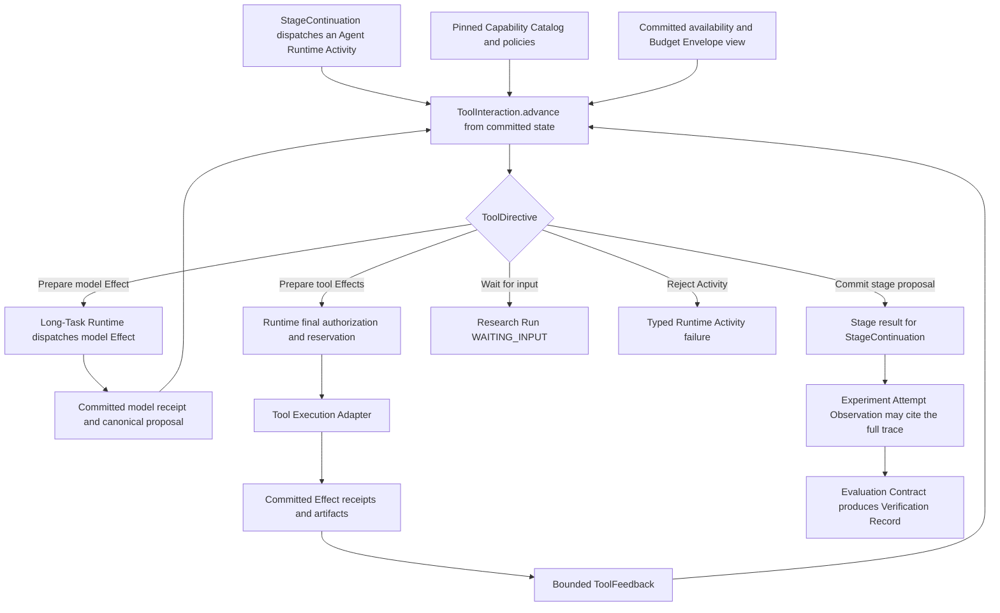

# Context-Aware Tool Use and Governed Tool Effects

**Status:** Proposed

**Audience:** maintainers implementing model-facing tool selection, execution,
and evaluation

**Scope:** per-turn decisions about whether to use a tool, which capabilities to
expose, how tool Effects execute, and how the behavior is evaluated across both
research entry flows

**Owner:** AI-Researcher maintainers

**Last updated:** 2026-07-31

**Implementation plan:**
[Context-Aware Tool Use implementation plan](../implementation/context-aware-tool-use-plan.md)

**Related governing designs:**
[Durable Research Runtime and Stage Continuation](durable-research-runtime.md),
[Experience-Driven Research Loop](experience-driven-research-loop.md), and
[Verified Research Memory](verified-research-memory.md)

**Authority:** [`CONTEXT.md`](../../CONTEXT.md) is authoritative for domain
identity and terminology. The durable design remains authoritative for Runtime
Activity, Effect, Physical Invocation, Budget Envelope, retry, reconciliation,
Durable Transition, and terminal-state semantics. The experience-loop design
remains authoritative for Hypothesis, Experiment Attempt, Observation,
Evaluation Contract, Verification Record, and Experience Record. The memory
design remains authoritative for Decision Point, Decision Intent, Evidence Card,
Recall Context, Recall Decision Outcome, Knowledge/Procedure records, and memory
lifecycle. This document is authoritative for Capability Catalog, Tool
Interaction, Tool Decision Record, model-visible tool exposure, and tool-use
evaluation semantics.

## 1. Decision

AI-Researcher will replace stage-local static tool wiring with one deep, pure
**Tool Interaction Module** behind one internal **Interface**:

```python
class ToolInteraction(Protocol):
    def advance(self, request: ToolInteractionRequest) -> ToolDirective:
        """Compute the next directive from committed input without producing an Effect."""
```

`advance()` is the single **Seam** between committed agent-stage state and the
next model or tool Effect. It owns the decision knowledge for:

- whether the next interaction is `DIRECT`, `CLARIFY`, `DISCOVER`, or `EXECUTE`;
- which capabilities are eligible under stage, authorization, configuration,
  environment, data-flow, risk, and Budget Envelope policy;
- whether a small eligible set should be exposed in full or progressively
  narrowed;
- selection over an already materialized catalog, ranking, schema expansion,
  confidence fallback, and
  trajectory-aware re-selection;
- exact model-visible schema ordering and toolset digest;
- validation of model proposals and separation of control actions from external
  tool Effects;
- transformation of committed Effect receipts into bounded, untrusted
  `ToolFeedback` for the next model Effect;
- Tool Decision Records, cache identity, replay identity, and shadow comparison.

The Module is pure: it does not read the clock, database, filesystem, network,
environment variables, credentials, or mutable global Registry. It does not call
an LLM or a tool. The Runtime Adapter resolves artifacts into bounded canonical
decision/receipt views before calling it, and its constructed Implementation is
bound to one verified, immutable Selection Bundle. Given byte-identical
canonical input and the same Selection Bundle digest, it returns a byte-identical
directive and digest.

The Long-Task Runtime remains the only owner of Effect preparation, Physical
Invocation authorization, Budget Envelope reservation and settlement, retry,
reconciliation, cancellation, and durable commit. There will be no second
"tool runtime" and no second retry owner.

Application code does not call `search_tools()`, `inspect_tool()`, or
`execute_tool()`. CLI and Web continue to use only `LongTaskRuntime.apply()` and
`LongTaskRuntime.inspect()`. A private Runtime Activity Adapter drives
`ToolInteraction.advance()` until the agent stage commits a result, waits for
input, hands off under workflow policy, or fails.

During migration, the current `MetaChain` loop is wrapped by a caller-first
compatibility **Adapter**. That Adapter gives the new Module committed inputs
and translates its directives back to the current provider request and
`Agent.functions` behavior. It is a migration bridge, not a second permanent
Interface.

## 2. Why this design is needed

### 2.1 Current behavior is stage-static, not on-demand

The process recursively imports the built-in tools, while each Agent factory
hard-codes a smaller callable list. Every model turn serializes that complete
stage-local list again. The result is neither global all-tools exposure nor true
per-turn selection.

Current production measurements using `function_to_json()` and the configured
tokenizer are:

| Agent | Tools | Approximate schema tokens per turn |
| --- | ---: | ---: |
| Prepare | 7 | 882 |
| Coding Plan | 9 | 1,458 |
| Machine Learning | 13 | 1,637 |
| Frozen ML | 8 | 907 |
| Experiment Analysis | 13 | 1,354 |
| Survey root | 2 | 264 |

These numbers are large enough to measure but too small to justify a mandatory
retrieval call on every turn. The first problem is decision quality and
governance, not reproducing a vendor's large-MCP token saving.

### 2.2 Control flow is represented as tool execution

Many Agents use `tool_choice="required"`. `case_resolved`,
`case_not_resolved`, and `transfer_to_*` are model-visible functions alongside
filesystem, command, browser, and search functions. If the model emits no call,
the loop asks it to use a tool.

This conflates three independent decisions:

1. whether external information or action is needed;
2. whether the current cognitive role should continue, complete, or hand off;
3. which external capability, if any, should execute.

The new model protocol separates interaction intent from stage control. A
provider may still encode control with function-calling wire syntax during
migration, but control records are not Tool Capabilities, create no Effect, and
are excluded from tool-execution metrics.

### 2.3 Discovery exists but has no production Leverage

`SkillLoader.scan()` and `SkillRegistry.search_tools()` exist, but the main
research paths never use their result to build the next model request. Applying
the deletion test to the skills search path leaves production behavior
unchanged, so it is currently a shallow **Module** with low **Depth**.

The existing search also lacks the metadata required for safe routing. It
indexes tool name, skill-level description, and tags; uses one dense index and a
fixed top-k; and silently substitutes an MD5-derived vector when the embedding
Implementation fails. The current tests check that results exist, not that the
right tool ranks ahead of hard negatives.

### 2.4 Execution and tracing have two authorities

Flow-level tools pass through `ToolModule`, while model-selected tools execute
directly inside `MetaChain.handle_tool_calls()`. Only the first path records
`ToolCallTrace`, and `ToolModule` currently writes `success=True` even when a
tool returns an error-shaped string. Tool errors, timeouts, hidden retries,
side effects, and output bounding vary by caller.

The durable design already defines the correct authority: every model call,
tool call, Docker invocation, and evaluator call is an Effect owned by one
Runtime Activity. This design deepens that existing Module rather than adding a
parallel executor.

### 2.5 Cache identity is not tool-decision identity

`CacheIdentity` has a generic `tool_configuration` field, but `AgentModule`
currently omits the actual exposed schemas and policy. A changed tool list,
schema, provider projection, or `required/auto` policy can therefore reuse a
transcript generated under different behavior.

The Research Context Snapshot must pin the catalog and policies; each model
turn must additionally bind its exact exposed toolset. A per-turn toolset may
change as committed trajectory changes without mutating the immutable Snapshot.

## 3. Goals and non-goals

### 3.1 Goals

- Make `DIRECT`, `CLARIFY`, `DISCOVER`, and `EXECUTE` explicit, traceable
  interaction outcomes.
- Separate `CONTINUE`, `COMPLETE`, and `HANDOFF` from Tool Capabilities.
- Preserve stage policy as a hard safety envelope while selecting a minimal,
  sufficient per-turn capability set inside it.
- Apply authorization, environment, configuration, data-flow, risk, and budget
  filters before relevance ranking, and re-check them immediately before Effect
  preparation.
- Keep small, compact toolsets intact when retrieval would cost more or reduce
  recall.
- Use progressive `Catalog -> Inspect -> Execute` disclosure only when the
  pinned schema budget or task confusion warrants it.
- Re-select after committed ToolFeedback, typed failure, evidence-gap, subgoal,
  or availability changes.
- Make every model proposal, policy rejection, tool attempt, Effect receipt, and
  bounded feedback view replayable.
- Ensure the same Evaluation Contract can compare static, filtered, retrieved,
  and trajectory-aware policies under the same model and Budget Envelope.
- Roll out through legacy parity, shadow, read-only canary, and full durable
  execution without switching in-flight Research Runs.

### 3.2 Non-goals for v1

- Perfect tool selection or a universal router.
- A remote tool registry, MCP server marketplace, A2A protocol, or plugin
  distribution system.
- Training, fine-tuning, or reinforcement learning before verified traces exist.
- Dynamic installation of new code into an active Research Run.
- Treating retrieval score, Agent prose, or policy reason codes as a
  Verification Record.
- Parallel tool execution by default.
- Schema compression before exposure selection is proven.
- A second lifecycle, budget ledger, cache authority, or retry loop outside the
  Durable Runtime.
- Renaming tool Effect evidence to `Observation`; that term remains reserved for
  the raw scientific result of an Experiment Attempt.

## 4. Domain model

The canonical domain vocabulary is defined in [`CONTEXT.md`](../../CONTEXT.md).
This design adds no alternate name for Research Run, Runtime Activity, Effect,
Physical Invocation, Observation, Evaluation Contract, or Verification Record.

### 4.1 Capability Catalog

A Capability Catalog is an immutable, content-addressed snapshot of normalized
tool descriptors permitted to be considered by one Research Run. It contains
descriptions and execution bindings, not credentials, live callables,
authorization tokens, or mutable environment handles.

The Snapshot pins:

- catalog schema version and catalog digest;
- every namespaced capability ID and version;
- model-visible name, summary, input schema, and output summary;
- descriptor, input-schema, output-schema, and execution-binding digests;
- `when_to_use`, `when_not_to_use`, positive examples, negative examples, and
  easily confused capabilities;
- stage eligibility, required configuration and authorization scopes;
- read/write/destructive, open-world egress, data classification, idempotency,
  reconciliation, cache, and parallel-safety policy;
- prerequisite, successor, and incompatible capability relationships;
- timeout, output-bounding, artifact, and worst-case reservation policy;
- source provenance and Adapter contract identity.

Live availability is not part of immutable catalog identity. Credential
presence, provider health, browser session state, and environment readiness are
captured in a time-bounded Availability Snapshot supplied to each decision and
rechecked before dispatch. Secret values are never stored in either snapshot.

### 4.2 Tool Interaction

A Tool Interaction is one durably identified decision sequence inside a Runtime
Activity. It starts from a committed stage/subgoal state, may alternate model
and tool Effects, and ends with a committed direct result, clarification wait,
stage control proposal, or typed failure.

A retry of one Effect does not create a new Tool Interaction. A new model turn
after committed ToolFeedback advances the same Interaction. A new stage,
subgoal generation, or control handoff creates a new Interaction identity under
the owning Runtime Activity. A clarification wait suspends the current
Interaction; `InputResolutionCommitted` resumes that same identity with a new
decision epoch.

### 4.3 Tool Decision Record

Every call to `advance()` produces an immutable Tool Decision Record containing
the canonical input digest, candidate universe, hard-filter decisions, ranking
trace, exposure set, exact schema token count, selected interaction/control
proposal or explicit no-proposal state, proposal-validation outcome, policy
outcome, confidence/degradation status, interaction ID, and decision epoch. It
does not contain the later directive, authorization, Effect, Physical
Invocation, or memory-outcome linkage.
When memory is present, every pure record binds the actor-safe decision-slot,
Recall Input Snapshot content, and optional Recall Context projection digests.
The Runtime journal separately binds the record to the actual Decision Intent.
A record that accepts a model
proposal binds the resulting interaction/control digest; an `EXECUTE` proposal
additionally binds exact capability and canonical-argument digests.

Shadow and active records are separate. A shadow record cannot authorize an
Effect, enter the active cache key, change model input, settle budget, or affect
Stage Continuation.

### 4.4 ToolFeedback and scientific Observation

`ToolFeedback` is the bounded, untrusted, model-facing projection of either a
committed tool-preparation rejection or committed Effect evidence. It may cite
immutable artifacts and evidence but is not a scientific Observation.

An Experiment Attempt's final Observation may reference Tool Decision Records,
Effect receipts, ToolFeedback artifacts, and cost traces. The Evaluation
Contract then determines whether that complete Observation supports a valid
Verification Record.

### 4.5 Memory-informed tool decisions

A tool-decision step may consume one committed Recall Context only under a
preallocated memory Decision Intent for a typed Decision Point. The pure Tool
Decision Record binds the actor-safe slot and Recall Input/Context projection;
the Runtime binding event supplies the actual Intent identity. Once proposed,
the record also binds the exact resulting decision digest, including
capability and canonical-argument digests for `EXECUTE`.

The model proposes one disposition and reason for every returned Evidence Card.
Those claims are untrusted. ToolInteraction validates coverage and citation
mapping, while the Runtime derives the actual decision/action digest and
authorization disposition. The memory Module remains authoritative for the
terminal Recall Decision Outcome. An append-only `MemoryToolDecisionLinked`
event joins that later outcome to the immutable Tool Decision Record; neither
record is mutated to add the other's later digest.

Recall is optional evidence, never policy. Evidence Card text is untrusted and
cannot add a Capability, widen an allowlist, change an ExecutionPolicy, satisfy
an authorization scope, approve egress/destruction, or override final Runtime
authorization. `evaluation` is not a memory-consuming Decision Point; the
independent evaluator receives the Evaluation Contract and immutable execution
evidence, not actor Recall Context. A blinded outcome-evaluation projection
replaces treatment/recall identities with opaque trial IDs. A separate
post-score manipulation audit may join Tool Decision and Recall Decision Outcome records;
it does not feed the evaluator.

## 5. Hard invariants

These are release blockers.

1. **One execution owner.** ToolInteraction prepares directives only;
   Long-Task Runtime exclusively creates, dispatches, retries, reconciles,
   settles, and commits Effects and Physical Invocations.
2. **Committed-input determinism.** `advance()` reads only canonical committed
   input. Equal input under the same verified Selection Bundle digest yields a
   byte-identical directive and digest. A dense-enabled bundle is valid only on
   a worker matching its pinned deterministic numeric-runtime profile; scores
   are canonically quantized before comparison, thresholding, or fusion.
3. **Pinned behavior.** Catalog, selection policy, execution policy, provider
   protocol, model/tool configuration, and Adapter contract digests are bound to
   the Research Run. Changing behavior creates a new Run.
4. **Exact per-turn exposure.** Every model Effect binds exact tool descriptors
   in wire order and an exposed-toolset digest. A model proposal may reference
   only that set.
5. **Policy classification precedes relevance in both lanes.** Stage,
   authorization, configuration, environment, data flow, risk, approval, and
   budget rules first classify candidates as `EXECUTABLE_ELIGIBLE`,
   policy-approved `BLOCKED_DIAGNOSTIC`, or `HIDDEN_DENY`. The execution ranker
   may only shrink or reorder the first lane. A separate diagnostic ranker may
   only shrink or reorder the second lane's bounded hints; it cannot reveal a
   schema/alias, prepare an Effect, participate in execution fallback, or promote
   a hint into the executable lane.
6. **Authorization is not retrieval.** A high score, Agent request, catalog
   annotation, or prior availability check never authorizes execution.
7. **Two-phase authorization without TOCTOU.** Preparation validates and reserves
   an Effect/Invocation but does not enter the external Seam. The atomic
   `DISPATCHABLE -> DISPATCHED` transaction immediately before Adapter entry
   revalidates Run/Activity state, generation, event sequence, fence, exact
   exposure/schema/arguments, live availability/auth/config/approval, data flow,
   incident state and reservation/Budget. A model Effect validates the current
   Intent/actor-slot/Recall-input binding before its Outcome exists; a tool Effect
   validates the terminal Recall Decision Outcome link created from the model's
   `EXECUTE` proposal. Rejection commits
   confirmed non-execution and settles the reservation.
8. **No invisible fallback.** Missing embeddings or rerankers produce a pinned,
   explicit lexical/static degradation, expansion, clarification, wait, or
   failure. Hash-derived vectors are forbidden.
9. **Control is not a tool Effect.** `COMPLETE`, `HANDOFF`, and clarification
   create no external Effect and cannot be ranked as Tool Capabilities.
10. **Execute cannot terminate.** A proposal cannot combine `EXECUTE` with
    `COMPLETE` or `HANDOFF`; the model must observe committed ToolFeedback in a
    later model Effect before proposing control.
11. **Completion remains governed.** Agent `COMPLETE` is only a stage proposal.
    StageContinuation and the durable settlement/verification chain remain the
    only route to Research Run `COMPLETED`.
12. **One retry owner.** Tool Adapters expose typed facts and disable hidden SDK
    retries. Runtime policy alone decides whether a new Physical Invocation is
    allowed.
13. **Unknown outcome is not success.** An unresolved or ambiguous Effect never
    becomes successful ToolFeedback and cannot justify completion.
14. **Untrusted output.** Tool output cannot change system policy, authorize
    another tool, or be forwarded to an open-world capability without explicit
    data-flow authorization computed from argument-level provenance. Free-form
    model transformation conservatively inherits the join of all actor-visible
    source labels unless a trusted declassification receipt proves a narrower
    result.
15. **Bounded model view.** Large output is content-addressed as an artifact;
    only a policy-bounded summary and cited references enter model context.
16. **No secret persistence.** Tool schemas, traces, errors, arguments, and
    artifacts follow redaction policy. Credentials are referenced by scope and
    availability attestation, never stored as values.
17. **Cache correctness.** Active model transcript reuse requires exact model,
    catalog, policy, provider-protocol, exposed-toolset, schema, Adapter, stage,
    subgoal, and committed-trajectory digests.
18. **Shadow causal inertness.** Shadow mode is byte-inert for the active model
    request, active cache identity, Effect preparation, ToolFeedback, control
    outcome, stage result, Run journal sequence, and active Budget Envelope.
    Selection shadow reads already committed actor-request artifacts through a
    non-causal audit outbox, is never awaited by the active path, and runs in an
    isolated worker pool. Its residual infrastructure overhead is measured
    against a preregistered shadow-overhead SLO; the design does not claim zero
    wall-clock overhead.
19. **Trajectory from committed facts only.** Uncommitted model output, stale
    worker evidence, or an unselected late receipt cannot influence the next
    decision.
20. **Independent verification.** Tool-use success is determined from the full
    end state by an evaluator satisfying the Evaluation Contract, never by the
    selector or Agent itself.
21. **Memory cannot authorize.** Recall Context may affect the no-tool decision,
    semantic query, or model proposal, but never the eligible set; ranking still
    receives only hard-filtered candidates. Every non-empty context is bound
    through a Recall Decision Outcome to the resulting decision/tool-action
    digest. It never changes approval or final authorization.
22. **Evaluator labels are private.** ToolInteraction, actor prompts, selection
    policy inputs, model/cache identity, and production traces never receive
    evaluator-only expected interactions, required/forbidden sets, milestones,
    minefields, answers, or treatment identity. Actor fixtures and evaluator
    labels are separately stored and separately digested.

## 6. Target architecture



There are three planes with separate authority:

1. **Decision plane:** ToolInteraction determines the next valid directive from
   committed state. It is deterministic and side-effect free.
2. **Execution plane:** Long-Task Runtime authorizes and executes model/tool
   Effects through Adapters. It owns all physical uncertainty and spend.
3. **Evaluation plane:** an independent evaluator assesses the resulting
   Observation under the pinned Evaluation Contract.

No plane may impersonate another. In particular, a selector cannot authorize,
an Adapter cannot retry or settle, and an Agent cannot verify itself.

## 7. Tool Interaction Interface

The types below are normative in meaning. Exact Python organization may change
without changing the Interface if the invariants and canonical serialization
remain stable.

### 7.1 Request

```python
@dataclass(frozen=True)
class ToolInteractionRequest:
    schema_version: Literal["1"]
    actor_scope: ActorTurnScope
    research_context: ResearchContextBinding
    decision_input: DecisionInputView
    decision_memory: DecisionMemoryBinding | None
    stage: StageDecisionContext
    interaction: InteractionState
    catalog: PinnedCapabilityCatalog
    selection_policy: PinnedSelectionPolicy
    selection_bundle: PinnedSelectionBundle
    execution_policy: PinnedExecutionPolicy
    availability: AvailabilitySnapshot
    budget: BudgetView
    rollout: RolloutConfiguration
    trigger: ToolInteractionTrigger
```

```python
@dataclass(frozen=True)
class ActorTurnScope:
    actor_request_scope_digest: str
    actor_workflow_view_digest: str
    actor_continuation_view_digest: str
    stage_name: str
    actor_stage_contract_view_digest: str
    actor_decision_contract_view_digest: str
    actor_interaction_key: str
    decision_epoch: int


@dataclass(frozen=True)
class ResearchContextBinding:
    snapshot_ref: ArtifactRef
    snapshot_digest: str
    snapshot_generation: int
    model_configuration_digest: str
    tool_configuration_digest: str


@dataclass(frozen=True)
class DecisionInputView:
    view_id: str
    request_text: str
    stage_goal: str
    subgoal: str | None
    committed_evidence_summary: str
    evidence_gaps: tuple[str, ...]
    source_refs: tuple[ArtifactRef, ...]
    data_classification: DataClassification
    source_provenance: tuple[DataProvenanceBinding, ...]
    data_provenance_digest: str
    redaction_policy_digest: str
    exact_token_count: int
    view_digest: str


@dataclass(frozen=True)
class DecisionMemoryBinding:
    actor_decision_slot_digest: str
    decision_point: DecisionPoint
    parent_recall_outcome_projection_digest: str | None
    source_status: Literal["NOT_REQUESTED", "EMPTY", "DEGRADED", "OK"]
    recall_input_snapshot_id: str | None
    recall_input_snapshot_digest: str | None
    recall_context_ref: ArtifactRef | None
    recall_context_id: str | None
    recall_context_digest: str | None
    evidence_card_ids: tuple[str, ...]
    data_classification: DataClassification
    data_provenance_digest: str
    bounded_rendered_recall: str
    exact_token_count: int
```

`ActorTurnScope` contains only actor-visible behavioral identity. It never
contains `run_id`, `run_spec_digest`, Runtime Activity/generation/event sequence,
fence, full/private Evaluation Contract digest, evaluator identity, or treatment
metadata. Those values live in a Runtime-only authorization envelope defined in
§9.1. The pure decision record/directive is content-addressed under actor scope;
the Runtime journal separately binds that digest to its concrete Run/Activity.
This permits byte-identical actor requests and cache keys across private-label
variants without permitting a model/tool Effect to be replayed across Runs.

`decision_input` contains actual bounded canonical content, not only artifact
digests. `decision_memory` is attempt/decision-specific and therefore is not
embedded in the shared Research Context Snapshot. It is absent outside a typed
Decision Point or when governed memory is off, and MUST be absent for independent
evaluation. A registered no-memory/control arm still supplies its preallocated
Decision Intent with a zero-card, null-context binding so a terminal Recall
Decision Outcome remains in the denominator. That binding has
`source_status=NOT_REQUESTED`, null Recall Input/Context fields, an empty card
tuple, and zero rendered tokens; it is not a blocked recall attempt. Its rendered
Recall Context is delimiter-safe untrusted evidence; the binding is not
authorization.

Runtime may construct that `NOT_REQUESTED` actor binding only after read-backing
the actual Decision Intent's admission-proof-backed Memory Governance Binding
with `recall_requirement=REGISTERED_NOT_REQUESTED`. A `REQUIRED` Intent cannot be
projected as not requested, and neither the model nor ToolInteraction can
override this fact.

`EMPTY | DEGRADED | OK` require a verified Recall Input Snapshot and Recall
Context whose source status matches; `NOT_REQUESTED` forbids both. The parent
outcome actor projection is one optional digest. These rules are closed validators,
not prompt conventions.

Each memory-governed model Effect receives a newly preallocated logical decision
slot and Runtime-owned Decision Intent. Only the actor-safe slot digest and
bounded recall projection enter `DecisionMemoryBinding`; the actual Intent
ID/digest remain in the Runtime authorization envelope. `DIRECT`, `CLARIFY`, `DISCOVER`, `EXECUTE`, or a
rejected proposal closes that Intent exactly once. A later model Effect in the
same Tool Interaction therefore receives a new Intent and may bind the preceding
Recall Decision Outcome actor projection as its causal parent. The Runtime reconstructs the next
model request without the prior turn's rendered Recall Context bytes; it carries
forward only committed bounded trajectory facts and the parent outcome projection digest.
After clarification input, tool feedback, or discovery changes the decision
state, recall is resolved afresh under the new Intent or represented by the
registered zero-card/no-memory binding. An Intent and its Recall Context are
never reused across model turns.

Before `advance()`, the Runtime Adapter resolves and verifies artifact digests,
applies redaction, and constructs these bounded views. V1 output projection is
deterministic structured selection/truncation. If semantic summarization or
remote retrieval is required, it is a separate Runtime Effect; only its
committed receipt enters a later request. ToolInteraction never opens an
artifact reference itself.

The trigger is a closed union:

```python
ToolInteractionTrigger = (
    BeginInteraction
    | ModelEffectSettled
    | ModelPreparationRejected
    | ModelDispatchAuthorizationRejected
    | ToolEffectsSettled
    | ToolPreparationRejected
    | ToolDispatchAuthorizationRejected
    | InputResolutionCommitted
    | DecisionTurnInputsCommitted
)
```

`ModelEffectSettled` contains a selected, committed model receipt and its
canonical proposal or typed protocol failure. `ToolEffectsSettled` contains one
selected logical Effect receipt plus its `CommittedToolReceiptView`.
`ModelPreparationRejected` contains a committed no-Effect rejection for the
exact model request/data-flow/provider/budget bindings. A
`ModelDispatchAuthorizationRejected` contains the already-created model Effect/
Physical Invocation, closed not-executed receipt/reason, and settled reservation.
Neither is ToolFeedback: the pinned policy can only wait for typed operator/input
resolution, reject the Activity, or request a new model turn after a genuinely
new committed state and newly preallocated Decision Intent.
`ToolPreparationRejected` contains the committed final-authorization outcome,
reason, proposed capability/argument digests, and `DENIED | UNAVAILABLE |
BUDGET_NOT_ADMITTED | APPROVAL_REQUIRED` disposition for a proposal that created
no logical Effect or Physical Invocation. An unresolved ambiguous Physical Invocation does not reach
`advance()`; reconciliation or `WAITING_INPUT` remains a Runtime responsibility.
`ToolDispatchAuthorizationRejected` instead carries an already-created Effect and
Physical Invocation whose dispatch gate committed `CONFIRMED_NOT_EXECUTED` and
settled its reservation. `DecisionTurnInputsCommitted` proves the Runtime has
committed the preceding decision outcome when required, then preallocated and
resolved the new actor decision slot, Decision Input, and optional Recall
Context described by an earlier continuation directive.

`InteractionState` contains only committed bounded views, Tool Decision Records,
ToolFeedback, subgoal/evidence state, decision epoch, and progress counters.
Large content remains in verified artifacts. A mutable Python callable, open
browser object, environment instance, database handle, evaluator label, or
benchmark answer is never part of the request.

Availability expiry is checked by the Runtime before constructing the request;
the snapshot carries a committed `FRESH | STALE` disposition and validation
event sequence. The pure Module never compares expiry to a live clock. Final
authorization still rechecks current availability immediately before dispatch.

### 7.2 Model proposal: interaction and control are orthogonal

The canonical model proposal separates external interaction from stage control:

```python
@dataclass(frozen=True)
class ModelTurnProposal:
    turn_contract_digest: str
    actor_decision_slot_digest: str | None
    interaction: Interaction
    control: StageControl
    recall_dispositions: tuple[RecallDispositionProposal, ...] = ()


Interaction = Direct | Clarify | Discover | Execute
StageControl = Continue | Complete | Handoff
```

Payloads are typed:

```python
@dataclass(frozen=True)
class Direct:
    content_ref: ArtifactRef
    evidence_refs: tuple[ArtifactRef, ...] = ()


@dataclass(frozen=True)
class Clarify:
    question: str
    missing_fields: tuple[str, ...]


@dataclass(frozen=True)
class Discover:
    query: str
    desired_capabilities: tuple[str, ...] = ()


@dataclass(frozen=True)
class ToolCallProposal:
    provider_alias: str
    canonical_arguments: CanonicalJsonObject
    arguments_digest: str
    argument_source_claims: tuple[ArgumentSourceClaim, ...]
    proposal_digest: str


@dataclass(frozen=True)
class Execute:
    call: ToolCallProposal


@dataclass(frozen=True)
class RecallDispositionProposal:
    evidence_card_id: str
    disposition: Literal["ADOPTED", "REJECTED", "NOT_CONSIDERED"]
    reason_code: RecallDispositionReason
    mapped_target: str | None


@dataclass(frozen=True)
class RecallDecisionOutcomeDraft:
    actor_decision_slot_digest: str
    source_status: Literal["NOT_REQUESTED", "EMPTY", "DEGRADED", "OK"]
    recall_input_snapshot_id: str | None
    recall_input_snapshot_digest: str | None
    recall_context_id: str | None
    recall_context_digest: str | None
    actor_dispositions: tuple[RecallDispositionProposal, ...]
    proposed_decision_digest: str
    completion_kind: Literal["DIRECT", "CLARIFY", "DISCOVER", "EXECUTE", "REJECTED"]
    draft_digest: str


@dataclass(frozen=True)
class Complete:
    claimed_status: Literal["SUCCEEDED", "EXHAUSTED", "NO_SOLUTION"]
    stage_output_ref: ArtifactRef


@dataclass(frozen=True)
class Handoff:
    target_role: str
    handoff_payload_ref: ArtifactRef
```

The draft repeats the closed `DecisionMemoryBinding` source-status constraints:
`NOT_REQUESTED` requires null Recall Input/Context and zero dispositions;
`EMPTY | DEGRADED | OK` require matching Recall Input/Context identity. It cannot
invent a different source status or lineage from the settled model turn. The
Runtime memory commit binds this actor-safe draft to the actual Decision Intent
from its authorization envelope and rejects a slot/content mismatch.

Valid v1 combinations are:

| Interaction | Valid control | Meaning |
| --- | --- | --- |
| `DIRECT` | `COMPLETE` | propose a completed or exhausted stage result |
| `DIRECT` | `HANDOFF` | propose a workflow-governed cognitive-role handoff |
| `CLARIFY` | `CONTINUE` | commit the question and wait for typed input |
| `DISCOVER` | `CONTINUE` | expand/re-rank within the pinned eligible catalog |
| `EXECUTE` | `CONTINUE` | prepare exactly one tool Effect |

`DIRECT + CONTINUE`, `CLARIFY + COMPLETE`, `DISCOVER + HANDOFF`, and any
`EXECUTE + COMPLETE/HANDOFF` are invalid in v1. After tool execution, the model
must receive committed ToolFeedback in a later model Effect before proposing
completion or handoff.

When `decision_memory` has Evidence Cards, `recall_dispositions` contains each
card exactly once. An adopted card must map to the canonical resulting decision;
ToolInteraction rejects missing, duplicate, unknown, or mismatched mappings.
These are actor claims, not execution proof. The Runtime and memory Module bind
the final authorization/resulting artifact in the Recall Decision Outcome.

`Complete` never means Research Run `COMPLETED`. It is an input to the owning
stage contract and then to `StageContinuation.plan()`. A valid negative result
can complete scientific work, while a self-declared successful string cannot.

### 7.3 Directive

```python
ToolDirective = (
    PrepareEffect
    | CommitDecisionAndRequestNextTurnInputs
    | CommitStageProposal
    | WaitForInput
    | RejectActivity
)
```

```python
@dataclass(frozen=True)
class PrepareEffect:
    effect: ModelEffectSpec | ToolEffectRequest
    decision_record: ToolDecisionRecord
    recall_outcome_draft: RecallDecisionOutcomeDraft | None
    directive_digest: str


@dataclass(frozen=True)
class CommitDecisionAndRequestNextTurnInputs:
    cause: Literal[
        "DISCOVERY", "TOOL_FEEDBACK", "INPUT_RESOLUTION", "PROTOCOL_CORRECTION",
        "PREPARATION_REJECTION", "DISPATCH_REJECTION"
    ]
    next_turn_input_spec: NextTurnInputSpec
    decision_record: ToolDecisionRecord
    recall_outcome_draft: RecallDecisionOutcomeDraft | None
    directive_digest: str


@dataclass(frozen=True)
class NextTurnInputSpec:
    actor_interaction_key: str
    next_decision_epoch: int
    cause_digest: str
    committed_trajectory_digest: str
    decision_input_projection_spec_digest: str
    catalog_or_toolset_view_digest: str
    decision_point: DecisionPoint | None
    memory_profile_digest: str | None
    parent_recall_outcome_required: bool
    spec_digest: str


@dataclass(frozen=True)
class CommitStageProposal:
    interaction: Direct
    control: Complete | Handoff
    decision_record: ToolDecisionRecord
    recall_outcome_draft: RecallDecisionOutcomeDraft | None
    directive_digest: str


@dataclass(frozen=True)
class WaitForInput:
    clarification: Clarify | None
    wait_reason: WaitReason
    decision_record: ToolDecisionRecord
    recall_outcome_draft: RecallDecisionOutcomeDraft | None
    directive_digest: str


@dataclass(frozen=True)
class RejectActivity:
    failure: ToolInteractionFailure
    decision_record: ToolDecisionRecord
    recall_outcome_draft: RecallDecisionOutcomeDraft | None
    directive_digest: str
```

Each `advance()` emits exactly one step-level Tool Decision Record. The record
contains pure decision facts and no later directive, authorization, Effect,
Physical Invocation, or Recall Decision Outcome IDs. Digest order is acyclic:
request digest -> decision-record digest -> Effect request -> directive digest;
later append-only events link authorization, Effect, and memory outcomes.

`CommitDecisionAndRequestNextTurnInputs` creates no model/tool Effect. It closes
the settled decision step, asks Runtime to commit/link its Recall Decision
Outcome when present, and describes only how to derive the next actor inputs.
Runtime then resolves/artifacts the bounded Decision Input and any new Recall
Context, preallocates the child Decision Intent, and calls `advance()` again with
`DecisionTurnInputsCommitted`. Only that second call may return the next
`PrepareEffect(model)`. Thus one request never uses an old
`DecisionMemoryBinding` to manufacture a new turn's Intent/Recall, and hidden
recall or artifact I/O never occurs inside the pure Module.

`PrepareEffect` prepares one canonical logical Effect request only. It neither
creates a Physical Invocation nor authorizes an external Seam. V1 accepts at
most one external tool call per model turn; multi-tool tasks proceed through
committed ToolFeedback and another model turn. Future independent batches need
a new schema version plus atomic multi-Effect reservation, partial-outcome,
cancellation, and settlement contracts. A provider's `parallel_tool_calls` flag
is not sufficient authority.

Normative Effect request bindings are:

```python
@dataclass(frozen=True)
class ModelEffectSpec:
    logical_effect_index: int
    decision_record_digest: str
    turn_contract_digest: str
    model_request_ref: ArtifactRef
    model_request_digest: str
    model_configuration_digest: str
    provider_protocol_digest: str
    destination_class: DataDestinationClass
    input_provenance_digest: str
    effective_input_classification: DataClassification
    declassification_receipt_digests: tuple[str, ...]
    data_flow_digest: str
    execution_policy_digest: str
    toolset_digest: str
    output_policy_digest: str
    worst_case_usage: WorstCaseUsage


@dataclass(frozen=True)
class ToolEffectRequest:
    logical_effect_index: int
    decision_record_digest: str
    turn_contract_digest: str
    toolset_digest: str
    provider_alias_map_digest: str
    capability_id: str
    descriptor_digest: str
    input_schema_digest: str
    execution_binding_digest: str
    adapter_bundle_digest: str
    canonical_arguments: CanonicalJsonObject
    arguments_digest: str
    argument_provenance_digest: str
    effective_input_classification: DataClassification
    declassification_receipt_digests: tuple[str, ...]
    destination_class: DataDestinationClass
    data_flow_digest: str
    execution_policy_digest: str
    output_policy_digest: str
    reconciliation_policy_digest: str
    worst_case_usage: WorstCaseUsage
```

The Runtime derives the stable logical Effect ID from Run, Activity generation,
and `logical_effect_index`, then revalidates every binding. For a memory-informed
directive, the memory Module validates and commits the Recall Decision Outcome
before a stage/control directive becomes visible. For `EXECUTE`, authorization
is recorded first, then the outcome is committed and linked; guarded
`DISPATCHED` authorization additionally requires that link. A failure to commit
memory leaves the prepared invocation undispatched and recoverable.

### 7.4 Normal ordering

```text
Every PrepareEffect(model) below expands first as:
  -> Runtime preparation
       -> rejected before Effect creation: ModelPreparationRejected
            -> close current Intent with typed blocked/actor-failed outcome
            -> WaitForInput or RejectActivity according to pinned policy
       -> accepted: create model Effect/Invocation/reservation as DISPATCHABLE
            -> atomic dispatch reauthorization
                 -> rejected: CONFIRMED_NOT_EXECUTED + settlement
                              -> ModelDispatchAuthorizationRejected
                              -> close current Intent and WaitForInput/RejectActivity
                 -> accepted: DISPATCHED -> Adapter entry -> ModelEffectSettled

BeginInteraction
  -> preallocate current-turn Decision Intent / resolve current Recall Context
  -> PrepareEffect(model)
  -> ModelEffectSettled(DIRECT)
       -> commit/link Recall Decision Outcome when present
       -> CommitStageProposal

BeginInteraction
  -> preallocate current-turn Decision Intent / resolve current Recall Context
  -> PrepareEffect(model)
  -> ModelEffectSettled(CLARIFY)
       -> commit/link Recall Decision Outcome when present
       -> WaitForInput
  -> InputResolutionCommitted
       -> same Interaction, new decision epoch
       -> CommitDecisionAndRequestNextTurnInputs
  -> Runtime preallocates/resolves child Intent/Input/Recall; removes old recall bytes
  -> DecisionTurnInputsCommitted
       -> PrepareEffect(model)

BeginInteraction
  -> preallocate current-turn Decision Intent / resolve current Recall Context
  -> PrepareEffect(model)
  -> ModelEffectSettled(DISCOVER)
       -> local catalog expansion/ranking
       -> CommitDecisionAndRequestNextTurnInputs with outcome draft
  -> Runtime commits/links old outcome
  -> Runtime preallocates/resolves child Intent/Input/Recall; removes old recall bytes
  -> DecisionTurnInputsCommitted
       -> PrepareEffect(model with a new exact toolset)

BeginInteraction
  -> preallocate current-turn Decision Intent / resolve current Recall Context
  -> PrepareEffect(model)
  -> ModelEffectSettled(EXECUTE)
       -> PrepareEffect(tool)
  -> Runtime final authorization
       -> accepted: commit/link Recall Decision Outcome when present
                    -> guarded dispatch
                    -> ToolEffectsSettled
                    -> construct bounded ToolFeedback
                    -> re-run eligibility and trajectory-aware selection
                    -> CommitDecisionAndRequestNextTurnInputs
       -> rejected: commit/link Recall Decision Outcome when present
                    -> ToolPreparationRejected
                    -> construct denial/unavailable/budget/approval ToolFeedback
                    -> CommitDecisionAndRequestNextTurnInputs / wait / fail
       -> dispatch gate rejected after preparation:
                    -> CONFIRMED_NOT_EXECUTED + settle reservation
                    -> ToolDispatchAuthorizationRejected
                    -> construct dispatch-rejection ToolFeedback
                    -> CommitDecisionAndRequestNextTurnInputs / wait / fail
  -> Runtime preallocates/resolves child Intent/Input/Recall when continuation requested
  -> DecisionTurnInputsCommitted
       -> PrepareEffect(model)
```

Model rejection never becomes ToolFeedback. A new model attempt after operator/
input/provider state changes is a new turn with a new Decision Intent and follows
the two-call next-turn-input protocol; it is not a hidden Adapter retry.

A committed preparation rejection becomes typed ToolFeedback with no Effect ID
and deterministically leads to re-selection, clarification/wait, budget
exhaustion, or failure according to the pinned policy. It never leaves the
Interaction waiting for a receipt that cannot exist.

A model-correctable protocol failure follows the same two-call continuation:
the first `advance()` closes the failed step and requests new turn inputs; only
`DecisionTurnInputsCommitted` may prepare the correction model Effect.

`DISCOVER` never installs or imports new code into an active Research Run. It
can inspect or expose more descriptors only from the already pinned Capability
Catalog. A truly new capability requires a new catalog digest and therefore a
new Research Run.

### 7.5 ToolFeedback

```python
@dataclass(frozen=True)
class CommittedToolReceiptView:
    decision_record_digest: str
    effect_id: str
    physical_invocation_id: str
    capability_id: str
    receipt_disposition: str
    bounded_payload: CanonicalJsonValue | None
    bounded_text: str
    artifact_refs: tuple[ArtifactRef, ...]
    evidence_refs: tuple[ArtifactRef, ...]
    data_classification: DataClassification
    data_provenance_digest: str
    settled_usage: SettledUsage
    output_policy_digest: str
    view_digest: str


@dataclass(frozen=True)
class ToolFeedback:
    decision_record_digest: str
    effect_id: str | None
    physical_invocation_id: str | None
    preparation_rejection_id: str | None
    dispatch_rejection_id: str | None
    capability_id: str
    status: Literal[
        "OK",
        "EMPTY",
        "RETRY_EXHAUSTED",
        "PERMANENT_FAILURE",
        "CONFIRMED_NOT_EXECUTED",
        "DENIED",
        "UNAVAILABLE",
        "BUDGET_NOT_ADMITTED",
        "APPROVAL_REQUIRED",
        "LEGACY_UNTYPED",
    ]
    runtime_retry_disposition: Literal[
        "NOT_APPLICABLE", "EXHAUSTED", "NOT_RETRYABLE"
    ]
    dispatch_rejection_reason: Literal[
        "FENCE_OR_STATE_CHANGED", "AUTH_REVOKED", "CONFIG_UNAVAILABLE",
        "APPROVAL_EXPIRED", "AVAILABILITY_CHANGED", "INCIDENT_QUARANTINE",
        "RESERVATION_INVALID", "MEMORY_LINK_FAILED"
    ] | None
    bounded_summary: str
    artifact_refs: tuple[ArtifactRef, ...]
    evidence_refs: tuple[ArtifactRef, ...]
    data_classification: DataClassification
    data_provenance_digest: str
    settled_usage: SettledUsage | None
    feedback_digest: str
```

`OK`, `EMPTY`, `RETRY_EXHAUSTED`, `PERMANENT_FAILURE`,
`CONFIRMED_NOT_EXECUTED`, and `LEGACY_UNTYPED` require an Effect ID, Physical
Invocation ID, selected committed receipt, and settled usage.
`RETRY_EXHAUSTED` is emitted only after Runtime, the sole retry owner, commits
`runtime_retry_disposition=EXHAUSTED`; an Adapter-level retryable error is never
directly model-visible. `PERMANENT_FAILURE` binds `NOT_RETRYABLE`; successful and
legacy projections bind `NOT_APPLICABLE`. `DENIED`, pre-dispatch `UNAVAILABLE`,
`BUDGET_NOT_ADMITTED`, and `APPROVAL_REQUIRED` require a committed
preparation-rejection ID and have no Effect ID, Physical Invocation, artifact
output, or settled usage. They bind `NOT_APPLICABLE`. Exactly one evidence source
is present.

`CONFIRMED_NOT_EXECUTED` additionally requires one closed
`dispatch_rejection_id` and `dispatch_rejection_reason`, a Runtime receipt proving
the execution Adapter was never entered, and released/settled reservation
evidence; it forbids `preparation_rejection_id`. Other statuses forbid the
dispatch-rejection fields. This status is not a preparation rejection and cannot
omit its Effect/Invocation lineage.

Full raw output is never required to fit model context. The Runtime output
projection verifies and artifacts raw bytes, applies structural redaction and
the pinned size policy, and constructs `CommittedToolReceiptView` before
`advance()`. `bounded_summary` is untrusted data rendered with an explicit
source/effect label. Optional semantic summarization is a separate Effect whose
committed receipt is bound to the view; it is never hidden inside
ToolInteraction. Tool-provided instructions cannot alter system, workflow,
selection, execution, or Evaluation Contract policy.

Legacy strings are translated by a temporary Adapter and marked
`LEGACY_UNTYPED`; the presence of a substring such as `Error` is not the target
status protocol. New and migrated tools return typed evidence to their
execution Adapter.

### 7.6 Closed error union

Model-correctable failures, subject to a pinned correction limit and remaining
Budget Envelope, are:

- `PROTOCOL_VIOLATION`;
- `UNKNOWN_CAPABILITY`;
- `CAPABILITY_NOT_EXPOSED`;
- `ARGUMENT_SCHEMA_VIOLATION`;
- `DISCOVERY_QUERY_INVALID`.

Wait or operator-policy outcomes are:

- `AUTH_UNAVAILABLE`;
- `REQUIRED_CONFIG_UNAVAILABLE`;
- `EXECUTION_ENVIRONMENT_UNAVAILABLE`;
- `BUDGET_NOT_ADMITTED`;
- `EFFECT_AMBIGUOUS`;
- `APPROVAL_REQUIRED`.

Permanent contract or integrity failures are:

- `INVALID_TURN_ORDER`;
- `TURN_CONTRACT_DIGEST_MISMATCH`;
- `CATALOG_INTEGRITY_FAILURE`;
- `CATALOG_IDENTITY_CONFLICT`;
- `POLICY_INTEGRITY_FAILURE`;
- `SCHEMA_DIGEST_MISMATCH`;
- `ADAPTER_CONTRACT_MISMATCH`;
- `TRAJECTORY_GAP`.

Timeout, rate limit, provider 5xx, transient process exit, and ambiguous remote
success are Runtime Effect outcomes, not ToolInteraction retry requests.

## 8. Capability Catalog and selection

### 8.1 Canonical capability identity

Every descriptor uses a namespaced, versioned identity:

```text
<namespace>/<capability-name>@<version>
```

The model-visible provider alias is a projection, not identity. The exact alias
map is stored in the model Effect request. Two sources declaring the same
capability ID with different schema, description, risk, or execution-binding
digests produce `CATALOG_IDENTITY_CONFLICT`; registration order never chooses a
winner.

Callable signature is the executable schema source during migration. Manifest
metadata enriches discovery and policy and pins the expected schema digest. A
manifest/callable mismatch fails catalog compilation. When tools are migrated to
typed request models, those models become the schema source and manifests
reference their digest rather than copy an independently editable schema.

### 8.2 Capability Catalog Compiler Module and Source Adapter Seam

Catalog materialization is a separate internal Module used by Research Run
admission/Snapshot build, not part of the pure per-turn Interface:

```python
class CapabilityCatalogCompiler:
    def compile(self, request: CatalogCompilationRequest) -> CapabilityCatalogArtifact: ...
```

The compiler owns normalization, identity/schema conflict detection, canonical
serialization, and content digesting. Its caller supplies fragments obtained
through source Adapters; ToolInteraction receives only the verified immutable
artifact and never reads a manifest or Registry.

The compiler validates only descriptor/source internal truth. It does not read
Run Selection/Execution Policy, approval configuration, or deployment state and
therefore cannot declare a catalog executable. A Runtime admission
`ToolConfigurationValidator` composes the compiled catalog with the pinned
Selection/Execution policies, Selection Bundle, provider protocol, Adapter
bundle, and compatibility matrix; it fails closed and emits the normalized
`tool_configuration_digest` carried by `ResearchContextBinding`. Run spec,
Snapshot, actor request, outer Effect authorization, and acceptance evidence bind
that digest.

There are two real production sources today:

- `LegacyRegistryCatalogAdapter` converts decorated tools and Agent-bound
  environment wrappers into canonical descriptors;
- `SkillManifestCatalogAdapter` reads SKILL manifests without importing their
  Implementation.

Both satisfy one private catalog-source Interface and compile into one
Capability Catalog. An in-memory Implementation runs the same contract suite.
Future MCP support may add an Adapter only when an actual MCP source exists; it
is not a v1 prerequisite.

After all tools have one authoritative descriptor source, the migration-only
dual-source Seam should be re-evaluated with the one Adapter versus two Adapter
principle. It must not remain as permanent indirection merely because it helped
migration.

### 8.3 Eligibility pipeline

Eligibility is deterministic and precedes ranking in this order:

1. pinned stage and cognitive-role capability policy;
2. workflow and frozen-protocol restrictions;
3. execution Adapter availability and compatibility;
4. required configuration and authorization scopes;
5. input data classification and destination/egress policy;
6. read/write/destructive and approval policy;
7. idempotency, reconciliation, and cache policy;
8. Budget Envelope admission estimate;
9. prerequisite, incompatible-tool, and trajectory constraints.

Each descriptor receives exactly one pre-ranking disposition:

- `EXECUTABLE_ELIGIBLE`: all hard requirements currently pass; only this pool
  may be ranked into full schemas, provider aliases, or `EXECUTE` proposals;
- `BLOCKED_DIAGNOSTIC`: stage/risk/data policy permits the capability in
  principle, but a remediable condition is missing:
  `AUTH_MISSING | CONFIG_MISSING | ENVIRONMENT_MISSING |
  PROVIDER_DEGRADED | APPROVAL_REQUIRED | BUDGET_NOT_ADMITTED`;
- `HIDDEN_DENY`: permanent policy/frozen/workflow/data-flow denial, capability
  confidentiality restriction, incompatible Adapter/effect contract, or a
  diagnostic-visibility denial.

The executable and diagnostic pools are ranked separately after this
classification. A blocked diagnostic contains only namespaced identity, bounded
use summary, stable reason/remediation class, and descriptor digest—never input
schema, provider alias, execution binding, arguments, scope names, config values,
or authorization. It may support a need-gate `CLARIFY` or typed `WAIT`, but it
cannot be promoted into the executable pool by score, discovery, or fallback.
`HIDDEN_DENY` is absent from every model-facing view and ranker. No retrieval
fallback can change any of these dispositions.

This split preserves “hard filters before relevance” for execution while still
letting the system say “the relevant capability exists but needs credential,
configuration, approval, provider recovery, or budget” instead of hallucinating
a direct answer. Diagnostic visibility and remediation text are themselves
pinned ExecutionPolicy outputs and are covered by private-capability leak tests.
The policy contains a closed, content-digested rule set keyed by stage, role,
principal class, capability ID, and blocked reason. A unique `ALLOW` match pins
the only renderable identity/summary/reason/remediation fields; no match,
conflicting matches, or `DENY` becomes `HIDDEN_DENY`. Remediation is selected from
a closed class and policy-owned public string, never generated from an exception,
descriptor prose, auth/config value, or model suggestion. Field-by-field leak
tests independently cover capability identity, summary, reason, and remediation.

The Runtime repeats all mutable checks against exact canonical arguments and
current committed state before Effect preparation, then repeats dispatch-relevant
checks in the atomic `DISPATCHABLE -> DISPATCHED` transaction immediately before
Adapter entry. Selection-time eligibility is necessary but never sufficient;
preparation is reservation, and only the later transaction authorizes physical
execution.

#### 8.3.1 Effective policy algebra

Catalog descriptors, Selection Policy, and ExecutionPolicy do not form three
independent precedence systems. One pinned, pure policy normalizer derives an
`EffectiveCapabilityPolicy` for both selection-time eligibility and Runtime
final authorization. Selection evaluates its argument-independent projection;
Runtime calls the same normalizer again with exact canonical arguments and the
current committed availability/budget state. Only Runtime may turn the result
into authorization.

The v1 algebra is closed and fail-closed:

| Constraint kind | Composition |
| --- | --- |
| explicit deny or incompatible declaration | any matching deny wins |
| stage/role/capability/data-flow allow sets | intersection; no matching ExecutionPolicy allow is deny |
| required auth scopes, config, approvals, evidence, and preconditions | union; policy may add but never remove descriptor requirements |
| allowed destinations, content types, Adapters, effect/idempotency/cache classes | intersection |
| byte, token, call, cost, and timeout ceilings | minimum applicable non-null ceiling |
| network openness and output exposure | most restrictive applicable value |
| Selection Policy | may only narrow the effective eligible set; it never widens or authorizes |

Every descriptor has a non-empty stage compatibility declaration; the explicit
sentinel `*` means stage-neutral. The current stage must be in the intersection
of descriptor compatibility, Selection Policy stage allowlist, and a matching
ExecutionPolicy stage/role `ALLOW`, while workflow/frozen-protocol and any
matching `DENY` still win. Missing, contradictory, or non-normalizable rules
produce a deterministic denial rather than an implementation default.

Reason precedence is fixed so selection and final authorization explain the
same conflict consistently: integrity/schema, explicit deny, stage/role,
data-flow, Adapter/effect contract, scope/config, approval, availability,
budget, dependency/trajectory, then exact-argument constraint. Final
authorization may add a later reason from mutable/exact-argument state but may
not reinterpret an earlier rule. The normalized policy and ordered reason list
are content-digested and covered by conflict-matrix contract tests.

#### 8.3.2 Data classification and argument provenance

Data-flow authorization is computed from closed facts, not from the model's
claim that an argument is harmless:

```python
@dataclass(frozen=True)
class DataClassification:
    confidentiality: Literal["PUBLIC", "INTERNAL", "CONFIDENTIAL", "RESTRICTED"]
    compartments: tuple[Literal["EVALUATOR_PRIVATE", "CREDENTIAL_SECRET"], ...]
    integrity: Literal["VALIDATED", "UNTRUSTED_EXTERNAL"]


DataDestinationClass = Literal[
    "LOCAL_PROCESS", "TRUSTED_MODEL_PROVIDER", "RESTRICTED_NETWORK", "OPEN_WORLD"
]


@dataclass(frozen=True)
class DataProvenanceBinding:
    source_kind: Literal[
        "DECISION_INPUT", "RECALL_CARD", "TOOL_FEEDBACK", "ARTIFACT",
        "USER_INPUT", "TRUSTED_CONSTANT"
    ]
    source_ref: ArtifactRef | None
    source_digest: str
    classification: DataClassification
    declassification_receipt_digests: tuple[str, ...]


@dataclass(frozen=True)
class ArgumentSourceClaim:
    json_pointer: str
    claimed_source_digests: tuple[str, ...]


@dataclass(frozen=True)
class DeclassificationReceipt:
    source_digest: str
    output_digest: str
    source_classification: DataClassification
    output_classification: DataClassification
    removed_field_paths: tuple[str, ...]
    policy_digest: str
    trusted_transform_effect_id: str
    receipt_digest: str
```

The join is deterministic: confidentiality takes the maximum closed level,
compartments are set-unioned and canonically sorted, and integrity becomes
`UNTRUSTED_EXTERNAL` if any input is untrusted. The model's
`ArgumentSourceClaim` is audit evidence only and can add sources, never remove a
source or lower a label. V1 conservatively assigns every free-form model-derived
argument the join of all actor-visible Decision Input, Recall, ToolFeedback, and
artifact sources in that turn. A narrower field-level label is allowed only when
a trusted deterministic transform Effect produces a verified derivation or
declassification receipt. `EVALUATOR_PRIVATE` and `CREDENTIAL_SECRET` cannot be
declassified into actor-visible or open-world destinations.

Runtime final authorization recomputes
`data_flow_digest = digest(arguments_digest, argument_provenance_digest,
effective_input_classification, destination_class, declassification_receipts,
execution_policy_digest)` and applies the pinned egress matrix. The digest in a
model proposal is never trusted. Semantic summarization, truncation, rendering,
and tool-to-tool forwarding inherit the source join and use the same governed
Effect/data-flow rule; they are not laundering boundaries. Tool output joins
the effective input classification with the descriptor's output class and
records the resulting provenance in the receipt, artifact, and ToolFeedback.

The same rule applies to every model and semantic-summarizer Effect. Runtime
recomputes the model request's input provenance/classification and destination
against the egress matrix both when preparing the Effect and in the atomic
dispatch transaction. Provider-visible bytes cannot be emitted before that
transaction commits. `EVALUATOR_PRIVATE` and `CREDENTIAL_SECRET` fail closed for
all actor model providers, including otherwise trusted destinations. Model
Effect/cache/replay identity binds the resulting data-flow digest.

### 8.4 Small-set bypass and progressive disclosure

Every pinned selection policy declares both an absolute schema-token budget and
a model-context fraction budget. The lower applicable limit governs.

If all eligible schemas fit and the pinned public Selection Policy has no
pre-registered narrowing override for that capability-confusion group, the
Module exposes the complete eligible stage set. A narrowing override may cite
an approved development/baseline evaluation artifact frozen before the release
corpus is evaluated, but it contains no case IDs, expected answers, forbidden
labels, milestones, or minefields. Production code never reads the active
Evaluation Contract's gold labels. This avoids paying a retrieval call or
losing recall merely to remove a few hundred tokens.

When the set does not fit, progressive disclosure uses:

1. **Catalog:** namespaced identity, one-line capability summary, availability,
   risk, and schema token estimate;
2. **Inspect:** full descriptor, input schema, examples, preconditions, and
   dependency metadata for ranked candidates;
3. **Execute:** exact descriptor/binding/argument digests sent for Runtime
   authorization.

The catalog and inspect views are derived from the same immutable descriptor.
They cannot disagree about identity, schema, or execution binding.

Their wire contracts are closed and deterministically rendered:

```python
@dataclass(frozen=True)
class CatalogEntryView:
    capability_id: str
    summary: str
    availability: str
    risk_class: str
    full_schema_tokens: int
    descriptor_digest: str


@dataclass(frozen=True)
class BlockedCapabilityHintView:
    capability_id: str
    summary: str
    blocked_reason: Literal[
        "AUTH_MISSING", "CONFIG_MISSING", "ENVIRONMENT_MISSING",
        "PROVIDER_DEGRADED", "APPROVAL_REQUIRED", "BUDGET_NOT_ADMITTED"
    ]
    remediation_class: str
    descriptor_digest: str


@dataclass(frozen=True)
class CatalogView:
    entries: tuple[CatalogEntryView, ...]
    blocked_hints: tuple[BlockedCapabilityHintView, ...]
    catalog_digest: str
    selection_policy_digest: str
    renderer_digest: str
    exact_token_count: int
    view_digest: str


@dataclass(frozen=True)
class InspectView:
    capability_id: str
    descriptor_digest: str
    input_schema: CanonicalJsonObject
    examples: tuple[str, ...]
    preconditions: tuple[str, ...]
    dependency_ids: tuple[str, ...]
    renderer_digest: str
    exact_token_count: int
    view_digest: str
```

`DISCOVER` consumes the current Catalog/Inspect view plus a bounded query, then
returns a directive for the next model Effect with a newly digested view and
exact exposed schemas. Catalog/Inspect/Execute are internal view phases, not
model-callable tool APIs.

`entries` and `blocked_hints` have separate token budgets, stable ordering, rank
traces, and digests. Inspect and Execute accept only an `entries` member. If the
diagnostic need-gate selects a blocked hint, ToolInteraction can request
clarification/wait/remediation but cannot reveal its schema/alias or prepare a
Tool Effect.

### 8.5 Candidate strategy

The first adaptive Implementation is constructed with a verified Selection
Bundle that pins the interpreter, tokenizer/schema estimator, lexical analyzer,
embedding model immutable revision, dense index, feature/input projection,
normalization, fusion weights, confidence thresholds, renderer, stable tie-break
rule, and deterministic numeric-runtime profile by reference and digest. The
dense index additionally binds the exact Capability Catalog digest and the
ordered `(capability_id, descriptor_digest)` corpus digest from which it was
built. Admission verifies exact descriptor coverage; partial or stale dense
indexes are invalid in v1 and follow the policy's explicit lexical-only/wait/fail
degradation rather than silently omitting capabilities. A static policy uses
explicit `none` identities for unused dense assets. No asset is lazily loaded
during `advance()`.

The numeric-runtime profile pins inference/runtime version, kernel and platform
ABI, CPU feature mask, single-thread execution, quantization, score scale, and
canonical rounding mode. V1 forbids GPU and nondeterministic reduction kernels
in active selection. Similarities are converted to signed fixed-point integers
before thresholding and fusion. A worker whose runtime fingerprint does not
match the bundle cannot admit the Run. Clean-process and cross-worker golden
tests must reproduce query features, ranked IDs, integer scores, directive bytes,
and digests exactly.

The deterministic hybrid ranker uses:

- lexical/token matching over identity, action, object, parameters, and examples;
- local dense similarity over tool-level use and non-use descriptions;
- deterministic reciprocal-rank or pinned weighted fusion;
- stable tie-breaking by canonical capability ID;
- adaptive top-k within the schema-token budget;
- explicit low-confidence expansion, lexical degradation, clarification, or
  static-stage fallback according to pinned policy.

Dense-only selection remains an Evaluation Contract ablation, not the default.
V1 forbids remote embedding or LLM reranking in active selection. A future
schema version would require an explicit selection-Effect request/settled trigger
with its own receipt, cost, and failure semantics; it cannot be hidden inside the
pure Module. V1 first proves the local deterministic strategy; learned reranking
is a later policy version backed by verified traces.

Selection algorithms are private Implementation strategies. Static stage,
hybrid, and trajectory-aware policies do not become public Interfaces that
callers coordinate.

### 8.6 Trajectory-aware re-selection

The Module rebuilds eligibility and ranking after any committed:

- successful, empty, denied, unavailable, retry-exhausted, or permanent ToolFeedback;
- evidence-gap or subgoal-generation change;
- input resolution or approval decision;
- availability generation change;
- budget settlement that changes remaining admission;
- control handoff into a new cognitive role.

It may reuse the same tool only when policy and the new committed state justify
it. Repeating an identical failed call without changed arguments, state, policy,
or explicit Runtime retry disposition is rejected as a repeated-failure loop.

Dependency metadata may describe a future invocation graph. V1 executes the
graph serially. Later parallel waves require all nodes to be independent,
side-effect compatible, separately budget-reserved, cancellable, and supported
by the durable Runtime's concurrency contract.

## 9. Runtime authorization and Tool Execution Adapters

### 9.1 Sealed authorization Implementation

Authorization is a sealed Long-Task Runtime Implementation, not an extension
Adapter. There is currently no second authorization Implementation, and adding
an abstract policy port would create a hypothetical Seam.

The Runtime Adapter owns a separate envelope that is never serialized into the
actor request, provider messages, actor turn-contract digest, pure Tool Decision
Record, or actor cache key:

```python
@dataclass(frozen=True)
class RuntimeAuthorizationEnvelope:
    run_id: str
    run_spec_digest: str
    full_evaluation_contract_digest: str
    activity_id: str
    activity_generation: int
    expected_event_seq: int
    fencing_epoch: int
    decision_intent_id: str | None
    decision_intent_digest: str | None
    actor_request_digest: str
    actor_decision_slot_digest: str | None
```

The journal binds this envelope to the actor request/directive digest. The model
echoes only the actor turn-contract digest. Effect/Physical Invocation identity
and every execution/cache authorization bind both layers, so actor transcript
reuse cannot become cross-Run Effect reuse.

For each proposed model or tool call, the control transaction validates:

- current Run and Runtime Activity state, generation, event sequence, lease, and
  fencing token;
- the exact Tool Decision Record and exposed-toolset digest;
- provider alias to canonical capability mapping;
- descriptor, schema, execution-binding, policy, and Adapter digests;
- canonical arguments against the exact input schema for a tool, or exact
  provider-visible request bytes for a model;
- current availability, authorization scope, and required configuration;
- recomputed argument/input provenance, classification join, declassification
  receipts, egress destination, destructive action, and approval;
- idempotency/reconciliation policy and stable logical Effect identity;
- worst-case reservation against Run and Experiment Attempt Budget Envelopes.

A preparation denial creates neither a logical Effect nor a Physical Invocation;
it creates `ModelPreparationRejected` for a model or a committed
`ToolPreparationRejected` record for a tool; only the latter can be projected as
ToolFeedback. A preparation acceptance atomically creates the logical Effect and
a reserved Physical Invocation in `DISPATCHABLE`; it does not authorize the
Adapter call yet.

The later transaction that changes `DISPATCHABLE -> DISPATCHED` is the sole
dispatch authorization point. It rechecks, rather than merely inherits:

- current Run/Activity state, generation, event sequence, lease, fence, and
  incident scope;
- exact directive/toolset/schema/binding/arguments and immutable policy digests;
- live availability, auth scope, config, exact-argument approval and its TTL;
- data-flow decision/provenance, reservation validity, and remaining hard
  Budget constraints;
- effect-kind memory lineage: a model Effect requires the current envelope's
  Decision Intent/actor slot/Recall Input/optional Context binding and forbids a
  pre-existing terminal outcome for that turn; a tool Effect requires the
  terminal Recall Decision Outcome link for the settled `EXECUTE` proposal.

Only after that transaction commits may an Adapter enter the external Seam. If
any mutable check changed, Runtime commits the Invocation as
`CONFIRMED_NOT_EXECUTED`, releases/settles the reservation, records a closed
dispatch-rejection reason, and delivers `ModelDispatchAuthorizationRejected` or
`ToolDispatchAuthorizationRejected` according to Effect kind. A tool rejection
cannot reuse `ToolPreparationRejected`, because the Effect and Invocation already
exist. A crash anywhere in this path is reconciled from the
durable invocation state; no caller infers non-execution from absence of a tool
result. Selection-time or preparation-time availability never substitutes for
the dispatch transaction.

### 9.2 Execution Adapter Seam

Tool execution has real variation and therefore a real Adapter Seam:

- `InProcessToolAdapter` for short, bounded, cooperatively cancellable work;
- `LocalSubprocessToolAdapter` for blocking or independently killable work;
- `DockerToolAdapter` for isolated workspace/dependency/GPU work;
- `BrowserSessionToolAdapter` for stateful browser sessions and explicit
  cancel/reconcile semantics;
- `ScriptedFaultToolAdapter` for contract and fault-injection tests.

Each Adapter accepts one already-authorized Physical Invocation and performs at
most one physical dispatch. It returns raw evidence, known non-execution, or
ambiguity. It cannot select the logical receipt, retry, settle budget, advance
the Research Run, or create a Verification Record.

Per-tool Python wrappers are Implementations behind these Adapters; every tool
does not receive its own Adapter class. Conversely, one universal callable
Adapter must not hide Browser, process, and Docker ownership differences.

### 9.3 Legacy execution bridge

Before the durable Runtime Effect journal ships, a
`LegacyToolExecutionAdapter` may delegate to the existing callable execution
path while producing typed trace projections. This permits selection and shadow
validation but provides none of the durable design's crash recovery,
logical-once commit, fencing, or worst-case budget guarantees.

The bridge must be labeled `legacy` in every Tool Decision Record and acceptance
manifest. It is removed after durable tool Effects are authoritative; it never
becomes a fallback for an in-flight durable Research Run.

## 10. Provider protocol and control separation

### 10.1 Provider protocol Adapters

Provider wire formats are true external variation. At least two Implementations
already exist conceptually:

- `NativeFunctionCallProtocolAdapter` maps canonical model proposals to/from
  native tool-call messages;
- `PromptEmulationProtocolAdapter` maps canonical proposals for models without
  native function calling.

Both must pass the same round-trip contract suite. A provider response is not a
canonical proposal until its Adapter validates the exact turn-contract digest,
provider aliases, argument JSON, and closed interaction/control union.

Adaptive enforcement initially supports only provider profiles that correctly
implement optional/automatic tool use and the canonical control contract.
Providers that require prompt-emulated mandatory calls remain `legacy` or
`shadow` until their Adapter passes no-tool, clarification, control, malformed
argument, and hard-negative tests. Provider-specific silent downgrades such as
`required -> auto` become explicit protocol-profile behavior and enter the
digest.

### 10.2 Migration protocol pseudo-actions and stage control

During migration, provider function-calling syntax may carry these reserved
protocol pseudo-actions:

- `control.complete`;
- `control.handoff`;
- `control.clarify`;
- `control.discover`.

They use a reserved namespace, are always identified separately from
capabilities, and create no Tool Effect. The compatibility mapping is:

`control.complete` and `control.handoff` encode `StageControl` proposals.
`control.clarify` and `control.discover` encode `Interaction` proposals paired
with `CONTINUE`; they are not themselves stage-control actions.

| Legacy function | Canonical proposal |
| --- | --- |
| `case_resolved` | `DIRECT + COMPLETE(SUCCEEDED)` |
| `case_not_resolved` | `DIRECT + COMPLETE(NO_SOLUTION)` |
| `transfer_to_*` | `DIRECT + HANDOFF(target_role)` |

After each stage's completion contract has migrated, the legacy control
functions are removed from Agent callable lists and prompts. The provider may
still encode canonical control via its protocol Adapter, but the catalog and
tool metrics never treat it as a capability.

### 10.3 Tool choice and stable request shape

`legacy` and `shadow` preserve exact current provider-visible schema order,
tool choice, parallel flag, messages, and control behavior.

An adaptive stage normally uses optional/automatic tool choice so a direct
answer is possible. A stage requiring structured completion enforces its
control contract through the provider protocol, not by requiring an external
tool call. The endless "Please use the tools" correction is removed only after
that stage's parity and control tests pass.

Within one Prepared model Effect, the toolset is immutable. Retries of that
same logical model Effect reuse the exact messages, schema order, aliases,
toolset digest, and provider profile. Candidate recomputation occurs only after
a committed trigger creates the next Effect. This protects replay and avoids
needlessly invalidating provider prompt caches mid-Effect.

## 11. Digests, Research Context Snapshot, and cache

### 11.1 Catalog and policy binding

The Research Run spec binds the full evaluator-only Evaluation Contract in the
verification plane and also binds its sanitized actor-visible
`DecisionContractView` digest. The Research Context Snapshot and every
ToolInteraction request receive only that actor view, never the full contract or
private-label digest. They additionally bind:

- Capability Catalog reference, schema version, and digest;
- selection and execution policy references, versions, and digests;
- Selection Bundle reference/digest covering every tokenizer, ranker, index,
  fusion, threshold, and renderer asset;
- provider protocol profile and Adapter contract digest;
- capability execution Adapter bundle reference and digest;
- tokenizer/schema-token estimator version and digest;
- model configuration and actor-visible `DecisionContractView` digest.

Live secrets and mutable availability do not enter the Snapshot. A committed
Availability Snapshot records only scopes, capability status, generation,
expiry, and non-secret attestation references.

Changing a descriptor, schema, selection behavior, execution policy, provider
protocol, Selection Bundle, or Adapter bundle is a behavioral change and
requires a new Research Run. Revoking or restoring an already-pinned credential
or provider can be handled as availability state under the durable design's
typed input-resolution rules; it cannot swap behavioral configuration.

### 11.2 Per-turn digests

Every model Effect binds:

```text
toolset_digest = SHA256(canonical_json(
  toolset_schema_version,
  catalog_digest,
  active_selection_policy_digest,
  selection_bundle_digest,
  availability_snapshot_digest,
  provider_protocol_projection_version,
  exact_visible_capability_descriptors_in_wire_order,
  exact_provider_alias_map
))
```

The actor turn-contract digest additionally binds:

- actor request/workflow/continuation/stage-contract view digests, stage, role,
  subgoal, actor interaction key, and decision epoch;
- committed trajectory digest;
- actor-safe decision-slot, Recall Input Snapshot content, and optional Recall
  Context projection digests when memory informed the decision, or an explicit
  no-recall value;
- model configuration and provider protocol;
- control-contract schema version;
- schema and output token budgets;
- maximum discovery and correction steps;
- exact model message artifact/digest;
- toolset digest or an explicit no-tool value.

The model proposal must bind the turn-contract digest. A mismatch is an
integrity failure, not a recoverable unknown-tool response.

Runtime Effect identity separately binds the Runtime authorization envelope,
actor turn-contract digest, and directive digest. Neither that outer identity nor
Run/Activity/private-contract fields enter provider-visible request bytes or the
actor transcript cache key.

### 11.3 Cache rules

Model transcript reuse requires exact:

```text
task/stage/subgoal/input
/ actor-visible Research Context Snapshot content digest
/ ActorTurnScope view digests and actor interaction key/decision epoch
/ model configuration and provider protocol digest
/ catalog, selection policy, Selection Bundle, execution policy, and Adapter bundle digests
/ committed trajectory digest
/ exact exposed toolset and turn-contract digests
/ Recall Context and actor-visible DecisionContractView digests
```

The Recall Context input applies to actor turns and is an explicit
`no-decision-memory` value when memory is off; a registered zero-card control
binds its actor decision-slot and null Recall Context. A blinded evaluator cache is
instead keyed by its opaque evaluation input and full Evaluation Contract; it MUST NOT include actor
Recall Context, Recall Decision Outcome, or treatment-arm identity.

Benchmark storage keeps an `ActorCaseFixture` artifact (the only case bytes that
may reach ToolInteraction/model input) separate from an
`EvaluatorLabelArtifact` containing expected interactions, capability sets,
milestones, minefields, and answers. Their namespaces and digests are distinct.
Dependency tests fail if an evaluator-label type is importable from the decision
plane or appears in an actor request, prompt, turn contract, or cache key.
For the same `ActorCaseFixture` and actor-visible contract view, changing private
labels, evaluator treatment metadata, or the private Evaluation Contract digest
must leave actor request bytes, turn-contract digest, and cache key identical.

The evaluator cache has the opposite positive identity requirement:

```text
evaluator_cache_digest = SHA256(canonical_json(
  opaque_terminal_evaluation_input_digest,
  evaluator_label_artifact_digest,
  full_evaluation_contract_digest,
  evaluator_implementation_digest,
  evaluator_configuration_digest,
  evidence_projection_schema_digest
))
```

Any private label, evaluator implementation/configuration, full contract, or
evidence-projection change is a mandatory evaluator cache miss. Actor Run/
Activity/Decision Intent IDs, Recall Context/Outcome IDs, and treatment-arm
identity are replaced by the opaque blinded evaluation input and are forbidden
as independent key fields. Thus private changes invalidate verification without
perturbing actor execution, while actor treatment identity cannot leak through
evaluator cache timing or partitioning.

Tool output reuse is allowed only when the capability descriptor declares a
safe cache policy and the durable Effect identity, canonical arguments,
execution binding, availability scope, data policy, and artifact receipts still
validate. Write, destructive, stateful browser, or non-reconcilable remote
Effects are never replayed from the current `ToolModule` file cache.

Shadow policy and predicted toolset digests are stored in shadow records but do
not enter the active cache identity. Once adaptive selection is active, all
active selection inputs do.

## 12. Observability and tool-use Evaluation Contract

### 12.1 Durable events and projections

The Runtime journal is the eventual authority. `ResearchRunTrace` and benchmark
files are projections, not independent mutation paths.

Minimum events are:

- `ToolInteractionOpened`;
- `ToolDecisionPrepared`;
- `ToolDirectiveEmitted`;
- `ToolEligibilityEvaluated`;
- `ToolCandidatesRanked`;
- `ToolsetExposed`;
- `ModelProposalReceived`;
- `ToolProposalRejected`;
- `ToolAuthorizationRecorded`;
- `ToolPreparationRejected`;
- `ModelPreparationRejected`;
- `ModelDispatchAuthorizationRejected`;
- `ToolDispatchAuthorizationRejected`;
- `ToolEffectPrepared`;
- `ToolEffectLinked`;
- ordinary durable Physical Invocation and receipt events;
- `ToolFeedbackCommitted`;
- `ToolInteractionWaitingInput`;
- `ToolStageProposalCommitted`;
- `ToolInteractionFailed`;
- `ShadowToolDecisionRecorded`;
- `MemoryToolDecisionLinked` after a Recall Decision Outcome is durably committed.

`ToolDecisionPrepared` stores only the pure step record. `ToolDirectiveEmitted`
references it and stores the directive digest. Authorization, preparation,
Effect/Invocation, feedback, and memory links are later append-only events.
`ResearchRunTrace` may join these into one read model but MUST NOT rewrite the
original Tool Decision Record or present projected later fields as if they were
known by `advance()`.

Every record includes, where applicable:

- Research Run, Runtime Activity/generation, Experiment Attempt, stage, role,
  subgoal, interaction, turn, and typed Decision Point IDs;
- event sequence, fence, trace ID, and timestamp;
- catalog/policy/provider/Adapter/availability/trajectory/toolset digests;
- actor-safe decision-slot and Recall Input/Context projection digests in the
  immutable decision record; the Runtime projection may join actual Decision
  Intent/Recall identities, and a later append-only linkage event carries the
  Recall Decision Outcome reference/digest;
- candidate universe, exclusions and reason codes;
- retrieval query digest, ranker versions, per-strategy ranks, fused score, and
  confidence/degradation status;
- exact exposed aliases, descriptor/schema digests, and schema tokens;
- interaction/control proposal and canonical argument digest;
- authorization disposition and denial reason;
- Effect/Physical Invocation IDs, latency, usage, retry/reconciliation class,
  artifact/evidence references, and ToolFeedback digest;
- redaction policy version.

Raw credentials, evaluator-private data, unrestricted prompts containing
secrets, and personal information are never emitted. Sensitive arguments are
represented by typed redaction plus canonical digest where replay permits it.

### 12.2 Tool-use case contract

The tool-use Evaluation Contract is versioned data split into two artifacts.
Only the actor artifact may enter ToolInteraction/model input:

```yaml
schema_version: "1"
artifact_kind: ActorCaseFixture
case_id: research/file-before-web/001
stage: coding_plan
request: "..."
committed_state_fixture: "artifact://..."
catalog_fixture: "artifact://..."
selection_policy_fixture: "artifact://..."
availability_fixture: "artifact://..."
decision_contract_view_ref: "artifact://tool-evals/actor-contract-view/001.json"
decision_contract_view_digest: "..."
budget:
  schema_tokens: 1800
  tool_calls: 3
  result_tokens: 3000
```

Evaluator-only labels live under a private namespace and bind the actor digest:

```yaml
schema_version: "1"
artifact_kind: EvaluatorLabelArtifact
case_id: research/file-before-web/001
actor_fixture_digest: "..."
expected:
  interaction: EXECUTE
  required_capability_groups:
    - ["builtin/file.read@1", "builtin/file.search@1"]
  forbidden_capabilities:
    - "builtin/terminal.execute@1"
  acceptable_sequences:
    - ["builtin/file.search@1", "builtin/file.read@1"]
  milestones: ["local evidence inspected"]
  minefields: ["external search before local inspection"]
```

The actor `DecisionContractView` is a deterministic public projection containing
only task-visible success and validity rules. Its schema rejects expected or
forbidden capabilities, acceptable sequences, milestones, minefields, answers,
evaluator identity, and treatment metadata. Gold labels are set-valued. The
private contract describes required capability groups,
acceptable dependency sequences, milestones, minefields, and final state rather
than insisting on one arbitrary function name when several tools are valid. The
runner reveals labels only to the post-run evaluator.

The corpus must include:

- correct direct response with no tool;
- missing information requiring clarification;
- mandatory freshness or external-evidence lookup;
- single-tool and minimal sufficient multi-tool cases;
- paper, repository, code, filesystem, and command hard negatives;
- dependent sequence and independently parallelizable sequence;
- missing credential/configuration/environment;
- forbidden write, destructive, and sensitive-data-egress attempts;
- empty result, timeout, rate limit, transient failure, permanent failure, and
  ambiguous external outcome;
- long result requiring artifactization and bounded feedback;
- tool-output prompt injection;
- memory-informed selection, recall abstention, malicious Evidence Card, and
  blinded evaluator isolation;
- trajectory changes where new evidence removes the need for another call;
- repeated identical failure that must not loop.

### 12.3 Metrics

Primary release metrics are end-state Evaluation Contract validity and pass,
plus pass^k reliability across repeated Research Runs. Tool metrics explain the
mechanism but cannot override an end-state regression.

Required metrics are:

| Layer | Metrics |
| --- | --- |
| need decision | tool-needed F1, direct accuracy, clarification accuracy, missed-tool and unnecessary-call rates |
| eligibility/exposure | required-capability-set Recall@k, exposure precision, excess exposure, forbidden exposure, schema tokens |
| proposal/arguments | first-tool accuracy, capability-set accuracy, argument exact/F1, invalid and hallucinated calls |
| execution/trajectory | recovery rate, repeated-failure rate, repeated-side-effect rate, dependency order, future parallel correctness |
| governance | authorization bypass, memory-policy bypass, sensitive egress, trace completeness, cache isolation, unknown-outcome false success |
| efficiency | input/schema/result tokens, model/tool calls, p50/p95 latency, cost, artifact bytes |
| final outcome | valid Verification rate, task pass, pass^k, evidence coverage, verified success per token and wall time |

Forbidden execution, authorization bypass, false successful ambiguity, stale
fence commit, and duplicate irreversible side effect have zero tolerance.
Behavioral noninferiority margins and efficiency targets are preregistered after
the baseline variance is measured; they are not selected after seeing adaptive
results.

### 12.4 Required ablations

Evaluation has two separate experiments. Migration parity compares the frozen
legacy path with a canonical static Adapter under byte-identical legacy
provider/control semantics; it is not used to estimate selection quality.

The selection ablation uses the same canonical optional-tool/typed-control
provider profile, case corpus, seeds, Budget Envelope, catalog, tool
Implementations, output policy, and evaluator for every arm. Only Selection
Policy/Bundle varies:

1. canonical static stage lists;
2. static lists plus hard availability/risk filtering;
3. hard filtering plus a pinned real dense top-k approach;
4. deterministic lexical+dense fusion and adaptive exposure;
5. the same hybrid policy with committed trajectory re-selection.

Hard-negative distractor sweeps vary eligible catalog size and similarity. Both
small and large toolsets are required so the release does not optimize for a
catalog scale unlike production.

## 13. Rollout and rollback

Selection and execution are separate concerns, but arbitrary mode combinations
are not supported. The migration allows only these states:

| State | Active selection | Active execution | Purpose |
| --- | --- | --- | --- |
| `LEGACY_STATIC` | current Agent list | current callable path | frozen baseline only |
| `SHADOW_ADAPTIVE` | current Agent list; adaptive counterfactual | current callable path | prove trace and selector behavior without changing output |
| `ENFORCED_DURABLE_LEGACY_OUTPUT` | adaptive exposure for approved stages | Long-Task Runtime Effect plus temporary legacy binding/output Adapter | selection canary with real Effect/Invocation/fencing/receipt/settlement; `LEGACY_UNTYPED` allowed temporarily |
| `ENFORCED_DURABLE_TYPED` | adaptive exposure | Long-Task Runtime Effect plus typed Tool Execution Adapter | target production state; `LEGACY_UNTYPED=0` |

`SHADOW_ADAPTIVE` adds no mode-specific synchronous serialization or Run-journal
write. After the active model request artifact is committed, a non-causal audit
projector reads that immutable artifact and appends a reference to a separate
shadow-outbox namespace; neither operation advances the Research Run event
sequence. A separate isolated worker performs selection-only shadow. The active
path never waits for projector or worker completion, shadow work is excluded
from the active Budget Envelope/deadline accounting, and it cannot call a remote
selector/model.
The projector is an idempotent scanner over committed request artifacts, with a
separate audit cursor and a job ID derived from request digest plus shadow-policy
digest. Restart repairs missed notifications without mutating or reopening the
active Run; duplicate scans cannot create duplicate logical shadow records.
It may predict candidate/exposure/need-gate outputs, not a counterfactual model
response. Full DIRECT/EXECUTE counterfactuals run later as independent replay
Research Runs with their own budget and journal, using recorded read receipts or
isolated deterministic fixtures; they never repeat live irreversible Effects.

The active lane remains byte-equivalent to `LEGACY_STATIC` for provider request,
tool order, tool choice, parallel flag, messages, active cache key, active
Effects, ToolFeedback, control result, and stage artifact. Shadow capture/result
events and artifacts are separate projections; timeout or failure never changes
the active outcome. Resource contention can still have measurable wall-clock
cost, so shadow uses a separate worker/resource quota and must pass a
preregistered p50/p95 active-latency overhead SLO. No release claim says shadow
has literally zero timing overhead.

Adaptive selection is never paired with direct callable execution. Before the
first enforced canary, Runtime Effect journaling, Physical Invocation,
reservation, fencing, the dispatch authorization transaction, receipt
selection, reconciliation, and settlement are already active. The temporary
legacy Adapter in `ENFORCED_DURABLE_LEGACY_OUTPUT` may translate an old binding
or string result, but it cannot create Effect identity, dispatch, retry, or
settle, and it cannot synthesize durable evidence after a direct call.

Enforcement order is risk based:

1. read-only survey and ideation roles that already support optional tool use;
2. planning roles with no irreversible side effects;
3. repository preparation and external search roles;
4. ML implementation, command execution, write, Docker, and Browser roles;
5. judge/control migration after typed stage completion and handoff contracts
   pass parity.

An in-flight Research Run never changes rollout state, catalog, policy, provider
profile, or Adapter bundle. Rollback changes admission for new Runs to the
previous retained, replay-compatible bundle. A durable Run whose exact bundle
is unavailable enters `WAITING_INPUT`; it never silently falls back to direct
callable execution.

That rule applies to performance/scientific rollback, not integrity incidents.
Any authorization bypass, stale commit, false-success ambiguity, duplicate
irreversible side effect, cross-arm leak, catalog corruption, or private-data
leak closes affected admission and invokes the durable incident epoch/fencing
contract: revoke affected fences, allow zero new `DISPATCHED` in scope, and move
affected Runs to quarantine/cancel/reconcile/`WAITING_INPUT` as evidence
requires.

A deployment bundle pins code revision, event readers/upcasters, canonical
serializer, protocol and execution Adapters, and their compatibility matrix.
Current, previous, and every in-flight-referenced durable bundle are retained;
garbage collection requires zero Run references and passed replay/settlement
gates. Append-only events are never downgraded or silently read with fields
dropped.

After full acceptance, production `LEGACY_STATIC`, direct callable dispatch,
the required-tool correction loop, global registration overwrites, and the
unused dense search Interface are deleted. A sealed legacy benchmark harness may
remain as evidence but cannot be imported by production.

## 14. Interface alternatives considered

Three deliberately different designs were evaluated.

### 14.1 Selected: pure `advance()` state machine

One deterministic entrypoint returns the next model/tool/commit/wait/failure
directive. It maximizes **Depth** because callers do not coordinate discovery,
authorization, execution order, feedback, or control. It aligns with the pure
`StageContinuation.plan()` pattern and preserves the Runtime as sole Effect
owner.

Its cost is a larger migration from today's imperative `MetaChain` loop. The
caller-first compatibility Adapter addresses that cost without enlarging the
target Interface.

### 14.2 Rejected as the target: `plan_turn()` plus public authorization/execution

A selection Interface returning `DIRECT | CLARIFY | EXPOSE`, followed by public
authorization and execution Interfaces, makes individual strategies easy to
replace. It also forces the caller to learn ordering, stale-plan rejection,
argument binding, budget reservation, receipt handling, feedback, and retry
rules. That lowers **Depth** and duplicates knowledge already owned by the
Runtime.

Catalog and execution retain private/real Adapter Seams inside the selected
design, so useful extensibility is preserved without exposing coordination.

### 14.3 Rejected as permanent: stateful `open() -> ToolUseSession`

A short-lived Session makes current `AgentModule` integration easy:
`prepare_turn -> model -> resolve_turn`. It is the right shape for the migration
Adapter and shadow parity tests, but a persistent public Session risks making
Python closure state part of replay and recovery.

Only IDs, canonical records, artifact references, and digests are durable. The
session-like convenience layer must be reconstructible and removable.

### 14.4 Rejected: model-callable search/inspect/execute broker

Exposing `search_tools`, `inspect_tool`, and `call_tool` as the permanent public
Interface keeps schemas small, but it charges extra model steps for small tool
sets, makes discovery reliability depend on the model, and tempts the broker to
become an authorization/retry owner. Progressive disclosure remains an internal
decision strategy instead.

## 15. Module and file Locality

Recommended target layout:

```text
research_agent/inno/tool_use/
  interaction.py             # ToolInteraction Interface, closed types, advance
  catalog.py                 # canonical descriptor, catalog compilation, digest
  policy.py                  # pinned selection/execution policy schemas
  bundle.py                  # verified tokenizer/ranker/index/renderer bundle
  views.py                   # bounded decision, catalog, inspect, receipt views
  selection.py               # private static/hybrid/trajectory Implementation
  feedback.py                # receipt classification and bounded ToolFeedback
  protocol.py                # canonical model proposal and provider projection
  tracing.py                 # canonical Tool Decision Record/event schemas
  adapters/
    catalog_legacy.py
    catalog_skill.py
    provider_native.py
    provider_prompt.py

research_agent/runtime/
  _tool_authorization.py     # sealed final authorization Implementation
  adapters/
    tool_interaction.py      # Runtime Activity Adapter driving advance()
    tool_execution.py        # in-process/subprocess/Docker/Browser Adapters
    tool_shadow.py           # outbox-driven selection-only shadow worker

research_agent/inno/evals/
  tool_use.py                # metrics and trace-to-evidence projection

benchmark/tool_use/
  contracts/
  cases/actor/
  cases/evaluator_private/
  fixtures/
  reports/
```

Types live beside the Seam that owns them. A catch-all `models.py`,
`interfaces.py`, or `utils.py` would disperse invariants and reduce **Locality**.

The migration changes these existing areas:

- `inno/core.py`: provider conversation loop becomes a compatibility Adapter;
  direct callable execution is eventually removed;
- `inno/types.py`: `Agent.functions`, `tool_choice`, and string `Result` remain
  compatibility fields until stage policies and typed feedback migrate;
- `inno/skills/loader.py`: manifest-only scan feeds catalog compilation;
- `inno/skills/search.py`: useful ranking logic moves behind ToolInteraction;
  MD5 fallback and production search Interface are removed;
- `inno/registry.py`: temporary binding source, then no longer metadata or
  collision authority;
- `workflow/flowcache.py`: receives exact active tool identity and ceases being
  a separate tool execution/cache authority;
- `evals/trace.py`: becomes a projection of complete decision/Effect records;
- Agent factories: capability policy references replace callable selection;
- both entry flows: use the same Agent Runtime Activity Adapter.

Apply the deletion test after migration: deleting ToolInteraction must cause
eligibility, discovery, exposure, protocol, feedback, trace, and cache knowledge
to reappear across every Agent and Runtime caller. That is the intended
**Leverage**. Deleting any remaining pass-through wrapper should instead remove
complexity and therefore should be done.

## 16. Security and trust

- Catalog annotations are untrusted supply-chain input until normalized,
  schema-validated, namespaced, digest-bound, and accepted by host policy.
- Tool output is untrusted data. Provider or webpage instructions cannot modify
  the pinned workflow, tool policy, Evaluation Contract, or authorization.
- Recall Context and Evidence Card text are equally untrusted. They may explain a
  semantic preference but cannot grant a capability, scope, approval, or egress
  permission; the resulting action must be bound by a Recall Decision Outcome.
- Data-flow policy labels source and destination classes. Private/evaluator data
  cannot reach open-world tools; credential values cannot reach model-visible
  schemas or traces.
- Destructive or externally visible calls require the pinned approval policy;
  retrieval confidence never substitutes for approval.
- Provider aliases are request-local and resolve only through the exact alias
  map digest. Bare names never resolve against a mutable global Registry.
- Each tool proposal is validated before its one Effect is prepared. V1 accepts
  no multi-call batch, so a later unvalidated call cannot race an earlier side
  effect.
- Bounded ToolFeedback labels source provenance, exposes only typed output
  fields selected by policy, and cites raw artifacts. Its untrusted text is
  never parsed as control; the design does not claim semantic prompt-injection
  sanitization.
- Late/stale receipts enter the durable evidence inbox and require current-owner
  reconciliation; they cannot directly update model history.
- Tool-use safety cases include indirect prompt injection, sensitive-data
  exfiltration, name/schema collision, stale availability, and malicious catalog
  metadata.

## 17. Source-backed rationale

- MCP's current client guidance recommends loading small compact toolsets in
  full and switching progressively when definitions materially consume context;
  it describes `Catalog -> Inspect -> Execute` and keyword, embedding,
  small-model, and hybrid discovery strategies:
  [MCP client best practices](https://modelcontextprotocol.io/docs/develop/clients/client-best-practices).
- Anthropic reports substantial token and accuracy improvements from tool search
  in its large internal MCP evaluations. Those results motivate measurement but
  are not treated as a forecast for AI-Researcher's current 1--13-tool stages:
  [Advanced tool use](https://www.anthropic.com/engineering/advanced-tool-use).
- MetaTool and WTU-Eval separately evaluate whether a tool should be used and
  show why mandatory use is not a realistic decision contract:
  [MetaTool](https://proceedings.iclr.cc/paper_files/paper/2024/hash/bc12914d66b41b6bfc2d3a5decdb498b-Abstract-Conference.html),
  [WTU-Eval](https://arxiv.org/abs/2407.12823).
- ToolRet shows that generic strong information retrievers can still perform
  poorly on tool retrieval, while Re-Invoke supports usage-query augmentation,
  intent extraction, and multi-view ranking:
  [ToolRet](https://aclanthology.org/2025.findings-acl.1258/),
  [Re-Invoke](https://aclanthology.org/2024.findings-emnlp.270/).
- DTDR supports conditioning retrieval on evolving execution history;
  ToolSandbox motivates state, dependency, clarification, error, and minefield
  evaluation; tau-bench motivates end-state and repeated-trial reliability:
  [DTDR](https://aclanthology.org/2026.findings-acl.1680/),
  [ToolSandbox](https://arxiv.org/abs/2408.04682),
  [tau-bench](https://arxiv.org/abs/2406.12045).

## 18. Consequences and design Definition of Done

Positive consequences:

- model-facing tool context becomes intentional, bounded, and replayable;
- direct response and clarification are first-class instead of tool failures;
- authorization and execution remain concentrated in the durable Runtime;
- catalog, policy, schema, and Adapter drift become visible cache/provenance
  changes;
- complete decision and execution traces make tool policy empirically tunable;
- static, hybrid, and trajectory-aware strategies can change behind one stable
  Interface;
- control flow no longer contaminates tool-use metrics.

Costs and limitations:

- every tool needs normalized metadata and an execution contract;
- exact digesting and provider projection add implementation work;
- dynamic schemas may reduce provider prompt-cache hits;
- deterministic local retrieval can underperform a remote reranker, while a
  remote reranker adds Effects and cost;
- active Research Runs cannot hot-load behaviorally new tools;
- Browser and irreversible remote Effects can still require operator input after
  ambiguous outcomes;
- durable execution depends on the proposed Long-Task Runtime phases and cannot
  be claimed from the legacy bridge.

This governing design is implemented only when:

- both entry flows and every production Agent stage use ToolInteraction or an
  approved migration Adapter;
- ToolInteraction receives bounded canonical views under a verified Selection
  Bundle and performs no artifact/clock/remote I/O;
- every `advance()` has exactly one causal-pure Tool Decision Record; every model
  turn has an exact turn contract and exposed-toolset digest;
- both executable and diagnostic lanes are policy-classified before their
  separate relevance ranking; only executable eligibility is repeated during
  final authorization and diagnostic hints can never become executable;
- `DIRECT`, `CLARIFY`, `DISCOVER`, `EXECUTE`, `COMPLETE`, and `HANDOFF` have typed
  non-overlapping semantics;
- every external tool call is a Runtime Effect with independent Physical
  Invocation, reservation, Adapter digest, receipt, and reconciliation state;
- v1 accepts one external tool call per model turn; preparation rejection creates
  no Effect/Invocation, while dispatch rejection preserves the existing
  Effect/Invocation lineage, commits `CONFIRMED_NOT_EXECUTED` plus reservation
  settlement, and returns through the effect-kind-specific dispatch-rejection trigger;
- ToolFeedback is typed, bounded, artifact-backed, and kept distinct from the
  Experiment Attempt Observation;
- Research Context Snapshot identity includes every behavior-changing catalog,
  policy, Selection Bundle, protocol, schema, and Adapter digest; actor-turn
  cache identity also binds its actor-safe decision slot/Recall Input/optional
  Recall Context projection or explicit no-recall value and its actor-visible
  DecisionContractView, never the private Evaluation Contract digest;
- memory-informed tool choices have Recall Decision Outcome linkage, cannot widen
  eligibility/authorization, and do not leak actor memory or arm identity to the
  blinded evaluator;
- actor fixtures are physically isolated from evaluator-private labels; the
  latter never enter selection/model/cache inputs;
- migration parity is measured separately; all selection arms run under the
  same canonical provider/control profile, Evaluation Contract, and Budget
  Envelope;
- shadow selection runs from a non-causal outbox outside the active critical
  path, cannot change active bytes, Run event sequence, or Budget Envelope, and
  passes the preregistered shadow-overhead SLO;
- safety gates have zero authorization bypass, stale commit, false ambiguous
  success, and duplicate irreversible side effects;
- final end-state performance passes the preregistered noninferiority gate before
  efficiency claims are made;
- legacy callable dispatch, control-as-tool definitions, eager collision-prone
  registration, duplicate trace/cache authority, and silent hash retrieval are
  removed from production.

The linked implementation plan is normative for pull-request order, test files,
release gates, rollout evidence, and deletion criteria.
