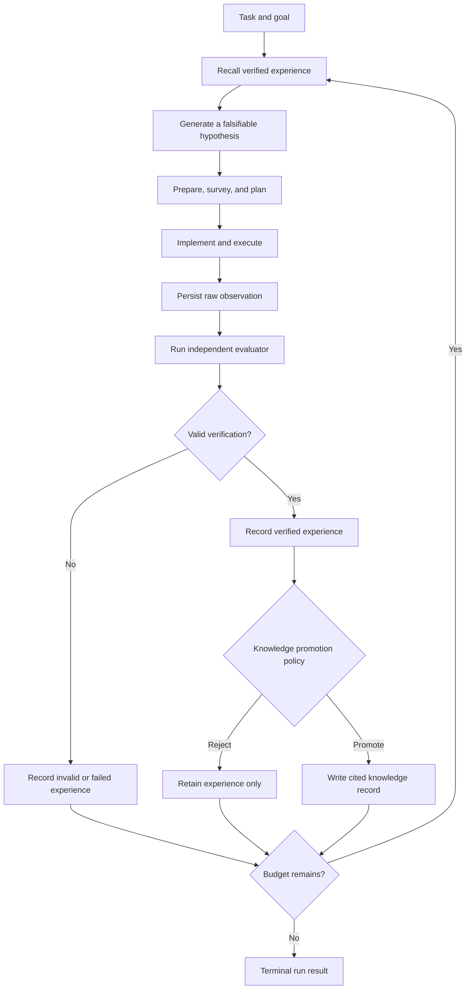

# Experience-Driven Research Loop

**Status:** Accepted; Phases 1–3 implemented

**Audience:** maintainers and contributors implementing the next architecture phase

**Scope:** turn verified research runs into reusable experience that measurably
improves later runs

**Last updated:** 2026-07-26

## 1. Decision

AI-Researcher will add a closed research loop with one governing rule:

> Generated output is not knowledge. Only independently verified observations
> may influence future research decisions.

The first implementation will deepen the existing runtime, evaluation, and
memory Modules instead of adding another parallel agent framework. The loop
will:

1. retrieve relevant, verified experience before a run;
2. execute the existing research stages;
3. evaluate actual artifacts and metrics with a task-specific evaluator;
4. persist the attempt and its provenance as immutable experience;
5. promote reusable knowledge only through an explicit verification policy;
6. expose the verified result to later runs with citations.

The initial storage Implementation will use SQLite for structured records and
the filesystem for large artifacts. Chroma remains a derived semantic index,
not the source of truth. Redis, Neo4j, model-weight updates, and distributed
execution are deliberately deferred.

## 2. Why this design is needed

The current repository already has most of the raw ingredients:

- ordered research stages and artifact guardrails;
- run status, hooks, heartbeats, restart support, and traces;
- Docker-backed execution;
- structural evaluation;
- session, episodic, semantic, code, paper, and tool memory primitives.

They do not yet form a trustworthy learning loop.

### 2.1 Artifact writers and validators disagree

The runtime guardrails and the flow writers do not currently share one schema:

| Stage | Writer output | Guardrail expectation | Consequence |
| --- | --- | --- | --- |
| `implement` | manifest nested under `project_manifest` | top-level `exists` and `key_paths` | a real writer result can be rejected |
| `submit` | `submission_report` | `submit_result` | a real submission can be rejected |

The supervisor tests construct JSON in the guardrail format directly, so they
do not exercise the real writer-to-validator path. A versioned artifact
contract is therefore the prerequisite for every later phase.

### 2.2 Evaluation is structural, not independent

The current evaluation Adapter converts `plan` and `final_output` into evidence.
The evidence metric then uses token overlap to decide whether a claim is
supported. This permits an output to support itself. An empty claim list also
passes evidence coverage.

This evaluator is still useful as a structural quality check, but it cannot be
the verification gate for scientific knowledge.

### 2.3 Memory is not connected to future decisions

`MemoryStore` keeps episodes in a process-local list. Episode retrieval is a
substring match. `MemoryAwareMetaChain` records generic completion summaries,
but the main research flows do not retrieve those episodes before hypothesis
or plan generation. Consolidation currently copies summaries into fact-shaped
objects.

The missing behavior is not another memory class. It is the verified transition:

```text
experiment -> independent evaluation -> immutable experience
           -> promotion decision -> cited recall in a later run
```

### 2.4 Iteration is text-driven

The current refinement loop detects success through a literal
`"fully_correct": true` substring. Later analysis/refinement steps continue to
refer to the original submission result and do not always re-submit and
re-evaluate the modified code.

Scientific progress must instead be driven by typed metrics, comparable
budgets, evaluator versions, and artifact digests.

### 2.5 The two entry flows duplicate orchestration

`run_infer_idea.py` and `run_infer_plan.py` contain near-duplicate long
pipelines. Adding recall, evaluation, persistence, and promotion separately to
both would reduce Locality and create contract drift. The common pipeline must
move behind one deep Module.

## 3. Goals and non-goals

### 3.1 Goals

- Make every stage artifact conform to the same versioned schema used by its
  writer and validator.
- Make independent evaluation a hard requirement for completed research and
  reusable knowledge.
- Persist successful, neutral, negative, failed, and invalid attempts across
  processes.
- Preserve complete provenance from recalled knowledge to experiment artifacts
  and evaluator output.
- Retrieve only scoped, reproducible, budgeted context for a later decision.
- Support memory-off, record-only, recall-only, and closed-loop modes.
- Make retries and restarts idempotent.
- Measure whether prior verified experience improves later runs.
- Keep the first implementation runnable without Redis, Neo4j, or a hosted
  vector database.

### 3.2 Non-goals for v1

- Updating foundation-model weights.
- Multi-machine orchestration.
- General-purpose conversation memory.
- Cross-user knowledge sharing.
- Autonomous publication or submission.
- Best-first tree search across many hypotheses.
- Replacing Scientist-Bench.
- Treating an LLM judge as ground truth when an executable evaluator exists.

Candidate search is intentionally deferred until a single hypothesis can
complete the verified loop reliably.

## 4. Domain language

These terms are normative and should be used in code, tests, logs, and future
documentation.

### Research Run

One invocation of a research entrypoint for a task. A run may contain multiple
Experiment Attempts.

### Hypothesis

A falsifiable proposed change with an expected effect, target metric, and
conditions under which the claim is expected to hold.

### Experiment Attempt

One execution of a Hypothesis under a fixed dataset, code revision, seed,
budget, environment, and Evaluation Contract.

### Observation

A raw result produced by executing an Experiment Attempt. It includes metrics,
artifact references, logs, exit status, and environment data. An Observation is
not yet trusted.

### Evaluation Contract

The task-specific definition of required artifacts, evaluator entrypoint,
metrics, directions, baselines, repetitions, timeouts, and validity rules.

### Verification Record

The immutable result of applying an Evaluation Contract to an Observation. It
is written by the evaluator, not by the research agent.

### Experience Record

An immutable record combining a Hypothesis, Experiment Attempt, Observation,
Verification Record, analysis, and provenance. Invalid attempts remain useful
audit records but cannot become Knowledge.

### Knowledge Record

A reusable abstraction backed by one or more verified Experience Records.
Positive and negative results may both become Knowledge. Invalid or
unverifiable results may not.

### Recall Context

A bounded, cited collection of Knowledge Records and verified Experience
Records selected for one decision.

### Improvement Cycle

The transition from Recall Context through hypothesis, experiment, evaluation,
recording, and promotion to the next run.

## 5. Architecture vocabulary

This document uses the following architecture terms consistently:

- **Module** — an Interface plus its Implementation.
- **Interface** — everything callers must know, including invariants,
  configuration, ordering, and error modes.
- **Seam** — where behavior can vary without editing the caller.
- **Adapter** — a concrete Implementation satisfying an Interface at a Seam.
- **Depth** — the leverage hidden behind a small Interface.
- **Leverage** — behavior callers receive without learning internal details.
- **Locality** — change and verification concentrated in one place.

## 6. Required invariants

These invariants are release blockers, not recommendations.

1. **One artifact contract.** Every writer output must validate against the
   exact versioned schema consumed by the runtime.
2. **No self-evidence.** Plans, analyses, judge prose, and final responses are
   never independent evidence for their own claims.
3. **Evaluator authority.** Only an evaluator satisfying the Evaluation
   Contract may write verified metrics or a Verification Record.
4. **Completion follows verification.** A run is not `completed` until its
   required Verification Record is persisted.
5. **Immutable raw history.** Hypotheses, Observations, and Verification Records
   are append-only. Corrections use superseding records.
6. **Traceable knowledge.** Every Knowledge Record names all source experience
   IDs, evaluator versions, artifact digests, and promotion policy version.
7. **Comparable experiments.** Primary metric, direction, baseline, budget,
   seed, evaluator version, dataset version, and code revision are required.
8. **Private evaluation isolation.** Agents cannot read private labels or
   evaluator-only data.
9. **Scoped recall.** Retrieval must enforce task/domain/dataset scope and must
   record the memory snapshot and ranking scores used.
10. **Idempotent restart.** Re-running an iteration ID cannot duplicate an
    attempt, evaluation, or knowledge promotion.
11. **Behavioral cache identity.** Cache keys include task, prompt, model
    configuration, Recall Context snapshot, code hash, data hash, and evaluator
    version.
12. **Bounded context.** Recall has explicit item and token budgets. More
    matching memories do not imply a larger prompt.

## 7. Target flow



The evaluator is intentionally outside the agent-controlled execution path.
The agent may propose metrics, but it may not declare them verified.

## 8. Deep Modules and Interfaces

The external Interface for the first loop should remain small:

```python
class ExperienceLoop:
    def before_run(self, request: RecallRequest) -> RecallContext:
        """Return a bounded, cited snapshot for the next decision."""

    def after_run(self, completion: RunCompletion) -> LoopOutcome:
        """Evaluate, record, promote, and return the next action."""
```

This gives both entrypoints the same leverage and keeps learning behavior local.
The following Modules live behind this Interface.

### 8.1 Stage Contract Module

**Location:** `research_agent/runtime/artifacts.py`

**Responsibility:** own all stage artifact schemas, serialization, validation,
and legacy normalization.

Proposed envelope:

```python
class StageArtifact(BaseModel):
    schema_version: Literal["1"]
    run_id: str
    task_id: str
    stage: StageName
    status: Literal["completed", "failed", "invalid"]
    created_at: datetime
    payload: dict[str, Any]
    artifact_refs: list[ArtifactRef] = []
```

Each stage has a typed payload model. File names remain compatible during
migration, but writers and validators must import the same model. Guardrails
validate semantics beyond presence, for example:

- referenced files exist;
- the main script is inside the experiment workspace;
- required metrics are finite;
- artifact hashes match;
- the submission exit status is recorded.

Legacy artifacts are read through a `LegacyStageArtifactAdapter`; new writers
never emit legacy shapes.

### 8.2 Experiment Ledger Module

**Location:** `research_agent/inno/experience/ledger.py`

**Interface:**

```python
class ExperimentLedger(Protocol):
    def append_attempt(self, attempt: ExperimentAttempt) -> None: ...
    def append_observation(self, observation: Observation) -> None: ...
    def append_verification(self, verification: VerificationRecord) -> None: ...
    def append_knowledge(self, knowledge: KnowledgeRecord) -> None: ...
    def get_experience(self, experience_id: str) -> ExperienceRecord: ...
    def query(self, query: ExperienceQuery) -> list[ExperienceRecord]: ...
    def snapshot_id(self) -> str: ...
```

Adapters:

- `SQLiteExperimentLedger` for real local runs;
- `InMemoryExperimentLedger` for contract and loop tests.

SQLite runs in WAL mode. Structured records live in the database; large logs,
models, datasets, figures, and papers stay in the filesystem and are referenced
by relative path plus SHA-256 digest.

The ledger is the canonical source of truth. Chroma can be deleted and rebuilt
from it.

### 8.3 Evaluation Module

**Location:** `research_agent/inno/experience/evaluation.py`

**Interface:**

```python
class Verifier(Protocol):
    def verify(
        self,
        contract: EvaluationContract,
        observation: Observation,
    ) -> VerificationRecord: ...
```

Adapters:

- `CommandVerifier` executes a task evaluator in an isolated subprocess;
- `CallableVerifier` runs deterministic Python evaluators in tests and small
  local tasks.

The current `GoalDrivenEvaluator` remains a `StructuralEvaluator`. It may reject
incomplete plans or missing provenance, but it cannot promote Knowledge.

An Evaluation Contract is stored with the benchmark task:

```yaml
schema_version: 1
contract_id: vq/one_layer_vq@1
task_id: one_layer_vq
entrypoint: python evaluate.py --attempt-dir "{attempt_dir}"
timeout_seconds: 900
repetitions: 3
required_artifacts:
  - metrics.json
  - run.log
primary_metric:
  name: fid
  direction: minimize
baseline: 42.10
validity:
  require_finite_metrics: true
  max_failed_repetitions: 0
private_data_dir: evaluator_private/
```

The evaluator receives the attempt directory and evaluator-only data. It writes
a machine-readable result. Its stdout is diagnostic, not the authoritative
metric.

### 8.4 Knowledge Gate Module

**Location:** `research_agent/inno/experience/knowledge.py`

**Interface:**

```python
class KnowledgeGate:
    def decide(
        self,
        experience: ExperienceRecord,
        related: list[ExperienceRecord],
    ) -> PromotionDecision:
        ...
```

The v1 policy is deterministic. Promotion requires:

- a valid Verification Record;
- all required artifacts and digests;
- a known baseline and metric direction;
- no unresolved validity violation;
- a lesson that states conditions and evidence;
- no direct contradiction with a higher-confidence record.

A verified failure may be promoted as negative Knowledge when it identifies a
reproducible dead end. An execution failure without valid evaluation remains
Experience only.

An LLM may draft a lesson, but the deterministic policy decides whether the
record is eligible and preserves all citations.

### 8.5 Experience Retrieval Module

**Location:** `research_agent/inno/experience/retrieval.py`

**Interface:**

```python
class ExperienceRetriever(Protocol):
    def recall(self, request: RecallRequest) -> RecallContext: ...
```

Adapters:

- `KeywordExperienceRetriever` provides an offline, deterministic baseline;
- `ChromaExperienceRetriever` adds semantic candidate retrieval.

Both use the same deterministic final ranker:

```text
score =
    relevance
  + outcome_utility
  + provenance_quality
  + recency
  + novelty
  - redundancy
```

The ranker filters scope before scoring and uses stable tie-breaking. Every
returned item contains a citation ID, source experience IDs, score breakdown,
and short lesson. Raw transcripts are not injected by default.

### 8.6 Shared Research Pipeline Module

**Location:** `research_agent/runtime/research_pipeline.py`

This Module owns the common prepare, survey, plan, implement, judge, submit,
analyze, and verify sequence.

Idea-based and plan-based entry become strategy Implementations:

```python
class ResearchIntentStrategy(Protocol):
    def build_hypothesis(self, request: RunRequest, recall: RecallContext) -> Hypothesis:
        ...


class ReferenceIdeationStrategy:
    ...


class ProvidedIdeaStrategy:
    ...
```

The shared pipeline concentrates stage ordering, artifact writing, trace
capture, evaluation, and loop callbacks. The two CLI files become thin
Adapters that parse arguments and select a strategy.

`MasterRuntime` remains responsible for lifecycle and resumption. It does not
decide scientific truth. `RuntimeHooks` remains an observer Seam and is not
used as the durable knowledge commit path.

## 9. Data model

All persisted models include `schema_version` and reject unknown enum values.
JSON serialization is stable and timestamps are UTC.

### 9.1 Hypothesis

| Field | Required | Meaning |
| --- | --- | --- |
| `hypothesis_id` | yes | deterministic UUID or content-derived ID |
| `task_id` | yes | evaluation task |
| `statement` | yes | falsifiable proposed effect |
| `mechanism` | yes | why the effect is expected |
| `expected_metric` | yes | metric and direction |
| `conditions` | yes | dataset/model/environment assumptions |
| `parent_experience_ids` | no | recalled sources used |
| `citations` | no | papers, code, or memory citations |

### 9.2 Experiment Attempt

| Field | Required | Meaning |
| --- | --- | --- |
| `attempt_id` | yes | idempotency key |
| `run_id` / `iteration_id` | yes | lineage |
| `hypothesis_id` | yes | tested hypothesis |
| `code_revision` | yes | Git SHA or workspace digest |
| `dataset_id` / `dataset_digest` | yes | comparable input identity |
| `model_config_digest` | yes | model and provider configuration |
| `seed` | yes | deterministic seed |
| `budget` | yes | time, token, GPU, and iteration limits |
| `evaluation_contract_id` | yes | verifier contract |
| `recall_snapshot_id` | yes | exact recalled context |
| `status` | yes | completed, failed, invalid, or cancelled |

### 9.3 Observation

| Field | Required | Meaning |
| --- | --- | --- |
| `observation_id` | yes | immutable ID |
| `attempt_id` | yes | source attempt |
| `exit_code` | yes | execution result |
| `metrics` | yes | unverified raw metric observations |
| `artifact_refs` | yes | path, media type, size, and digest |
| `started_at` / `completed_at` | yes | timing |
| `environment_fingerprint` | yes | Python, packages, GPU, OS, container |
| `error` | no | structured failure information |

### 9.4 Verification Record

| Field | Required | Meaning |
| --- | --- | --- |
| `verification_id` | yes | immutable ID |
| `observation_id` | yes | evaluated observation |
| `contract_id` / `contract_version` | yes | evaluator identity |
| `evaluator_digest` | yes | exact evaluator code |
| `valid` | yes | whether evaluation is trustworthy |
| `passed` | yes | contract success result |
| `outcome` | yes | positive, neutral, negative, or invalid |
| `verified_metrics` | yes | evaluator-produced metrics |
| `baseline_comparison` | yes | delta and direction |
| `violations` | yes | failed validity rules |
| `evidence_refs` | yes | evaluator outputs and artifact citations |

### 9.5 Knowledge Record

| Field | Required | Meaning |
| --- | --- | --- |
| `knowledge_id` | yes | immutable ID |
| `scope` | yes | task, domain, dataset, model family |
| `lesson` | yes | concise reusable abstraction |
| `conditions` | yes | where the lesson applies |
| `outcome` | yes | positive or negative |
| `confidence` | yes | deterministic policy result |
| `source_experience_ids` | yes | provenance |
| `promotion_policy_version` | yes | reproducibility |
| `supersedes` | no | correction lineage |

## 10. Persistence layout

Default project-level state:

```text
.ai_researcher/
  experience.sqlite3
  semantic_index/
  artifacts/
    <run_id>/
      <iteration_id>/
        observation.json
        verification.json
        metrics.json
        run.log
        ...
```

Suggested SQLite tables:

- `research_runs`
- `hypotheses`
- `experiment_attempts`
- `observations`
- `metric_observations`
- `verification_records`
- `experience_records`
- `knowledge_records`
- `knowledge_sources`
- `recall_snapshots`
- `recall_items`
- `promotion_decisions`

Foreign keys are enabled. Raw history tables reject updates and deletes through
the public Interface. Retractions and superseding Knowledge Records are
append-only.

## 11. Run lifecycle

### 11.1 Before a run

1. Resolve the task and Evaluation Contract.
2. Compute task, dataset, model, code, and config scope.
3. Create a `RecallRequest` with item and token budgets.
4. Retrieve only verified, scoped records.
5. Persist a Recall Context snapshot.
6. Add cited lessons to `RunContext`.
7. Generate the Hypothesis with explicit parent experience IDs.

If retrieval fails, the run continues with an empty Recall Context and records
the retrieval failure. Retrieval cannot make the system unavailable.

### 11.2 During a run

1. Persist typed stage artifacts through the Stage Contract Module.
2. Record all tool calls and agent steps with artifact references.
3. Include the Recall Context snapshot in cache identity.
4. Persist an Experiment Attempt before code execution.
5. Persist the raw Observation immediately after execution.

The research agent may inspect public metrics during refinement, but private
evaluation data remains isolated.

### 11.3 After execution

1. Run the independent Verifier.
2. Persist the Verification Record atomically.
3. Build and append the Experience Record.
4. Run the Knowledge Gate.
5. Persist either a Knowledge Record or a rejection decision.
6. Mark the runtime completed only if required verification is valid.
7. Return `continue`, `completed`, `failed_budget`, or `invalid`.

If the process crashes after writing an Observation, restart resumes at
verification. If it crashes after verification, restart resumes at promotion.
Idempotency keys prevent duplicates.

## 12. Configuration and CLI

Proposed settings:

```yaml
experience:
  mode: closed-loop       # off | record | recall | closed-loop
  store_path: .ai_researcher/experience.sqlite3
  max_recall_items: 8
  max_recall_tokens: 3000
  semantic_index: chroma  # none | chroma
  include_negative_results: true
  cross_task_recall: false

evaluation:
  contract: benchmark/evaluators/vq/one_layer_vq.yaml
  require_verification_for_completion: true

loop:
  max_iterations: 3
  stop_on_primary_metric: true
```

Equivalent CLI flags:

```text
--experience-mode
--experience-store
--evaluation-contract
--max-loop-iterations
--recall-item-budget
--recall-token-budget
```

Defaults during rollout:

- existing entrypoints: `record`;
- benchmark closed-loop command: `closed-loop`;
- after Phase 2 acceptance: `closed-loop` for supported tasks;
- unsupported tasks fail closed when verification is required and no contract
  exists.

## 13. Cache correctness

Current cache identity is too coarse for trustworthy A/B evaluation. The new
cache key is:

```text
sha256(
  task_id
  + stage
  + normalized_input
  + model_provider_and_version
  + tool_configuration
  + recall_snapshot_id
  + code_revision
  + dataset_digest
  + evaluation_contract_version
)
```

Unattended runs never prompt interactively about stale cache entries. Cache
policy is explicit: `reuse`, `refresh`, or `disabled`.

Memory-on and memory-off experiments must use distinct cache identities.

## 14. Observability

The runtime emits these additional events:

- `recall_started`
- `recall_completed`
- `recall_failed`
- `attempt_recorded`
- `observation_recorded`
- `verification_started`
- `verification_completed`
- `verification_failed`
- `experience_recorded`
- `knowledge_promoted`
- `knowledge_rejected`
- `iteration_scheduled`
- `loop_completed`

Required event fields:

- run, iteration, attempt, and task IDs;
- memory snapshot ID;
- evaluation contract and evaluator versions;
- artifact IDs and digests;
- duration and resource usage;
- terminal status and reason.

Secrets, full prompts containing credentials, private evaluation data, and
raw personal information are redacted before events are written.

## 15. Success metrics

The north-star measurement is **Experience Gain**:

```text
Experience Gain =
  score(closed-loop with prior verified experience)
  - score(same model, task, seed policy, and budget without recall)
```

Supporting metrics:

- valid verification rate;
- repeated-failure rate;
- hypothesis redundancy rate;
- successful experiments per GPU-hour;
- successful experiments per million tokens;
- Recall Context precision;
- percentage of recalled lessons cited in decisions;
- Knowledge promotion precision;
- contradiction and retraction rate;
- run completion and restart-recovery rates;
- Pass@k and variance across repeated runs.

No claim of self-improvement is made until Experience Gain is positive across
multiple tasks and repeated trials.

## 16. Test strategy

The Interface of each deep Module is the test surface.

### 16.1 Stage contract tests

- Feed every real writer output into `validate_stage_artifacts`.
- Cover all stages, not hand-written guardrail fixtures.
- Reproduce and fix the current `implement` and `submit` mismatches.
- Round-trip each versioned schema through JSON.
- Verify legacy artifacts normalize but new writers never emit legacy shapes.

### 16.2 Ledger contract suite

Run the same contract tests against in-memory and SQLite Adapters:

- append and reload after process restart;
- idempotent writes;
- immutable raw history;
- superseding Knowledge Records;
- concurrent writers;
- foreign-key and digest validation;
- stable snapshot IDs.

### 16.3 Evaluation trust tests

- Empty claims do not imply scientific success.
- A plan or final output cannot support its own claim.
- Only evidence with provenance and a digest is accepted.
- Metric direction and baseline are required.
- Private labels are not visible in `RunContext`.
- Invalid, timed-out, or non-finite results cannot be promoted.
- Evaluator version changes produce a new Verification Record.

### 16.4 Retrieval tests

- task and dataset scope filters;
- positive and negative lesson retrieval;
- no cross-task leakage by default;
- deterministic ranking and tie-breaking;
- item and token budget enforcement;
- complete citation IDs and score breakdown;
- index rebuild from the canonical ledger.

### 16.5 Closed-loop integration test

Create one deterministic local task requiring no LLM, Docker, network, or GPU:

1. iteration one produces a verified negative result;
2. the negative lesson is promoted;
3. iteration two receives that lesson with a citation;
4. the strategy changes the Hypothesis;
5. the evaluator returns a better primary metric;
6. the ledger shows exact lineage and no duplicate records.

Additional cases:

- verification failure does not promote;
- crash after Observation resumes at verification;
- crash after verification resumes at promotion;
- memory-off and memory-on caches remain isolated;
- both provided-idea and reference-ideation strategies cross the same pipeline
  Interface.

### 16.6 External evaluation

CI runs deterministic unit, contract, and fake-loop tests. A manually triggered
or scheduled workflow runs a small real Docker experiment. GPU benchmarks
remain outside normal PR CI until a dedicated runner exists.

## 17. Implementation plan

Each slice is independently reviewable and must leave the test suite green.

### Phase 0 — Make existing contracts truthful

**Deliverables**

- Add versioned stage artifact models.
- Update all real writers and guardrails to use them.
- Add writer-to-validator contract tests.
- Fix `implement` and `submit` schema mismatches.
- Separate structural evaluation from scientific verification terminology.
- Remove self-generated plan/final text from independent evidence.
- Make cache policy non-interactive for unattended runs.

**Exit criteria**

- Every stage written by a fixture flow passes its real guardrail.
- No test fabricates a different schema from the writer.
- A run cannot be marked completed before its configured checks pass.

### Phase 1 — Persist independently verified experience

**Deliverables**

- Add domain models and schema versioning.
- Add SQLite and in-memory ledger Adapters.
- Add Evaluation Contract loading and validation.
- Add callable and subprocess Verifier Adapters.
- Record attempts, Observations, Verification Records, and provenance.
- Add one deterministic evaluator fixture.

**Exit criteria**

- Records survive process restart.
- Repeated commits are idempotent.
- The evaluator is the sole writer of verified metrics.
- Failed and invalid attempts are retained but cannot become Knowledge.

### Phase 2 — Close the single-hypothesis loop

**Deliverables**

- Add deterministic Knowledge Gate.
- Add keyword and Chroma retrieval Adapters.
- Add Recall Context snapshots and citations.
- Add `ExperienceLoop.before_run` and `after_run`.
- Extract the shared research pipeline.
- Integrate both entry strategies.
- Add lifecycle events and configuration modes.

**Exit criteria**

- The deterministic two-iteration integration test passes.
- A later iteration can prove which verified experiences influenced it.
- Restart at every durable transition commits exactly once.
- Recall stays within scope and budget.

### Phase 3 — Demonstrate Experience Gain

**Status:** completed for the bounded three-task CPU functional subset. See the
[V5 evidence bundle](../../benchmark/results/scientist_bench_phase3_v5/README.md)
and [ADR-0003](../adr/0003-causally-paired-scientist-bench.md).

**Deliverables**

- [x] Define Evaluation Contracts for a representative Scientist-Bench subset.
- [x] Add memory-off versus closed-loop benchmark runner.
- [x] Execute repeated trials with identical model and budget settings.
- [x] Publish result artifacts, cost, variance, and failure analysis.
- Add a ResearchClawBench Adapter after the internal subset is stable.

**Exit criteria**

- [x] Positive Experience Gain on more than one task.
- [x] Lower repeated-failure rate without materially increasing invalid
  results.
- [x] Results can be reproduced from stored config, code, data, evaluator, and
  memory snapshot IDs.

The V5 run improved FSQ by `+0.1606` and Exphormer by `+0.0667`, but regressed
Immiscible Diffusion by `-0.1333`. Mean repeated-failure rate fell from
`0.2222` to `0.1111`; both modes retained a 100% valid selected-result rate.
This satisfies the aggregate criteria without implying universal improvement.
The result is limited to the task1 CPU functional contracts and makes no
paper-level quality, accuracy, speed, or state-of-the-art claim.

### Phase 4 — Candidate search

Only after Phase 3:

- generate multiple Hypotheses;
- evaluate candidates under a shared budget;
- add best-first, bandit, or other search policy Adapter;
- retain complete parent/child lineage;
- compare search gain separately from memory gain.

## 18. File-level change map

| File or Module | Action |
| --- | --- |
| `research_agent/runtime/artifacts.py` | new versioned stage contracts |
| `research_agent/runtime/criteria.py` | validate typed artifacts and verification state |
| `research_agent/runtime/master.py` | make verified completion explicit and resumable |
| `research_agent/runtime/research_pipeline.py` | new shared pipeline Module |
| `research_agent/runtime/context.py` | add Recall Context and lineage IDs |
| `research_agent/runtime/hooks.py` | emit closed-loop lifecycle events |
| `research_agent/inno/experience/models.py` | new domain models |
| `research_agent/inno/experience/ledger.py` | ledger Interface and SQLite Adapter |
| `research_agent/inno/experience/evaluation.py` | Evaluation Contract and Verifier Adapters |
| `research_agent/inno/experience/knowledge.py` | promotion policy and Knowledge construction |
| `research_agent/inno/experience/retrieval.py` | scoped recall and index Adapters |
| `research_agent/inno/experience/loop.py` | deep external closed-loop Interface |
| `research_agent/inno/evals/evaluator.py` | retain and rename structural checks |
| `research_agent/inno/evals/adapter.py` | remove self-evidence and emit typed observations |
| `research_agent/inno/evals/trace.py` | add artifact/evidence citations and lineage |
| `research_agent/inno/workflow/flowcache.py` | content-addressed cache identity |
| `research_agent/inno/memory/store.py` | keep session memory; stop treating it as durable experience |
| `research_agent/run_infer_idea.py` | thin CLI Adapter using reference-ideation strategy |
| `research_agent/run_infer_plan.py` | thin CLI Adapter using provided-idea strategy |
| `tests/test_runtime/` | real writer-to-validator and resume tests |
| `tests/test_experience/` | ledger, evaluation, retrieval, gate, and loop contract suites |
| `benchmark/evaluators/` | task Evaluation Contracts and evaluator code |

## 19. Pull request sequence

Recommended tracer-bullet sequence:

1. **Stage artifact contracts:** typed artifacts, real writer contract tests, and
   current mismatch fixes.
2. **Evaluation trust:** structural/scientific split and self-evidence removal.
3. **Experience models and ledger:** SQLite persistence with contract suite.
4. **Evaluation Contract:** deterministic task evaluator and Verification
   Record.
5. **Knowledge gate:** verified positive/negative promotion with citations.
6. **Recall:** scoped retrieval, snapshots, budgets, and cache identity.
7. **Closed-loop tracer bullet:** one deterministic task across two iterations.
8. **Shared pipeline extraction:** move both entry strategies behind one
   Interface.
9. **Scientist-Bench subset:** memory-off versus closed-loop comparison.
10. **Search policy:** only after measurable single-loop improvement.

Do not combine the first eight items into one large rewrite. Each pull request
must add an Interface-level test that survives later Implementations.

## 20. Rejected alternatives

### Add Redis and Neo4j first

Rejected for v1. They add operational complexity without fixing verification,
schema consistency, or provenance. SQLite and Chroma are sufficient to prove
the loop.

### Store full conversations as long-term knowledge

Rejected. Transcripts are low-density experience and may contain unsupported
claims. Store structured, cited lessons backed by verified experiments.

### Let the judge agent decide what becomes knowledge

Rejected. The judge may help interpret an experiment, but promotion eligibility
must depend on an independent Verification Record and deterministic policy.

### Add tree search before persistence and evaluation

Rejected. Parallel search multiplies invalid experiments when the observation
and verification contracts are not trustworthy.

### Replace all existing memory code

Rejected. Existing session and RAG memory remain useful. Durable experimental
experience gets a distinct domain model so conversation state is not confused
with verified knowledge.

## 21. Definition of done for v1

The experience-driven loop is v1-complete only when all statements below are
demonstrably true:

- Real flow writers and runtime validators share one versioned contract.
- A task-specific evaluator independently verifies actual artifacts and metrics.
- Runtime completion requires a persisted valid Verification Record.
- Every attempt, including failures, survives restart with complete provenance.
- Only verified experience can pass the Knowledge Gate.
- A later run automatically retrieves a bounded cited Recall Context.
- The deterministic two-iteration test proves end-to-end feedback.
- Memory-on/off runs have isolated caches and reproducible configuration.
- The existing test suite and new contract suites pass in CI.
- At least one benchmark report compares closed-loop and memory-off behavior
  under the same model and budget.

Until these conditions hold, documentation and releases should describe memory
as experimental infrastructure rather than self-improvement.
