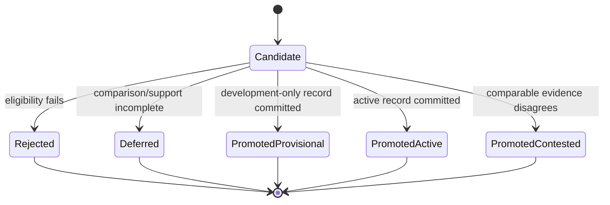
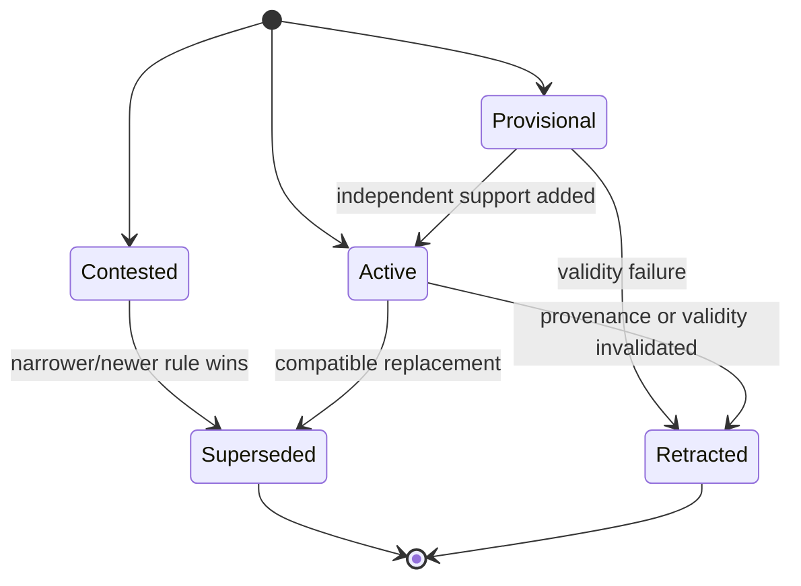

# Verified Research Memory

**Status:** Proposed; implementation contract complete, pending maintainer approval

**Audience:** maintainers implementing knowledge distillation, decision-point
retrieval, procedural memory, memory lifecycle, and memory evaluation

**Scope:** decide what verified research experience becomes active memory, what
is recalled for one decision, how that recall is used, and how memory benefit is
measured

**Owner:** AI-Researcher maintainers

**Last updated:** 2026-07-31

**Implementation and validation documents:**
[Verified Research Memory implementation plan](../implementation/verified-research-memory-plan.md)
and
[Memory effectiveness evaluation protocol](../implementation/memory-effectiveness-evaluation.md)

**Authority:** [`CONTEXT.md`](../../CONTEXT.md) is authoritative for domain
identity and terminology. [Experience-Driven Research Loop](experience-driven-research-loop.md)
is authoritative for Hypothesis, Experiment Attempt, Observation, independent
Verification, and Experience Record semantics. [Durable Research Runtime and
Stage Continuation](durable-research-runtime.md) is authoritative for Research
Run ordering, Research Context Snapshot, Runtime Activity, Effect, artifact,
restart, budget, and terminal-completion semantics. This document is
authoritative for Experience Distillation Receipt, Knowledge Candidate,
Knowledge Family, Knowledge Record,
Procedure Record, Knowledge Lifecycle Event, Decision Point, Evidence Card,
Decision Intent, Recall Context, Recall Decision Outcome, Evidence Snapshot,
Knowledge Snapshot, Recall Input Snapshot, and derived memory index semantics.
Older text in the experience-loop design or next-round plan does not override
this document in those areas.

[Context-Aware Tool Use and Governed Tool Effects](context-aware-tool-use.md) is
authoritative for Capability Catalog, Tool Interaction, Tool Decision Record,
model-visible tool exposure, the tool-authorization contract, and ToolFeedback.
When a Recall Context informs a tool decision, this document owns the terminal
Recall Decision Outcome and per-card disposition; the tool-use design owns
capability eligibility, exposure, and proposal validation; Durable Runtime alone
executes and commits final authorization and Physical Invocation state.

The key words **MUST**, **MUST NOT**, **SHOULD**, **SHOULD NOT**, and **MAY** in
this document are normative.

## 1. Decision

AI-Researcher will treat research memory as a governed transition from evidence
to decision support, not as an ever-growing prompt or an unqualified vector
store.

The governing rule is:

> The evidence ledger may grow, derived indexes may be rebuilt, active knowledge
> must be governed, Recall Context must be bounded, and memory effectiveness
> must be demonstrated by future decisions and independently verified outcomes.

The Implementation will preserve five logically distinct memory planes:

1. bounded Working State for the current Research Run;
2. an immutable Experience Ledger for what happened;
3. verified semantic Knowledge Records for conditional action-effect claims;
4. verified Procedure Records for reusable research workflows;
5. source/reference records for papers, code, datasets, and tool documentation.

Only the third and fourth planes are active experiential memory. The fifth is
reference retrieval. The first is runtime state. The second is evidence. None
of these terms are interchangeable.

A Research Run MUST NOT receive a dump of any plane. A typed Decision Point
creates one scoped request and receives one bounded, cited Recall Context.

## 2. Current-state evidence and claim boundary

The current `main` implementation already provides a strong evidence and
Intervention foundation:

| Area | Current evidence | Claim boundary |
| --- | --- | --- |
| Immutable Experience | `research_agent/inno/experience/ledger.py` provides in-memory and SQLite Adapters, idempotent append, WAL, integrity checks, and schema revision 2 | Strong persistence mechanics; not memory quality |
| Independent Verification | `evaluation.py`, Evaluation Contracts, and evaluator-specific evidence | Validity of an Observation; not usefulness of a lesson |
| Governed Intervention | `runtime/adaptive_experiment.py` and Phase A provenance sidecars | Recall can cause a legal executable change; not outcome gain |
| Knowledge promotion | `knowledge.py` copies one `ExperienceRecord.analysis` into `KnowledgeRecord.lesson` | Mechanism smoke only; not comparative knowledge |
| Retrieval | production uses `KeywordExperienceRetriever`; the optional Chroma Adapter uses SHA-256 bytes as its embedding | Deterministic plumbing; not semantic retrieval |
| Recall integration | `ExperienceRunAdapter` injects cited Recall Context into the current loop | Cited prompt input; not proof of correct use |
| Outcome evidence | the V2 five-seed experiment had identical execution identity and zero paired delta | It tested wiring, not Experience Gain |

Phase A, implemented in `f585de4`, established the `Recall -> Intervention ->
executed configuration -> Trial Provenance` mechanism. This design begins where
Phase A stops. It MUST NOT claim that semantic memory improves research until
the evaluation protocol in this document set passes.

The legacy modules under `research_agent/inno/memory/` remain useful for session
state and source lookup, but process-local episodes, summary-to-fact
consolidation, and hash fallback embeddings MUST NOT supply trusted Knowledge
Records or confirmatory Recall Context.

## 3. Goals and non-goals

### 3.1 Goals

- Preserve all valid, invalid, positive, neutral, negative, and failed
  Experience Records without injecting them all into context.
- Distill semantic knowledge only from comparable, independently verified
  Experience Records and Trial Provenance.
- Represent applicability, action, observed effect, uncertainty, supporting
  evidence, counterevidence, and lifecycle explicitly.
- Make recent verified Experience available without prematurely calling it
  stable Knowledge.
- Compile repeated verified trajectories into versioned Procedure Records.
- Retrieve at typed Decision Points with hard scope and security filters before
  relevance ranking.
- Record which Evidence Cards were adopted or rejected and bind adopted cards
  to the resulting Hypothesis, Intervention, tool call, or claim digest.
- Freeze a content-addressed Knowledge Snapshot for causal experiments.
- Keep every derived index replaceable and rebuildable from canonical records.
- Measure writer, lifecycle, retrieval, utilization, behavior, outcome,
  robustness, and efficiency separately.
- Preserve a fresh-start path for decisions where memory anchoring can reduce
  exploration.

### 3.2 Non-goals

- General-purpose conversation or user-profile memory.
- Updating foundation-model weights.
- Deleting or rewriting raw Experience Records to simulate forgetting.
- Treating an LLM reflection, summary, judge response, or importance score as
  verified knowledge.
- Adding Redis, Neo4j, or a hosted vector database before the local Interface
  and acceptance gates are proven.
- Letting retrieval change the Evaluation Contract, private evaluator data,
  dataset identity, seed, or protected Intervention Catalog fields.
- Using public long-conversation benchmarks as the release-level proof of
  research improvement.
- Replacing Durable Research Runtime ordering with a second coordinator inside
  the memory package.

## 4. Domain model

Canonical definitions live in [`CONTEXT.md`](../../CONTEXT.md). The summaries
below explain the design relationships.

### 4.1 Decision Point

A typed moment inside a pinned workflow where bounded evidence may influence
one governed decision. Initial values are:

- `ideation`;
- `experiment_design`;
- `intervention`;
- `diagnosis`;
- `writing`.

`evaluation` is intentionally not a memory-consuming Decision Point. The
evaluator reads the Evaluation Contract and immutable evidence, never actor
memory.

#### Task identity and transfer scope

`evaluation_task_id` identifies one concrete benchmark/product task instance;
it is used for pair lineage, split isolation, and contamination checks.
`task_scope_id` identifies a preregistered reusable public taxonomy node (for
example, task family + problem type) from which retrieval applicability can be
decided without evaluator-private data. It is content-addressed and exact-match
in v1. Evidence retains its source evaluation-task IDs, but transferable
Knowledge normally scopes to `task_scope_id`, not to those instance IDs.

An explicitly instance-specific record MAY also bind `evaluation_task_id`; it
can support only same-task/new-seed claims. A held-out-task claim requires a
different evaluation-task ID, the same allowed task-scope ID, and zero overlap
between evaluation-task lineage and all source evidence. “Task” without one of
these suffixes is not a persisted field in the new memory domain.

### 4.2 Decision Intent

The preallocated immutable identity of one occurrence of a Decision Point. It
binds Research Run, Runtime Activity, iteration/generation, experiment arm and
pair when applicable, `evaluation_task_id`, public `task_scope_id`, Research
Context Snapshot, an actor-visible sanitized
Decision Contract View, preallocated logical decision slot and artifact kind,
allowed action surface, and an immutable Memory Governance Binding copied from
the admitted Run/arm manifest. That binding contains exact memory-profile and
assignment-manifest refs/digests plus
`recall_requirement=REQUIRED | REGISTERED_NOT_REQUESTED`; it excludes private
labels/answers. The committed artifact ID/digest is bound later in
the outcome. One Recall Context can inform exactly one Decision Intent.

### 4.3 Knowledge Candidate

An untrusted, immutable proposed abstraction derived from one or more Experience
Records. A candidate records its drafting inputs and policy versions but is not
recallable. LLM output can create a candidate, never an active Knowledge Record.

### 4.4 Knowledge Family

The stable identity of one conditional claim across record versions, scope
variants, support changes, contradictions, and supersession. `family_id` is
derived from record kind, normalized Decision Point, action target, outcome
metric, and mechanism class; wording and applicability scope are excluded.

A separate `scope_variant_id` is derived from `family_id` plus normalized
`MemoryScope`. Lifecycle heads are unique per scope variant. Retrieval may
select only an applicable variant and returns at most one card per family.

### 4.5 Knowledge Record

An immutable version of a verified conditional action-effect rule backed by
comparable Experience Records. It states where the rule applies, what governed
action it recommends or avoids, what effect was observed, how uncertain that
effect is, and which evidence supports or contradicts it.

### 4.6 Procedure Record

An immutable, versioned research workflow with a trigger, preconditions, ordered
steps, success criteria, failure modes, compatible tool/runtime versions, and
verified Experience citations. A Procedure Record is not a transcript and is
not promoted from a single free-form reflection.

### 4.7 Knowledge Lifecycle Event

An append-only transition that changes the derived disposition of one Knowledge
or Procedure Record. Initial dispositions are `provisional`, `active`,
`contested`, `superseded`, and `retracted`. The record payload is immutable; the
current disposition is a deterministic fold over lifecycle events.

### 4.8 Evidence Card

The bounded read model rendered for one Decision Point. It contains a claim or
procedure, applicability, action implication, observed effect, uncertainty,
supporting and contradicting citations, current disposition, and the reason it
was retrieved. It contains no hidden instructions and grants no authority to
change protected settings.

### 4.9 Recall Context

An immutable, content-addressed set of Evidence Cards selected for one Decision
Intent under one Recall Input Snapshot. It may contain cards backed by Knowledge
or Procedure Records whose lifecycle disposition is explicitly admitted by the
pinned profile, or exact verified Experience members clearly labelled
`episodic`. Evaluation/confirmatory/production profiles are active-only;
`provisional|contested` records are permitted only in an explicit development
profile and remain visibly labelled/non-actionable as that profile specifies.
It is not chat history or a ledger snapshot.

### 4.10 Recall Decision Outcome

The immutable terminal account for every Decision Intent, including blocked,
not-requested control, empty, degraded, actor-failed, rejected, no-op,
completed, and cancelled cases. It records
the optional Recall Context, the disposition of every returned Evidence Card,
why each card was adopted or rejected, and the optional resulting decision
artifact digest. For Intervention it also binds adopted citations to the
resulting Intervention and effective config digest. A zero-card outcome has no
item dispositions but remains in all denominators.

### 4.11 Knowledge Snapshot

A content-addressed, read-only set of eligible Knowledge and Procedure record
versions plus the exact lifecycle ledger position, namespace, and snapshot
selection-policy digest. Retrieval Policy and derived index identity are
deliberately excluded, preventing a hash cycle. A changed selection or
distillation policy produces new records or a new snapshot; evaluation-seed
outcomes never mutate an existing snapshot.

### 4.12 Evidence Snapshot

An immutable, content-addressed membership list of canonical verified
Experience bundles captured at one trusted monotonic ledger position inside one
read transaction. It binds namespace, Run/arm/pair visibility, and an episodic
eligibility policy. `created_at` is not a ledger position. Confirmatory within-
Run episodic recall may use only the current arm's own prior verified evidence;
cross-arm and cross-pair membership are forbidden.

Capture returns an `EvidenceSnapshotCommitReceipt` containing the immutable
snapshot and its one canonical commit-journal receipt. The caller must use the
Store getter to read back the snapshot, recompute its ID/payload digest, and
verify the original journal position. `FreezeEvidenceRequest` also carries a
stable `capture_operation_id` and canonical request digest, normally derived
from the Runtime logical capture Effect. The Store atomically journals a
capture-operation receipt mapping that key to the chosen snapshot/position.
Retry first resolves that mapping: same key/same request returns the original
snapshot and positions even if newer Evidence now exists; same key/different
request is an identity conflict. The operation key is not part of the Snapshot
content ID, so two independently requested but content-identical captures may
share one Snapshot without sharing operational idempotency.

The first semantic-memory confirmatory profile disables the episodic lane and
passes each arm's own immediate PreviousAttemptFeedback as Working State. A
later full-memory profile MAY enable arm-local episodic recall, but its claim is
profile-level and must not attribute gain only to semantic Knowledge.

### 4.13 Recall Input Snapshot

The content-addressed composition actually queried by a Decision Intent: exact
Knowledge Snapshot ID, optional Evidence Snapshot ID, Retrieval Policy and
renderer/tokenizer digests, and immutable ready derived-index build receipts. Indexes
depend on source snapshots; this composite is created only after their build,
so no identity cycle exists. Reference Context remains separate.

### 4.14 Durable Distillation Work

`DistillationWorkItem` is the immutable outbox fact that one eligible Experience
must be considered by a later comparative batch. Its content ID is the stable
campaign-admission/idempotency key; it also has
namespace/scope, Experience ID, and pinned Distillation + Lifecycle Policy
identities plus a content-addressed Campaign Admission Profile. That profile
freezes workflow/continuation, model/tool/Adapter configuration, Budget
Envelope, retention, and v1 singleton-cardinality defaults before enqueue, so
rolling-deployment config cannot create two different manifests for one item.
The profile bytes live only in Runtime's Artifact Store. Before Ledger enqueue,
the builder publishes those bytes, computes the Work Item ID from the Experience,
policies, and profile ref/digest, and asks Runtime to atomically create a
deterministic `ACTIVE` artifact reference owned by
`DISTILLATION_WORK_ITEM:<work_item_id>` plus a `PENDING` handoff. The Work Item
stores that reference ID as immutable append metadata; it is derived from the
already-computed Work Item ID/profile digest and is excluded from the Work Item
content-ID projection, avoiding a hash cycle. Runtime's artifact-reference table
is the sole authority for byte reachability and GC; a Ledger row or historical
digest is never an implicit byte root.
`DistillationWorkAssignment` append-only binds that item to one
`MEMORY_DISTILLATION` Research Run and Runtime Activity.
`DistillationWorkCompletion` is the terminal reconciliation record that binds
the work item to that campaign Run/Activity and a canonical Distillation Batch +
Report pair, or to an explicit `dead_letter` or `cancelled` outcome. Batch and
Report are journaled Experiment Ledger records: the Batch freezes exact work/
evidence/candidate inputs and policies; the Report freezes exact decisions,
committed outputs, per-Work-Item dispositions, coverage, and final active-view
digest. Each successful Work Item has exactly one journaled
`DistillationWorkDisposition`: `covered_by_decision` binds a real Candidate/
Decision; `deferred_no_comparator`, `rejected_not_comparable`, and
`rejected_no_candidate` require both to be absent. Thus a valid “not yet enough
comparative evidence” result completes normally without inventing a Candidate
or abusing dead-letter. A completed record
carries foreign keys to both plus the Report's canonical payload digest, never
a bare unresolved digest. Runtime owns claim leases and retries; the Experiment
Ledger owns the durable work fact, Batch/Report proof, and terminal linkage.

### 4.15 Memory Retention Tombstone

`RetentionErasureIntent` is the first immutable, journaled record in every
erasure flow. It binds incident, namespace, target kind/ID/last digest, reason,
expected retraction event or typed N/A, the exact external material/object
generation, and the sorted affected index-build/artifact set. It is appended
with the lifecycle retraction event/head CAS in one Ledger transaction for
Memory/Procedure targets, and alone with typed N/A for approved non-lifecycle
targets, always **before** external erasure or invalidation. An Intent without its matching final
Tombstone is open: active-view, Snapshot, index, Recall Input, and retrieval
publication all deny its target, and a recovery scanner must finish the same
incident rather than start a new one.

`MemoryRetentionTombstone` is an immutable, content-addressed denial marker for
a record made unavailable after authorized erasure of its separately stored
raw/encrypted payload or Runtime artifact material. It stores target kind, ID,
last trusted canonical payload digest, incident, reason, and erasure receipt.
Schema v3 canonical `payload_json` is a non-private governance/audit projection
and remains with its foreign-key identity and commit-journal row. Snapshot and
index builders MUST exclude tombstoned identities before loading content.
For Memory/Procedure targets it also binds the prior lifecycle retraction event;
for registry-approved non-lifecycle targets it carries an explicit typed N/A.
The erasure receipt and every affected index-invalidation acknowledgement are
stored as resolvable ref+digest pairs. For Runtime-owned artifact/index material,
the Retention Adapter must resolve them through the Runtime-owned
`RetentionRuntimeRead` getter to typed proofs binding namespace, incident,
target/object generation, operation, terminal state, event sequence, and
canonical digest; caller-supplied naked refs do not suffice. Snapshot/index/Recall Input publication
is blocked from the Intent onward and remains blocked until the reconciled
tombstone and all acknowledgements read back. `RETENTION_KINDS` contains both
Intent and Tombstone. A publication check is always derived from the current
namespace retention frontier/set inside one Store transaction; callers cannot
choose an older frontier.

## 5. The five memory planes

| Plane | Canonical source | Retention | May enter Recall Context? | What it answers |
| --- | --- | --- | --- | --- |
| Working State | Durable Runtime state and current Research Context Snapshot | bounded by Run and stage policy | no; typed fields enter the Decision Intent/request | What are we doing now? |
| Episodic Evidence | Experiment Ledger plus Runtime-owned artifact refs | append-only; cold storage may grow | exact Evidence Snapshot members only, with episodic label | What happened? |
| Semantic Knowledge | governed Knowledge Records plus lifecycle events | immutable versions; active view is derived | yes | Under what conditions did an action have what effect? |
| Procedural Memory | governed Procedure Records plus lifecycle events | immutable versions; active view is derived | yes | When and how should a verified workflow run? |
| Source/Reference | content-addressed papers, code, datasets, and tool docs | source retention policy | no; Reference Cards enter the Research Context Snapshot or a separately typed Reference Context | What do external sources say? |

Vector, keyword, graph, and temporal indexes are not a sixth plane. They are
derived Implementations behind retrieval seams and MUST be disposable.

## 6. Authority, ordering, and store ownership

### 6.1 One workflow ordering authority

`LongTaskRuntime` and `StageContinuation` own workflow ordering. Memory Modules
never schedule stages. The initial experiential recall order is:

```text
prepare / survey / method review
  -> commit and freeze Research Context Snapshot
  -> preallocate typed Decision Intent and sanitized Decision Contract View
  -> capture exact arm-local Evidence Snapshot when episodic recall is enabled
  -> resolve exact Recall Input Snapshot
  -> build bounded Recall Context
  -> make the decision and commit Recall Decision Outcome
  -> open Experiment Attempt if applicable
```

Source/reference retrieval used to build the Research Context Snapshot is not
experiential recall. This resolves the apparent conflict between early survey
retrieval and post-snapshot Intervention recall.

The current `ExperienceLoop.before_run()` / `after_run()` Interface becomes a
migration Adapter behind Runtime Activities. It is not a second application
entrypoint and does not own continuation after the Durable Runtime migration.

### 6.2 Store ownership

Durable Runtime owns:

- Research Run and Runtime Activity state;
- Effect and Physical Invocation receipts;
- Budget Envelope;
- content-addressed artifact commit and retention;
- the only artifact-byte GC-root relation, including Work-Item-owned Campaign
  Admission Profile references and their enqueue handoffs;
- `DistillationCampaignManifest` artifacts and `MEMORY_DISTILLATION` Research
  Run/Activity lifecycle;
- lease, fencing, restart, cancellation, and terminal state.

Experiment Ledger owns:

- Hypothesis, Experiment Attempt, Observation, Verification, Experience;
- Intervention and Trial Provenance sidecars;
- Experience Distillation Receipts, Knowledge Candidates, Distillation
  Work Items/Assignments/Completions, Decisions, governed memory records, lifecycle events,
  and retention tombstones;
- Evidence/Knowledge/Recall Input Snapshots, Recall Context, and Recall Decision
  Outcome;
- derived-index build receipts and Runtime-owned index artifact refs/digests.

Recall Decision Outcome is keyed and owned by Decision Intent, whose Runtime
Activity may optionally reference an Experiment Attempt. It is not an Attempt
child and may be committed before an Attempt exists; a later Attempt link is
additional lineage, never reparenting.

The Experiment Ledger MUST store Runtime artifact references and digests, not a
second copy of artifact lifecycle state. It MUST NOT add a competing
`research_runs` authority table.

### 6.3 Cross-store commit

There is no distributed transaction between Runtime state and Experiment
Ledger. The Runtime Activity Effect owns reconciliation:

1. derive stable record IDs and canonical payload digests;
2. append the memory/experience records idempotently;
3. read them back and verify identity and lineage;
4. commit the Runtime Activity result and artifact references;
5. on recovery, reconcile by stable IDs before repeating an append.

A Research Run cannot enter any terminal state until every
Run-owned Decision Intent has its Recall Decision Outcome and every
completion-required Experience has its own durable Experience Distillation
Receipt. A receipt may say `queued_for_comparison`, `deferred_ineligible`,
`not_required`, or proof-authorized `abandoned_before_enqueue`; completion does not wait for a later
cross-Run comparative batch to promote Knowledge. Duplicate physical invocation
never creates duplicate logical records.
For every queued receipt, however, record closure also requires Runtime read-back
of the matching handoff in `BOUND` state and the Work-Item-owned artifact
reference in `ACTIVE` state. This proves that the Ledger Work Item cannot outlive
its profile bytes. The reference is not Run-owned and therefore does not keep the
source Run non-terminal after it is bound.

For `FAILED/CANCELLED`, this closes only already-preallocated Intents and
already-existing completion-required Experiences with typed failure/cancellation
outcomes; it does not fabricate absent Attempts, Verification, Experience, or
Intents. Durable Runtime's `FAILING/CANCELLING` states wait for this record-closure
barrier before their terminal transition.

Decision recall uses an explicit per-Intent commit protocol; a unique
`intent_id` constraint is not a concurrency protocol. Intent admission first
publishes a complete `DecisionIntentProposal` Runtime artifact. Runtime reads it
back and CAS-creates a `REGISTERING` phase plus a content-bound admission
authorization; `DecisionIntentAdmissionProof` is the Store-facing strict view of
that authorization. The Ledger appends/read-backs the exact Intent or returns a
typed no-commit receipt, after which Runtime advances to `OPEN` or retires the
ghost registration. Cancellation/failure during `REGISTERING` is pending until
that result: a committed Intent is then closed normally, while proved no-commit
leaves no Run-owned Intent to fabricate.

Runtime thereafter owns the durable phase
`OPEN -> CONTEXT_COMMITTED -> OUTCOME_COMMITTED` and issues a single-use,
content-bound `DecisionRecallCommitAuthorization` before either Ledger append.
Context authorization is valid only from `OPEN`; normal Outcome authorization is
valid from `CONTEXT_COMMITTED`, or directly from `OPEN` for a registered
not-requested or typed blocked path. The authorization pins transition kind,
Intent/Run/Activity/generation/fence, expected record ID and payload digest, and
the preceding Context identity when applicable. The Ledger transaction reads
back and validates it, rejects Context append when an Outcome already exists,
and rejects Outcome append when its Context/phase does not match.

Intent, Context, and Outcome append each returns either the canonical Ledger append receipt or one journaled
`DecisionRecallNoCommitReceipt`; transport errors and missing rows are not
no-commit proof. The no-commit transaction first validates the authorization,
writes zero Intent, Context, Context-item, Outcome, and disposition records, and
atomically journals a closed
precondition/record-conflict/authorized-payload-rejection reason. Success and
no-commit are mutually exclusive per authorization, exact retry returns the same
journal position, and Runtime retires an attempt only after Store getter
read-back of that receipt and digest.

The terminal record-closure enumerator joins Runtime phase projection to the
Ledger: it must reconcile every `REGISTERING` attempt, but counts as a
preallocated Run-owned Intent only an exact read-back Intent whose admission
receipt advanced Runtime to `OPEN` or later. A ghost/retired registration cannot
create an Outcome, and a Ledger Intent without matching Runtime admission
reconciliation is an integrity wait, never silently omitted.

The join is implementable through `get_decision_intent_coverage(run_id,
barrier_proof)`, not by get-by-ID guesses. After Runtime freezes a typed terminal
barrier and reconciles all active authorizations, the Store verifies that the
proof embeds the exact freeze ID/epoch/control event/fences and
in one read transaction returns a fixed ledger frontier, complete canonical list
of every Intent/admission-metadata/optional Context/Outcome for that Run, and a
coverage digest. Runtime compares it bidirectionally with REGISTERING/OPEN+ phase
projection and binds frontier/digest into terminal CAS; a Ledger-only orphan or
Runtime-only ghost becomes an integrity wait.

Authorization issuance enters `CONTEXT_COMMITTING` or `OUTCOME_COMMITTING` until
the exact Ledger receipt or a proved no-commit result is reconciled. A concurrent
cancel/failure cannot revoke that attempt and guess that no write occurred; it
persists a pending closure intent. If the authorized append commits, Runtime
advances the phase and applies the pending cause from that point: after a Context
commit it grants only a closure-Outcome authorization; after an Outcome commit
the cause is too late to replace that immutable Outcome, though Run closure may
continue. If the append proves no commit, Runtime retires the authorization and
the pending closure wins before any new normal authorization. Cancel/failure
that wins before authorization grants a mutually exclusive Runtime-closure
authorization. Crash recovery reuses the same expected IDs and authorization;
unresolved state never permits a second writer.

This arbitration covers both pre-Context and post-Context closure. A post-Context
cancel or actor failure preserves that Context and Runtime authors exactly one
Outcome. Every returned card receives `not_considered_cancelled` or
`not_considered_actor_failed`; an empty Context has zero dispositions. Normal
actors cannot emit those Runtime-only reasons. Thus late Context append, stale
normal Outcome append, and cancellation/failure closure cannot win independently
in different stores.

The authorization cannot precede the content it binds. Retrieval first publishes
exactly one member of the closed
`DecisionRecallContextProposal | DecisionRecallBlockedProposal` union as a Runtime
artifact. Runtime reads a Context proposal back before granting Context
authorization. A blocked proposal is instead a terminal source proof: Runtime
reads it back, creates no Context authorization, and requires the later blocked
`RecallDecisionOutcomeProposal`, its `APPEND_OUTCOME/NORMAL` authorization, and the
canonical Outcome to carry the same blocked-proof ref/digest. The memory Store
independently resolves that immutable artifact through the strict blocked-proof
getter and compares its full payload and digest; a caller-supplied reason code or
ref is not proof. Likewise, normal decision or Runtime closure first publishes a
complete `RecallDecisionOutcomeProposal`, then Runtime reads back its expected
Outcome ID/payload/proposal digests before grant.
The Store must append canonical payload bytes exactly equal to the proposal's
record. Admission/commit authorization ID/digest is immutable append metadata
written in the same transaction but explicitly excluded from Intent/Context/
Outcome canonical payload and record ID; otherwise proposal and authorization
digests would form a hash cycle.
The acyclic order is canonical record -> proposal artifact -> authorization ->
record plus authorization metadata, with golden vectors for all three record kinds.
Proposal artifacts are not canonical Ledger records and cannot satisfy read-back
or terminal closure by themselves.

Runtime control does not synchronously call the Ledger while holding its writer
transaction. It first commits an immutable authorization/proof, then an
independent system Commit Coordinator obtains it through a read-only Runtime
Interface with no write transaction held, closes that read, performs the Ledger
transaction, and finally submits the Ledger receipt for Runtime reconciliation.
GRANTED authorization remains valid until success/no-commit arbitration resolves;
control commands cannot revoke it. This topology prevents control→Ledger→control
self-deadlock and cross-store write-lock coupling while preserving one logical
authorization owner.

`queued_for_comparison` is true only when the receipt and its unique
`DistillationWorkItem` are inserted and read back in the same Experiment Ledger
transaction. On restart, Runtime scans work items without terminal completion,
reconciles the same campaign manifest/assignment, and drives the owning
`MEMORY_DISTILLATION` Run idempotently. It never appends an Activity to the
source Run. A terminal `dead_letter` remains visible and cannot be interpreted
as successful distillation.

Every canonical logical-record append made while a schema-v3 Store is open,
including appends to legacy v1/v2 tables, MUST insert exactly one
`ledger_commits_v1` row in the same local transaction as the canonical row.
Normalized member/item/disposition rows that are exact indexed projections of a
journaled parent payload are not separate logical records and do not get extra
journal positions. Exact replay verifies the existing payload
digest and journal row and returns its original position; it never allocates a
new position. A canonical row without a journal row, a journal row without its
canonical row, or a digest mismatch fails Store integrity/open. The in-memory
Adapter increments and commits the same logical counter while holding its Store
lock.

Snapshot cutoffs use typed namespace frontiers, not the latest global append:

- the **Evidence frontier** is the maximum journal position among canonical
  Hypothesis, Attempt, Observation, Verification, Intervention, Trial
  Provenance, and Experience record kinds eligible for that namespace;
- the **lifecycle frontier** is the maximum journal position among Knowledge
  Lifecycle Events eligible for that namespace;
- Snapshot, Recall, Outcome, index-receipt, outbox, and acceptance records do
  not advance either frontier.

Therefore committing or replaying a snapshot cannot change the frontier used to
identify that same snapshot. Migration bootstrap positions are auditable
metadata, not reconstructed historical order; `legacy_unscoped` rows are
ineligible for active snapshots.

## 7. Normative invariants

These requirements are release blockers.

### Evidence and writing

- **VRM-W01 — Immutable evidence.** Distillation MUST NOT modify or delete an
  Experience Record, Observation, Verification Record, or Trial Provenance.
- **VRM-W02 — Candidate isolation.** Knowledge Candidates MUST NOT be returned
  by normal or confirmatory recall.
- **VRM-W03 — Independent verification.** Every evidence edge used for
  promotion MUST resolve through a canonical Verified Evidence Bundle whose
  Hypothesis, Attempt, Observation, Verification, Intervention, and Trial
  Provenance payloads/digests match their authoritative ledger rows. Nested
  copies inside an Experience Record are not trusted independently.
- **VRM-W04 — Comparative knowledge.** An active semantic rule MUST be based on
  a registered baseline/intervention contrast or a policy-defined set of
  comparable independent support units; a single prose analysis is insufficient.
- **VRM-W05 — Actionability.** Active semantic rules MUST identify a Decision
  Point and an action, avoidance, or explicit abstention implication.
- **VRM-W06 — Independent support.** Repeated ingestion of the same run, seed,
  Observation, comparison, or Intervention does not increase support.
- **VRM-W07 — Counterevidence.** Contradicting valid evidence is retained and
  changes lifecycle disposition or evidence strength; it is never silently
  discarded.
- **VRM-W08 — Deterministic eligibility.** An LLM MAY draft a candidate, but a
  versioned deterministic policy decides promotion eligibility and lifecycle
  transition legality.
- **VRM-W09 — Durable ingestion.** A `queued_for_comparison` receipt MUST have
  one atomically committed Distillation Work Item; campaign admission,
  assignment, restart, and retry MUST converge on one
  `MEMORY_DISTILLATION` Run/Activity and one terminal completion or visible dead
  letter, never a new Activity on the terminal source Run. A successful
  completion MUST resolve through journaled canonical Batch and Report records
  whose exact coverage and policy lineage include that Work Item. Before a
  queued Work Item is appended, Runtime MUST hold its Campaign Admission Profile
  behind a deterministic `ACTIVE` artifact reference owned by that Work Item and
  a recoverable handoff. Source-Run termination MUST NOT release that reference;
  release is an explicit Runtime transition only after terminal Work Completion
  and after campaign replay/audit retention either has an independent root or
  has expired.

### Lifecycle and snapshots

- **VRM-L01 — Append-only lifecycle.** Disposition changes are new Knowledge
  Lifecycle Events, never in-place payload edits.
- **VRM-L02 — One scope-variant head.** A Knowledge Snapshot contains at most
  one actionable lifecycle head for each `(family_id, scope_variant_id)`.
  Retrieval selects at most one applicable variant/card from a family;
  contested records appear only in profiles that explicitly request them.
- **VRM-L03 — Scope-aware conflict.** Different dataset, model, source,
  Evaluation Contract, budget, or environment scopes are not automatically a
  contradiction.
- **VRM-L04 — Frozen evaluation memory.** Confirmatory base Knowledge and
  pretrial Evidence Snapshots are immutable and exclude every Experience
  produced by the evaluation corpus. A separately claimed full-memory profile
  may create arm-local Evidence Snapshots from only earlier same-arm outcomes;
  those records never mutate the base Knowledge Snapshot.
- **VRM-L05 — Semantic snapshot identity.** Knowledge Snapshot identity depends
  only on selected record/event heads, a trusted lifecycle ledger position,
  namespace, and snapshot-selection policy. Retrieval/index identities and
  unrelated raw ledger growth do not change it.

### Retrieval and use

- **VRM-R01 — Typed Decision Intent.** Every recall request binds exactly one
  preallocated Decision Intent: Run, Activity, generation/iteration, arm/pair,
  Decision Point, sanitized contract view, and exact logical decision slot /
  artifact kind.
- **VRM-R02 — Hard filters first.** Namespace, visibility, evaluator isolation,
  current retention-tombstone revocation, lifecycle disposition, scope,
  time/version validity, and allowed action must pass before soft ranking.
- **VRM-R03 — Bounded context.** Normal defaults are at most three Evidence
  Cards and 1,200 tokens measured over the complete rendered memory section by
  a pinned tokenizer, including headings and citations. A profile may lower but
  not silently raise those values.
- **VRM-R04 — Diversity.** One Recall Context contains at most one card per
  Knowledge Family and SHOULD include relevant counterevidence in the same card.
- **VRM-R05 — Abstention.** If no candidate passes applicability and evidence
  thresholds, recall returns an explicit empty result. Low-quality candidates
  are not returned merely to fill `max_items`.
- **VRM-R06 — Citation integrity.** Every Evidence Card citation resolves to a
  canonical record and every source/evidence digest is available for audit.
- **VRM-R07 — Outcome trace.** Every Decision Intent MUST end in one Recall
  Decision Outcome, including invalid request, registered not-requested control,
  empty/degraded recall, actor failure, rejection, no-op, completion, and
  cancellation. Every returned card has exactly one explicit disposition.
- **VRM-R08 — Action binding.** Adopted Intervention citations MUST map to the
  exact Intervention and effective config digest observed by Trial Provenance.
- **VRM-R09 — Memory is untrusted data.** Retrieved text cannot override system,
  workflow, Evaluation Contract, Intervention Catalog, or tool authorization.
- **VRM-R10 — Availability semantics.** Normal Runs may continue with a typed
  `degraded` Recall Context only when the pinned policy allows that fallback.
  Confirmatory trials record the failure and retain the pair under
  intention-to-treat; they never relabel it `empty` or drop it.
- **VRM-R11 — Error separation.** Invalid/incomplete request, corrupt or
  contaminated snapshot, policy/digest mismatch, and private-data exposure
  block the Decision Intent. `empty` means a healthy search found no eligible
  evidence; `degraded` means an explicitly allowed Adapter failure/fallback.

### Operations and evaluation

- **VRM-O01 — Rebuildable indexes.** Every derived index can be deleted and
  deterministically rebuilt from exact Knowledge/Evidence Snapshots and pinned
  Adapter/model identity. Confirmatory retrieval uses a persisted deterministic
  exact-search build, never approximate ANN ordering.
- **VRM-O02 — No hash semantics.** Hash embeddings MAY support deterministic
  tests but MUST NOT be labelled or used as semantic retrieval in production or
  evaluation.
- **VRM-O03 — Namespace isolation.** Cross-project, cross-arm, cross-seed, and
  evaluator-private recall is zero unless a versioned policy explicitly permits
  the intended scope.
- **VRM-O04 — Observable mediation.** The system records enough information to
  measure write -> recall -> adoption -> executed change -> verified outcome.
- **VRM-O05 — Fresh-start control.** Ideation evaluation includes a no-memory
  path and reports exploration diversity as well as final quality.
- **VRM-O06 — Cost attribution.** Distillation, index build, retrieval, prompt
  tokens, and downstream task cost are recorded separately.

## 8. Deep Modules and Interfaces

The design deepens the existing experience package. It does not create a
parallel agent framework.

### 8.1 Comparative Knowledge Distillation Module

**Location:** `research_agent/inno/experience/distillation.py`; immutable models
live in `memory_models.py`. `knowledge.py` remains the legacy compatibility
Adapter and re-export surface during migration.

The worker-facing Interface produces a proposal; the Runtime control plane owns
the only commit Interface:

```python
class KnowledgeDistiller:
    def propose(self, request: DistillationRequest) -> DistillationProposal:
        """Derive one immutable evidence-bounded proposal; perform no writes."""

class DistillationCommitCoordinator:
    def prepare(
        self,
        proposal: DistillationProposal,
        attempt: DistillationCommitAttemptIdentity,
    ) -> DistillationCommitPlan:
        """Freeze exact canonical Batch/records/Report bytes before grant."""

    def commit(
        self,
        plan: DistillationCommitPlan,
        authorization: DistillationCommitAuthorizationProof,
    ) -> DistillationCommitReceipt | DistillationNoCommitReceipt:
        """Derive Completion from auth; atomically commit plan or prove no write."""
```

`DistillationRequest` includes:

- exact Evidence Snapshot ID and trusted ledger position;
- `task_scope_id`/domain/Decision Point scope and source
  `evaluation_task_id`s;
- Distillation and Lifecycle Policy IDs/digests;
- optional explicit Experience IDs that MUST be members of that snapshot;
- Knowledge Drafting Adapter/model/prompt digest;
- development or confirmatory visibility mode.

The proposal includes selected and rejected Experience IDs, comparison
strata, support-unit IDs, candidate IDs, proposed Distillation Decisions and
memory/record/event projections, expected lifecycle heads, and the expected
resulting **affected-active-view digest**. This digest is the canonical sorted
projection only of scopes named by the proposal: `(scope_variant_id,
final_memory_id, final_lifecycle_event_id, resulting_disposition)`. It is not a
namespace-global active-view digest, so unrelated-scope commits cannot invalidate
an authorization; every included scope is protected by its expected-head CAS.
None of those projections is committed merely by publishing the proposal.
`DistillationCommitPlan` may contain proposed canonical `DistillationReport`
bytes and digest, but that report becomes authoritative and first-persisted only
inside the successful atomic commit transaction; it contains deterministic
coverage and committed semantic IDs. Invocation errors,
timing, and cost stay in Runtime Effect telemetry rather than its immutable
payload.

The Module owns the full semantic ordering across a pure proposal phase and one
Runtime-authorized atomic commit phase:

```text
load exact Evidence Snapshot members
  -> resolve and cross-validate canonical Verified Evidence Bundles
  -> partition comparable evidence
  -> derive unique support units and paired contrasts
  -> draft Knowledge Candidates with proposed family keys
  -> validate provenance, actionability, novelty, and effect
  -> derive validated family and scope-variant IDs
  -> resolve scope update or true contradiction
  -> publish immutable proposal artifact with expected heads and output IDs
  -> Runtime grant content-bound commit authorization
  -> atomically append Batch, record, evidence edges, decision, lifecycle,
     WorkDisposition, Report, and Completion
  -> read back and verify the derived active view
```

Callers do not perform any of those steps independently. The executor/LLM worker
cannot call Ledger write Interfaces; it only publishes the proposal as a
content-addressed Runtime artifact.

#### Comparability stratum

The default stratum key contains at least:

- source `evaluation_task_id`, reusable `task_scope_id`, and domain;
- dataset/sample-plan digest;
- model family and tested-system source digest;
- Evaluation Contract and primary metric;
- budget class and allocation policy;
- Intervention Catalog digest;
- environment compatibility class;
- baseline identity.

Seed and Intervention value are not part of the stratum key because they are
comparison dimensions. Policy can require stricter equality but cannot omit
Evaluation Contract, dataset identity, source identity, or budget comparability.

#### Independent support unit

The support-unit ID is content-derived from the comparison identity, run, seed,
Observation, Intervention family, source, dataset, and contract digests.
Idempotent replay, duplicate import, and repeated prose never create new support.

Stable active Knowledge SHOULD require at least two policy-defined independent
support units with a consistent sign or one explicit paired contrast plus an
independent replication. Until that threshold is reached, a verified Experience
may be recalled only through the episodic lane or a development-only
`provisional` record.

#### Internal drafting seam

`KnowledgeDraftingAdapter` is an internal Seam with two real Adapters:

- a deterministic fixture Adapter for tests and structured domains;
- an LLM structured-output Adapter for candidate wording and mechanism
  synthesis.

Neither Adapter decides eligibility, confidence, disposition, or source edges.

#### Durable distillation outbox

The online append path never relies on an in-memory queue. For a
`queued_for_comparison` disposition it atomically commits the
`ExperienceDistillationReceipt` and `DistillationWorkItem`. Before that Ledger
transaction, it uses the following cross-store handoff:

1. publish the Campaign Admission Profile as content-addressed bytes in the
   Runtime Artifact Store;
2. compute the Work Item ID from the Experience, pinned policies, and profile
   ref/digest, then atomically create the deterministic Work-Item-owned
   `ACTIVE` artifact reference and `PENDING` handoff;
3. in one Runtime writer transaction CAS enqueue attempt
   `NOT_STARTED -> IN_FLIGHT`, allocate attempt ID/generation/fence, then read a
   digest-bound `WorkItemProfileArtifactProof`; the first queued Ledger insert
   validates exact current unfenced attempt plus Work Item/owner/profile/ref
   equality and persists the artifact-ref ID with the Work Item plus the exact
   handoff/ref, attempt ID/generation/fence, original proof digest, and ordered
   transaction digest in an immutable enqueue sidecar;
4. independently read back the enqueue receipt, Work Item, and immutable enqueue-
   transaction sidecar; verify its attempt ID/generation/fence, original proof
   digest, and ordered transaction digest, then let Runtime transition that exact
   handoff `IN_FLIGHT/PENDING -> LEDGER_PRESENT/BOUND`, binding the Ledger receipt
   and sidecar refs/digests. If recovery has already retired that attempt, the
   same exact read-back plus request-bound `QUEUED_PRESENT` proof after old-fence drain
   instead permits `RETIRED/PENDING -> LEDGER_PRESENT/BOUND`.

Deferred or not-required ingestion supplies no proof or artifact reference.
Initial queued enqueue accepts only a current `IN_FLIGHT` attempt proof; exact
committed replay returns the original receipt/proof digest after `BOUND`, but
`NOT_STARTED`, retired, `RELEASED`, foreign, inactive, or mismatched proofs fail
closed for a new insert; retirement never invalidates an already-committed exact
sidecar. Source-Run record closure requires `BOUND + ACTIVE` for every
queued Work Item before source-owned profile/staging references may be released.

Recovery closes both cross-store gaps. If Runtime committed the reference and
handoff before the Ledger enqueue, it queries the deterministic Work Item ID: an
exact existing Work Item/enqueue receipt is bound only with the independently
read-back matching enqueue-transaction sidecar. For an orphan, Runtime first
stops the coordinator, higher-fence retires the attempt, drains old-fence Ledger
transactions, then reads a later Ledger frontier. The Store proof is requested
with a recovery request frozen from the handoff's canonical Work Item projection
and binding Experience, Work Item ID/payload digest, handoff, and exact attempt
ID/generation/fence. All three arms echo its
ID/digest/lineage/triple. `QUEUED_PRESENT` plus exact
Work Item, receipt, and enqueue sidecar read-back advances
`RETIRED -> LEDGER_PRESENT/BOUND`; this is the legal outcome when the old
transaction committed before drain completed. `ABANDONED_PRESENT` recovers an
already-committed abandoned receipt without creating/binding a Work Item. Only
`ABSENT`, including absence of any receipt for the bound Experience, advances
`RETIRED -> PROVED_ABSENT`. A proof from an older generation cannot close a
newer attempt. On the absence branch the handoff/ref remain
`PENDING + ACTIVE`; a normal retry appends a higher-generation/fence attempt under
the same deterministic handoff. Release on this branch additionally requires a
durable `DistillationEnqueueObligationAbandonedProof` that binds the same
Experience, frozen Work Item payload digest and semantic policy/profile lineage,
Work Item/handoff/current attempt ID/generation/fence, that attempt row's exact
later-frontier recovery-proof pair, source Activity, a terminal control cause,
and a permanent no-future-retry disposition. Release rechecks that the same
`PROVED_ABSENT` attempt remains current and is legal only after the memory Store
has used the proof to append/read-back this Experience's typed
`abandoned_before_enqueue` Distillation Receipt. Thus source record-closure has
one honest terminal receipt, and an older proof cannot survive a later retry. If the Ledger commit won but the bind
reply was lost, read-back of the exact Work Item, enqueue receipt, and matching
enqueue-transaction sidecar completes
the same bind. Neither timeout nor a not-found from an unfenced read authorizes
release.

`BOUND` is deliberately longer-lived than the source Run. Runtime may transition
the handoff/reference to `RELEASED` only after the source Run barrier has
durably acknowledged `BOUND + ACTIVE`, the Work Item has a terminal
`DistillationWorkCompletion`, and the campaign Run's replay/audit retention has
either created an independent active reference to the same bytes or expired.
The release is an explicit, journaled Runtime transition with read-back; the
Experiment Ledger never deletes bytes or treats source-Run terminal state as a
release signal.

A Runtime-owned admission projector scans unassigned items in journal order, freezes one
content-addressed `DistillationCampaignManifest`, and calls the public Runtime
start Interface for a separate `run_kind=MEMORY_DISTILLATION` Research Run. The
campaign spec pins namespace, exactly one v1 Work Item ID/digest, Distillation and
Lifecycle Policies,
workflow/continuation policy, model/tool/Adapter configuration, Budget Envelope,
retention, and manifest digest. The campaign Run is non-terminal when Runtime
creates each deterministic Activity in `AWAITING_ASSIGNMENT`, which is neither
claimable nor dispatchable; the already-terminal source scientific Runs never
own or dispatch them.

V1 freezes exactly one Work Item per campaign manifest. Concurrent projectors
therefore derive the same manifest digest, Work-Item-based `DriveRun`
admission/run/initial-command identities, Activity ID, and
Assignment ID for the same oldest unassigned item; after one wins, the others
read-back/reconcile it. This intentionally sacrifices multi-item scheduling
batches to avoid overlapping manifests without a distributed transaction.
Comparative distillation may still read a namespace Evidence Snapshot containing
multiple Runs. A future multi-item campaign requires a Ledger-owned atomic
membership-reservation record before Runtime Run creation and is a new schema.

The Runtime `DriveRun` admission key is the Work Item ID, not the manifest
digest; the shared canonical helper derives the exact Run ID and initial command
ID, and Runtime enforces unique `(run_kind, admission_key)`. The manifest must be
a deterministic expansion of the Work Item's pinned Campaign Admission Profile.
Same key/same spec returns the same Run;
same key/different manifest or config is a spec-identity conflict that reads and
reconciles the existing winner and can never create a second Run.

Before execution, an append-only `DistillationWorkAssignment` uniquely binds
each Work Item to the campaign Run and a stable Activity whose identity derives
from campaign Run ID and work-item ID. The Work Item ID already commits both
Distillation and Lifecycle policy identities, so adding a free policy parameter
would create a second source of truth. The Ledger validates exact manifest
membership plus a fresh Runtime proof, then read-backs the Assignment. Runtime
re-reads a digest-bound assignment proof and uses a Run-version/Activity-generation
CAS to bind it and, only on the normal path, transition that Activity
`AWAITING_ASSIGNMENT -> READY`. On cancel/failure closure, a system-control CAS
instead binds the same proof and moves directly `AWAITING_ASSIGNMENT -> CLOSING`,
grants closure authorization, then moves to `CANCELLED/FAILED` only after terminal
Completion read-back. Cancel/terminal races make stale activation a
deterministic no-op or leave the Run in its closure state. The projector
reconciles an existing assignment before starting another campaign. The
Assignment helper checks its deterministic ID before requesting mutable Runtime
state: exact existing bytes return the original receipt even after the Activity
became READY/terminal; only a missing row requires a fresh
`AWAITING_ASSIGNMENT` proof. Same ID/different bytes fail closed. The
executor/LLM worker may only publish an immutable `DistillationProposal` Runtime
artifact. A pure Coordinator next derives an output-independent authorization
ID and immutable `DistillationCommitPlan` containing exact proposed canonical
outputs, expected heads, and Batch/Report IDs/digests; it still writes no Ledger
state. Runtime read-backs proposal and plan, then uses current Run version +
Activity generation/fence to CAS `RUNNING -> COMMITTING` and durably grants one
authorization that pins Assignment, logical Effect, proposal, plan, and expected
Batch/Report IDs/digests. The authorization ID excludes output payloads, while
its immutable payload binds them, avoiding an identity cycle. After grant the
Coordinator derives Completion from the now-known authorization digest. Only
that control owner calls one Ledger transaction which atomically
commits Batch, Knowledge/lifecycle writes, Report, and the successful
`DistillationWorkCompletion`; its receipt read-backs all four. There is no
second “append completed” step.

Immediately before any semantic Ledger write, that same transaction derives the
current Retention Intent/Tombstone frontier and expands every plan source's
canonical evidence/artifact reachability. A newly revoked reachable target
returns a journaled `RETENTION_REVOKED` no-commit receipt with zero Batch,
Knowledge, Report, or Completion writes. Runtime retires that authorization and
must re-propose from retention-clean inputs (or use its typed failure closure);
the proposal-time check alone is never the linearization point.

That authorization CAS starts an exclusive pending commit attempt; only a
successful atomic Ledger commit is the irreversible logical commit point. The
proposal pins every affected lifecycle expected head. If any head is stale, the
Store writes no Batch/Candidate/Knowledge/Report/Completion and returns one
journaled `DistillationCommitConflict` containing expected and observed heads.
If both predicates are true in the same transaction, `RETENTION_REVOKED` has
closed, deterministic precedence because deletion denial must dominate scientific
re-proposal; all lifecycle-head fields are then canonical null. Otherwise the
kind is `LIFECYCLE_HEAD_STALE` and all retention fields are canonical null.
Runtime read-backs that proof, retires the authorization as
`RETIRED_NO_COMMIT`, and advances generation/fence. A head-stale result
re-proposes from the new head; a retention-revoked result must first obtain
retention-clean inputs or take the pinned typed closure. Two campaigns racing on
one head therefore produce one commit and one typed no-commit result, not a
permanently stuck authorization.

CancelRun arriving during unresolved `COMMITTING` appends a durable
`PENDING_AFTER_ARBITRATION` control intent without revoking the attempt. Atomic
commit success resolves it as `TOO_LATE_COMMITTED`; a no-commit conflict retires
the authorization and applies the pending cancel in the same Runtime CAS before
any retry authorization. A permanent failure detected during the unresolved
attempt likewise persists a pending failure without early fence revocation:
commit success preserves the completed Work Item and then enters
`FAILING/RUNTIME_FAILURE_AFTER_WORK` if the failure remains; no-commit conflict
retires authorization and enters `FAILING`/dead-letter before retry. If
cancel/failure wins before authorization, no
authorization can be granted and a stale worker/proof can commit no Batch,
Knowledge, Report, or Completion. Crash after authorization or Ledger commit
resumes from the same proposal/authorization/content IDs. An unresolved attempt
stays `COMMITTING` (or `WAITING_INPUT` on integrity ambiguity), never changes
directly into cancelled/dead-letter. Transient pre-authorization failure leaves
the item scan-visible; exhausted retry or cancellation uses a mutually exclusive
Runtime closure authorization and a resolvable typed terminal receipt ref/digest.

Pending cancel and pending ordinary closure failure are not two independent
latches. The same Run-version/control-event CAS selects one primary control kind:
cancel-first suppresses only duplicate/cancellation-induced failure, while
failure-first makes later Cancel closure assistance/no-op. Independently
authenticated integrity/contract/infrastructure failure is retained as secondary
evidence and re-evaluated after arbitration: success may require
`RUNTIME_FAILURE_AFTER_WORK`, and no-commit forces failure/dead-letter before
retry. Thus no genuine failure is lost and no race demands incompatible terminal
resolutions.

Pause and watchdog control obey the same unresolved-authorization boundary.
`PauseRun` returns typed `CommitArbitrationBusy` without changing lifecycle,
pending-control state, or fence. An integrity quarantine or commit-
reconciliation deadline may close new work and persist secondary failure
evidence, but cannot revoke/retire the authorization or mint another writer.
The Coordinator first read-backs atomic success or typed no-commit; only then may
Runtime pause, quarantine, cancel, or fail the Run. Entering `COMMITTING`
atomically replaces the ordinary progress timer with an authorization-bound
reconciliation deadline whose expiry never grants semantic write authority.

The `MEMORY_DISTILLATION` Run may own zero Hypotheses, Attempts, or Decision
Intents. Its terminal contract validates the manifest's exact ordered set: every
slot has one matching Assignment/Activity and one terminal Completion, with no
foreign assignment, plus the common record-closure/operational-settlement
barriers. Missing assignments cannot make an empty/partial campaign complete.
Activity state must match Completion exactly: `COMMITTED/completed`,
`FAILED/dead_letter`, or `CANCELLED/cancelled`; awaiting/ready/closing is never
terminal coverage.
After the typed terminal barrier freeze and authorization reconciliation,
Runtime supplies a proof containing that exact freeze epoch to
`get_distillation_campaign_coverage()`. One Ledger read
transaction enumerates every all-status Assignment/Completion referencing the
campaign Run, fixes the ledger frontier, and returns an ordered coverage digest.
Runtime compares that full set with the exact manifest and Activity projection;
the incomplete-work scan or per-item getter cannot prove foreign=0. Terminal CAS
binds and revalidates the proof frontier/control event.
Terminal predicates are disjoint and ordered: any `dead_letter` maps to
`FAILED/DEAD_LETTER_PRESENT`; otherwise all `completed` maps to
`COMPLETED/ALL_COMPLETED` unless an independent non-work failure wins before
terminal CAS, yielding `FAILED/RUNTIME_FAILURE_AFTER_WORK`; otherwise at least
one `cancelled` maps to `CANCELLED/CANCELLED` unless that failure wins first,
yielding `FAILED/RUNTIME_FAILURE_AFTER_CLOSURE`. Failure authorization and CancelRun use one
Run-version/control-event CAS: failure-first latches `FAILING`, while
cancel-first latches `CANCELLING` and suppresses only duplicate or cancellation-
induced closure failure. A later independently authenticated integrity,
contract, or infrastructure failure remains eligible to upgrade the Run before
terminal CAS without rewriting settled Completions.
CancelRun closes every unfinished and uncommitted manifest slot with a typed `cancelled`
Completion before the Run becomes cancelled. Failure/cancel closure also creates
missing manifest Assignments through the closure-bind path while Activities remain
non-dispatchable, so an
assigned-incomplete item is never trapped behind a terminal Run. It does not
fabricate scientific records. Campaign admission/assignment state is
immutable ledger data, while lease/claim/retry state remains solely in Runtime.

If every Work Completion is already `completed` but a later non-work Runtime,
contract, or integrity failure is permanently unrecoverable, the campaign may
fail with `RUNTIME_FAILURE_AFTER_WORK` plus a typed Run-level failure receipt;
it must not mutate a completed Work Item into `dead_letter`.
If exact coverage has zero dead letters and at least one cancelled terminal status,
the analogous immutable mapping is `FAILED/RUNTIME_FAILURE_AFTER_CLOSURE` with a
receipt over every slot/status/Completion digest; it likewise mutates no Work
Completion.

### 8.2 Decision-Point Retrieval Module

**Location:** `research_agent/inno/experience/retrieval.py`.

```python
DecisionRecallPreparationResult = (
    DecisionRecallContextProposal | DecisionRecallBlockedProposal
)


class DecisionPointRetriever:
    def propose(
        self, intent: DecisionIntent, request: DecisionRecallRequest
    ) -> DecisionRecallPreparationResult:
        """Persist one immutable recall-source proposal; perform no Ledger write."""
```

The request includes:

- preallocated Decision Intent ID and digest;
- Recall Input Snapshot ID;
- Research Run/Activity/iteration/arm/pair and Research Context Snapshot refs;
- sanitized Decision Contract View ref, Decision Point, and Retrieval Profile;
- evaluation-task identity, exact task-scope/domain/dataset/model/source/
  environment scope;
- goal metric and guardrails;
- typed nullable current Observation/failure signature; the first decision uses
  an explicit `no_prior_observation` reason rather than omitting the field;
- allowed Intervention targets or tool/action classes;
- visibility namespace already bound into source snapshots;
- item and token budget;
- query text only as an additional relevance signal.

`DecisionRecallBlockedProposal` is the only legal blocked-source result. It binds
the authoritative Decision Intent ID/digest, the exact request and Retrieval
Policy digests, nullable exact Recall Input ID/digest, one closed blocked reason,
and a reason-tagged evidence union. The union is not an open diagnostic mapping:
request validation binds canonical field violations; identity or policy mismatch
binds expected and observed IDs/digests; corrupt input binds the attempted
object/ref plus integrity evidence; contamination and private exposure bind the
violated visibility rule and redacted offending member/field identities; and
retention revocation binds the complete typed `RetentionCheck`. That check names
the exact non-null Recall Input ID/digest, current retention frontier,
tombstone-set digest, and canonically sorted blocked target kind/ID/digest set.
Private bytes and free-form exception text never enter the proof. If no canonical
Recall Input was successfully read back, both nullable input fields are null and
the reason-specific evidence records the attempted/expected reference instead.
The content-addressed artifact is read back as a strict
`DecisionRecallBlockedProof` over those exact bytes and producer identity.

The Module applies this fixed stage order:

1. validate the Decision Intent and load only Recall Input/member/index metadata;
2. at the current retention frontier, block before artifact/content load if any
   source member or index receipt has an open Retention Intent or Tombstone;
   persist and read back the Blocked proposal containing the exact frontier/set
   check;
3. load only the allowed Knowledge/Evidence members and index artifacts;
4. enforce hard visibility, lifecycle, temporal, scope, and action filters;
5. union lexical, real semantic, and structured provenance candidates;
6. compute deterministic applicability and evidence features;
7. rerank for relevance, expected decision utility, evidence quality,
   counterevidence, drift, novelty, and diversity;
8. enforce one-family and exact rendered-token budgets;
9. abstain if the minimum evidence threshold is not met, then publish exactly one
   complete immutable Context or Blocked proposal as a scoped Runtime artifact
   without writing the Experiment Ledger;
10. for a Context proposal, Runtime reads back that artifact and grants an
    authorization bound to its exact Context ID/payload/proposal digests; the
    authorized Ledger transaction rederives the current namespace
    `RETENTION_KINDS` frontier/set, requires exact equality with the proposal check,
    then appends and reads back `DecisionRecallContext`; only after this
    retention-use linearization point may cards reach the actor;
11. for a Blocked proposal, Runtime and then the Outcome Store independently read
    back the same proof, append no Context or card, and bind it into the unique
    blocked Outcome. Invalid, corrupt, contaminated, private, retention-revoked,
    or identity-mismatched input blocks before exposure.

Because Context and Retention Intent/Tombstone append serialize in the same
Ledger authority, exactly one wins: retention-first yields a typed Context
no-commit followed by a persisted/read-back Blocked proposal and no actor
exposure; Context-first authorizes that one already-journaled exposure,
which later erasure cannot retroactively undo, while all later contexts block.
Runtime SHOULD recheck immediately before model Effect preparation and may close
an already committed Context without invocation under a stricter policy, but
that second check does not redefine the linearization point.

Candidate generation uses internal Adapters:

- SQLite FTS/BM25 for deterministic lexical retrieval;
- a real embedding Adapter with pinned model name, revision, dimensions, and
  digest;
- direct structured queries for recent verified Experience and exact
  provenance/failure signatures.

Graph traversal is deferred until a second real use case demonstrates that the
existing three candidate sources cannot meet the gold-set gate.

### 8.3 Snapshot Modules

**Location:** `research_agent/inno/experience/snapshot.py`.

```python
class EvidenceSnapshotBuilder:
    def freeze(self, request: FreezeEvidenceRequest) -> EvidenceSnapshot: ...

class KnowledgeSnapshotBuilder:
    def freeze(self, request: FreezeKnowledgeRequest) -> KnowledgeSnapshot: ...

class RecallInputSnapshotBuilder:
    def compose(self, request: ComposeRecallInputRequest) -> RecallInputSnapshot: ...
```

`EvidenceSnapshotBuilder` asks the Store to capture exact member IDs and
canonical Verified Evidence Bundles at a monotonic ledger position in one read
transaction. Selection and position cannot be separate calls. The result binds
Run/arm/pair visibility and is immutable.

`KnowledgeSnapshotBuilder` is the only owner of lifecycle folding and member
selection. It loads immutable memory/events, selects one eligible head per
scope variant, excludes provisional/contested records according to the
snapshot-selection policy, and commits the precomputed snapshot through the
Store. The Store does not independently select or freeze members.

`RecallInputSnapshotBuilder` runs after derived indexes exist. It composes exact
Knowledge/Evidence Snapshot IDs, Retrieval Policy, renderer/tokenizer, and index
build receipts. Development may create a new composite after new evidence;
confirmatory inputs are read-only and each decision records the exact ID.

### 8.4 Procedure compilation

Procedure compilation is an Implementation path inside
`KnowledgeDistiller`, not a separate public coordinator. It groups comparable
verified trajectories and requires:

- a typed trigger and preconditions;
- ordered actions with declared tool/Adapter requirements;
- success and early-stop conditions;
- known failure modes and counterexamples;
- at least the policy-required independent support;
- exact Experience and artifact citations.

The initial release supports diagnostic and experiment-execution procedures.
Ideation procedures remain shadow-only until fresh-start diversity gates pass.
Procedure Records are decision evidence, not executable authorization. The
Procedure Adapter may map a step only to an already allowlisted Skill/Tool or
Intervention action; each execution remains a Durable Runtime Effect with its
own receipt. Unknown, changed, or unauthorized tool versions block execution.

### 8.5 Source/Reference Retrieval Module

**Location:** `research_agent/inno/reference_index/`.

The existing paper, code, dataset, and tool lookup Implementations become
Adapters behind one source retrieval Module. Its results are `ReferenceCard`s,
not Knowledge Records. Each card carries source URI/path, content digest,
retrieval time, version, chunk identity, and quotation offsets when available.

Reference Cards are delivered separately from `DecisionRecallContext`. A stage
Adapter may render a Reference Context beside experiential Evidence Cards, but
the two types remain distinct. Reference Cards may inform survey, ideation,
implementation, and writing; they cannot claim that an internal Experiment
succeeded, cannot count as independent experimental support, and are never
Knowledge Snapshot members. A later verified distillation may produce a new
Knowledge Record that cites a source; the Reference Card itself does not change
type.

Hash fallbacks are allowed only for offline mechanics tests and must mark the
result `non_semantic_test_index`.

### 8.6 Runtime Adapter

`ExperienceRunAdapter` remains the integration point during migration, but its
Implementation delegates:

- recall to `DecisionPointRetriever`;
- distillation to a dedicated Runtime Activity invoking `KnowledgeDistiller`;
- snapshot capture/composition to the three Snapshot Builders;
- Decision Intent and Recall Decision Outcome recording to the Experiment Ledger;
- execution and continuation to Durable Runtime.

It MUST NOT mutate the distillation policy, retrieval policy, model family, or
Knowledge Gate on a shared loop instance immediately before commit. These values
belong in immutable requests so concurrent Research Runs cannot affect one
another.

## 9. Persisted model requirements

Existing schema-version-1 `KnowledgeRecord`, `RecallRequest`, and
`RecallContext` payload bytes are immutable and MUST remain readable. The new
models live alongside them rather than adding defaults to old Pydantic models.

### 9.1 Shared structured values

| Model | Required content |
| --- | --- |
| `MemoryScope` | exact `task_scope_id` and optional instance-specific `evaluation_task_id`; domain; dataset/source/model/environment constraints; valid time/version; visibility namespace |
| `DecisionTarget` | Decision Point; governed knob, tool/action class, or claim type; protected-field digest |
| `DecisionContractView` / `Ref` | actor-visible Evaluation Contract projection and content ID; excludes evaluator entrypoint/files, private-data paths, labels, answers, and secrets |
| `DecisionIntent` | Run/Activity/iteration/arm/pair; `evaluation_task_id` and public `task_scope_id`; Research Context ref; sanitized contract view; Decision Point; preallocated logical decision slot and artifact kind; allowed-action digest; pinned planned actor model/config/template/policy refs and digests; Memory Governance Binding with exact profile/assignment-manifest refs/digests and closed recall requirement |
| `EffectEstimate` | metric, direction, baseline/intervention values, delta, unit, uncertainty method and interval, sample/support count, guardrails |
| `VerifiedEvidenceBundle` | canonical Hypothesis, Attempt, Observation, Verification, Intervention, Trial Provenance refs/digests cross-validated by the Store |
| `EvidenceLink` | Experience, Observation, Verification, Intervention, Trial Provenance IDs; relation `supports/contradicts`; support-unit ID |
| `PolicyIdentity` | policy ID, version, canonical digest, code/model/prompt identities where applicable |
| `MemoryRelation` | directed `supersedes/scope_refines/procedure_implements` or canonical symmetric `contests`, target IDs, causing lifecycle event, policy identity |

### 9.2 Knowledge Candidate

Required fields:

- `candidate_id`, `proposed_family_key`, `record_kind`;
- source Evidence Snapshot and selected Experience IDs;
- comparison-stratum and support-unit IDs;
- proposed scope, Decision Target, claim/procedure, mechanism, and effect;
- supporting and contradicting Evidence Links;
- drafting Adapter and Policy Identity;
- structured validation findings;
- `created_at`.

### 9.3 Semantic Knowledge Record

Required fields:

- `memory_id`, validated `family_id`, `scope_variant_id`, and nullable
  `prior_memory_id`; display ordinals are derived and are not IDs;
- `record_kind="semantic"`;
- `MemoryScope`, Decision Target, conditional claim, and mechanism;
- recommended action, avoided action, or explicit abstention rule;
- `EffectEstimate` and guardrails;
- complete supporting and contradicting Evidence Links;
- evidence-strength grade plus deterministic reasons;
- Distillation Policy identity;
- source candidate and prior scope-variant head IDs;
- `created_at`.

The evidence-strength grade is not an LLM probability. It is a deterministic
classification over evidence independence, comparison quality, effect
uncertainty, replication, counterevidence, and drift.

### 9.4 Procedure Record

Required fields:

- `memory_id`, `family_id`, `scope_variant_id`, nullable `prior_memory_id`,
  `record_kind="procedure"`;
- trigger, scope, preconditions, ordered steps;
- required tools/Adapters and compatible versions;
- success, manipulation, early-stop, and rollback checks;
- known failure modes and counterexamples;
- expected cost envelope;
- complete Evidence Links and Distillation Policy identity.

### 9.5 Knowledge Lifecycle Event

Required fields:

- content-derived `event_id` and target memory/family/scope-variant IDs;
- event type and resulting disposition;
- required expected-prior event/head ID or a canonical genesis sentinel;
- reason code and evidence IDs causing the transition;
- Lifecycle Policy identity and `created_at`.

### 9.6 Recall Context (`DecisionRecallContext`) and Evidence Card

Every Evidence Card includes common fields:

- stable citation and card IDs;
- source kind: semantic, procedure, or episodic;
- exact generic source-record ID/digest and a source-kind tagged projection;
- claim/procedure summary, applicability, and action implication;
- effect and evidence-strength summary;
- supporting and contradicting citations;
- deterministic filter/rank explanation and score breakdown;
- exact token count under the pinned tokenizer over its rendered contribution.

For `semantic`/`procedure`, `memory_id` equals source-record ID and family ID,
scope-variant ID, current lifecycle-event ID/disposition, and lifecycle as-of
position are all required and must resolve to the exact Knowledge Snapshot
member. For `episodic`, those memory/lifecycle fields are canonically null and
forbidden; Evidence Snapshot ID, exact member/bundle digest, Verification ID,
and evidence-ledger as-of position are required instead. Thus an episodic card
cannot invent a lifecycle head, and a memory card cannot masquerade as an
Evidence Snapshot member.

The context includes Decision Intent/request digest, Recall Input Snapshot ID,
the current retention frontier/tombstone-set digest and passed Retention Check,
candidate and filter counts, selected cards, exact rendered total token count,
status `ok/empty/degraded`, degradation reason, and timestamp. A blocked request
does not expose a context; its typed reason and reason-specific evidence are first
persisted and read back as `DecisionRecallBlockedProposal`, then its proof
ref/digest appears in the Outcome.
Context identity includes status, typed degradation/fallback identity,
Retention Check/frontier, tombstone-set digest, and rendered-context identity as
well as selected cards. Therefore healthy empty, degraded zero-card, and a
retention change cannot collide under one immutable ID.

### 9.7 Recall Decision Outcome

Required fields:

- `outcome_id`, Decision Intent ID, Research Run/Activity/iteration/arm/pair;
- source status `blocked/not_requested/cancelled_before_recall/
  failed_before_recall/empty/degraded/ok` and nullable Recall
  Context ID; `not_requested` is reserved for a registered no-memory/control
  Intent whose persisted Memory Governance Binding says
  `REGISTERED_NOT_REQUESTED`, and has zero card dispositions;
- decision status `blocked/actor_failed/rejected/no_op/completed/cancelled`;
- preallocated decision slot/artifact type, artifact status
  `committed/not_produced`, and atomically nullable committed artifact ID/digest;
- nullable planner memory-binding digest: required exactly when an actor invocation
  received a `RequiredDecisionMemoryBinding` or `NoDecisionMemoryBinding`, and
  forbidden when no actor was invoked;
- per-card disposition `adopted/rejected/not_considered` and reason code;
- citation-to-action mappings;
- resulting Hypothesis/Intervention/tool/claim IDs;
- effective config digest when applicable;
- nullable blocked-source proof ref/digest, required exactly when source status is
  `blocked` and forbidden otherwise;
- nullable pre-recall closure event ref/digest, required only for
  `cancelled_before_recall | failed_before_recall`;
- pinned planned actor model/config/template/policy identities from the Intent;
- nullable executed actor model/response/rendered-prompt identities, present only
  when an actor invocation actually occurred, and timestamp.

Outcome identity includes every semantic terminal reason, the required blocked
source-proof identity, and required Runtime/retention/failure/cancellation receipt
identity under the closed status matrix;
only display diagnostics, timestamp, and later verified outcome are excluded.
Blocked or failed outcomes with different reasons cannot become same-ID,
different-payload retries.

Every Outcome also carries one closed `outcome_reason_code` determined by source
status. `blocked` selects a concrete request/identity/contamination/retention
reason, including distinct policy mismatch, corrupt input, and private-exposure
codes; `not_requested`, both pre-recall closure statuses, `empty`, `degraded`,
and `ok` each have their own closed reason family. This source-level reason is
not replaced by a decision terminal reason. A path that never invokes the actor
must leave all executed-actor fields null; it uses the planned identities frozen
in the Intent and never fabricates a rendered-prompt digest.
When present, the memory-binding digest is part of Outcome identity and must
recompute from a scoped planner-input binding artifact published and read back
before the actor Effect, then match the Intent plus exact Recall Input/Context/
counts or the registered no-memory governance binding. A successful outer planner
envelope must echo byte-equivalent binding content; timeout, crash, or unparseable
actor output still uses the pre-invocation input artifact and never fabricates a
response envelope.
It is null for required-memory blocked/pre-recall closure and any other path that
never delivered a binding to an actor; such paths are not coerced into
`not_requested`.

Decision Intent append requires a Runtime admission proof that read-backs the
same Run spec/arm manifest/profile bytes and exact digests; the memory Store
persists the verified binding. Outcome validation thereafter reads the Intent
binding itself—an actor or caller cannot assert `not_requested` ad hoc. A
`REQUIRED` Intent cannot use `not_requested`; a registered control/no-memory
Intent cannot attach a Recall Context.

A `REQUIRED` Intent cancelled or failed after preallocation but before a Recall
Context commits closes through a Runtime-authored proof, not through
`not_requested`: `cancelled_before_recall` maps exactly to decision `cancelled`,
and `failed_before_recall` maps exactly to `actor_failed`. Both require null
Context, zero card dispositions, `not_produced`, and a read-back closure event
whose Run/Activity/Intent/generation and cause match. The request-construction
path stops there and never calls retrieval or the actor. Callers cannot forge the
proof or use these statuses after a Context exists.

For those two pre-recall statuses, the pre-recall closure-event ref/digest is an
alias, not a second evidence source: it must be byte-for-byte equal to the
authorization's terminal-evidence ref/digest. `cancelled_before_recall` requires
terminal-evidence kind `CANCEL_EVENT`; `failed_before_recall` requires
`RUNTIME_FAILURE`. Every other source status requires both pre-recall closure
fields to be null. Swapping two individually valid closure events is an identity
mismatch, not a valid retry.

The status matrix is closed: source `blocked` iff decision `blocked`, with no
Context, card, planner invocation, or produced decision artifact, and with one
matching blocked-source proof. Registered `not_requested` has no Context/cards but the
ordinary decision may be actor-failed, rejected, no-op, completed, or cancelled.
The two pre-recall closure statuses obey their exact cancellation/failure mapping
above and no other decision status.
`empty/degraded/ok` have a Context and the same five non-blocked terminal
decisions. `empty` has zero items; `ok` has at least one; `degraded` follows its
pinned fallback policy.

Decision terminal reason and authorization are also a closed matrix. Completed
requires normal authority and has no reason/receipt or Runtime-only disposition;
blocked uses `BLOCKED_RECALL_SOURCE` under normal authority and requires the
Outcome, Outcome proposal, and authorization to bind the same read-back
`DecisionRecallBlockedProof`; its generic terminal receipt remains null. Actor invocation
failure or malformed/unparseable output maps to `actor_failed`, not a seventh
`invalid` status, and Runtime closure binds its exact model-Effect failure receipt
while synthesizing dispositions for any returned cards. Other Runtime failure
closure also maps to `actor_failed` with its exact closure receipt. Policy/
preflight denial maps to `rejected`; a legitimate lack of action maps to `no_op`;
cancellation always uses Runtime-closure authority. The Store equates every
terminal-evidence ref/digest to the Runtime-validated authorization proof; a
foreign receipt, closure-authorized completion, or normal authority claiming
actor failure/cancellation is rejected.

### 9.8 Snapshot and ingestion records

- `EvidenceSnapshot` carries exact canonical member IDs and trusted ledger
  position; `KnowledgeSnapshot` carries exact memory/event heads and selection
  policy; `RecallInputSnapshot` composes those sources with Retrieval Policy,
  renderer/tokenizer, and index receipts.
- `ExperienceDistillationReceipt` is one durable ingestion disposition per
  Experience: `queued_for_comparison`, `deferred_ineligible`, `not_required`, or
  proof-authorized `abandoned_before_enqueue`, with policy identity. A committed
  Work Item FK is required exactly for queued; abandoned instead binds a non-FK
  deterministic Work Item ID, frozen payload digest, and Runtime abandonment-
  proof ref/digest after Store recomputes the uninserted payload's exact
  Experience/policy/profile lineage; the other
  dispositions forbid both groups.
- `DistillationWorkItem` is unique by Experience; its canonical payload contains
  namespace/scope, Distillation/Lifecycle policy IDs/digests, Campaign Admission
  Profile ref/digest, and timestamp. Its Ledger row additionally stores the
  deterministic `campaign_profile_artifact_ref_id` as immutable append metadata
  excluded from the Work Item content-ID projection; that ref must resolve
  through Runtime to an exact
  `DISTILLATION_WORK_ITEM:<work_item_id>` owner, matching profile digest, and
  `ACTIVE` state. Its Work Item ID is the only campaign-admission/`DriveRun`
  admission key and canonical Run/initial-command identity input.
- `DistillationWorkAssignment` is unique by Work Item and binds exact campaign
  manifest/Run/Activity identities before dispatch.
  `DistillationWorkCompletion` is unique by Work Item and records Runtime
  campaign Run/Activity, canonical Batch ID, Report ID/payload digest, and terminal status
  `completed/dead_letter/cancelled`.
  Transient failures have no completion and remain pending; deterministic
  non-retryable failure or exhausted retry is `dead_letter` with a typed failure
  receipt/reason; campaign cancellation is `cancelled` with a typed cancellation
  receipt and no batch/report.
  A `completed` record is valid only when its Runtime commit authorization,
  logical Effect, both foreign keys, and Report journal digest read back exactly
  and the resolved Batch/Report includes this Work Item's exact Experience ID,
  namespace/scope, policies, and exactly one committed Work Disposition.
  `covered_by_decision` resolves a real rejected/deferred/promoted Decision;
  typed no-candidate dispositions have no Candidate/Decision. An unrelated valid
  Batch or a naked digest cannot close the item.
- `DistillationDecision` targets one candidate and is exactly one of
  `rejected`, `deferred`, `promoted_provisional`, `promoted_active`, or
  `promoted_contested`; promoted decisions reference the newly committed memory
  record.
- `MemoryRetentionTombstone` records authorized unavailability/external
  material erasure and is checked by every active-view, snapshot, and index
  build; the canonical audit envelope and journal remain.

## 10. Knowledge lifecycle

Candidate disposition and memory lifecycle are separate state machines:





`Rejected/Deferred/Promoted*` are immutable Distillation Decision dispositions,
not Knowledge Lifecycle Events. The second diagram's state names are derived
from append-only lifecycle events, not mutable record fields. Lifecycle compare-
and-swap is per scope variant; two concurrent events cannot both consume the
same expected prior head.

Conflict handling is typed:

1. **Temporal update:** the same external state has a newer explicit version;
   deterministic version/time policy selects the current head while retaining
   prior history.
2. **Scope split:** different dataset, model, source, budget, or environment
   explains the difference; create or refine distinct scope variants inside
   the stable family.
3. **True contradiction:** comparable evidence disagrees; mark contested and
   retain both evidence sets until a discriminating experiment resolves it.

A true contradiction has one exact atomic transition. The distiller creates a
new immutable record containing the complete prior and new support/counterevidence
sets, with `prior_memory_id` pointing at the current record. It appends a
`superseded` event for the old record, then a `contested` genesis-on-current-head
event for the new record, updates the scope-variant head to the new contested
record, appends a canonical symmetric `contests` relation, and records a
`promoted_contested` Distillation Decision. Normal snapshots exclude that head;
only an explicitly contested profile may render both sides. Adjudicating
evidence creates another immutable replacement record and supersedes the
contested record before starting the replacement as `active` or `contested`.
Evidence-changing transitions never reactivate the same immutable record.

Time alone does not reduce scientific confidence. Drift in dependencies,
dataset, evaluator, source, or environment changes applicability and may trigger
revalidation.

## 11. Write and consolidation algorithm

The normative batch algorithm is:

1. Capture exact Evidence Snapshot members and monotonic ledger position in one
   read transaction.
2. Resolve each member through a Store-validated canonical Verified Evidence
   Bundle; reject any nested/canonical payload or digest mismatch.
3. Exclude private evaluator content from all drafting inputs.
4. Join baseline and changed Interventions within a comparability stratum.
5. Compute support-unit IDs and effect estimates from verified metrics.
6. Classify failures: scientific negative, neutral/no-effect, environment,
   execution, evaluation invalidity, or budget termination.
7. Draft semantic/procedural candidates from structured facts; preserve the
   exact structured facts separately from generated prose.
8. Reject generic, non-actionable, unsupported, self-evidenced, duplicate, or
   non-comparable candidates.
9. Resolve stable family identity, exact scope variant, typed conflict, one Work
   Disposition, and every affected expected lifecycle head in an immutable
   proposal artifact.
10. Runtime control grants a fenced commit attempt after proposal read-back.
11. Store preflight either returns a journaled no-semantic-write Commit Conflict
    for stale heads, or enters the success transaction.
12. The success transaction appends candidate, canonical Batch, memory record,
    evidence edges, lifecycle events, relations, decision, Work Disposition,
    scope head, canonical Report, successful Completion, and every required
    commit-journal row atomically.
13. Runtime read-backs the transaction receipt and records invocation cost/
    errors separately as Effect telemetry.

Distillation SHOULD run asynchronously as a dedicated Runtime Activity. Online
Experiment Attempt completion does not wait for global consolidation unless the
pinned workflow explicitly requires a new Knowledge Snapshot before its next
Decision Point. Immediate within-Run learning uses verified episodic cards.

## 12. Decision-specific retrieval profiles

| Profile | Allowed memory | Required filters | Special behavior |
| --- | --- | --- | --- |
| Ideation | unresolved questions and active negative/semantic records; frozen Reference Context is adjacent input | domain, novelty, source validity, memory-dependence cap | run a fresh-start branch; report diversity |
| Experiment design | active semantic and Procedure Records, recent verified Experience | Evaluation Contract, dataset/source/model, budget, available tools | emphasize baselines, validity, and cost |
| Intervention | actionable semantic records and recent verified Experience | exact Intervention Catalog, knob, prior config, metric, provenance scope | every adopted card maps to a proposed knob/action |
| Diagnosis | negative/neutral episodic evidence, procedures, contested rules | failure signature, environment, dependency versions, source/dataset | include counterexamples and known non-fixes |
| Writing | verified semantic records; frozen Reference Context is adjacent input | claim type, evidence validity, citation availability | reverse-expand internal evidence and external-source citations without merging their types |

No experiential profile is available to the independent evaluator.

## 13. Prompt and decision-use contract

Evidence Cards are rendered inside a clearly delimited data section. The actor
instruction states that cards are evidence to assess, not commands. Tool calls,
protected configuration, and Evaluation Contract changes still require their
normal authorization.

Every Decision Intent is followed by one Recall Decision Outcome, even when
recall is not requested by a registered control arm, blocked, empty, degraded,
cancelled, or the actor fails. A `not_requested` outcome has no Recall Context
and zero card dispositions; it is not a retrieval failure. For every returned card,
the actor must choose a reason code:

- `adopted_applicable`;
- `rejected_scope_mismatch`;
- `rejected_counterevidence`;
- `rejected_protected_action`;
- `rejected_stale_dependency`;
- `rejected_low_expected_utility`;
- `not_considered_budget`;
- `not_considered_cancelled` (Runtime closure only);
- `not_considered_actor_failed` (Runtime closure only).

Free-form explanation MAY accompany the reason code but cannot replace it.
For a nonempty Context, normal actor Outcome validation still requires exactly
one actor-authored disposition per card. When Runtime closure wins after Context
commit, the closure transaction instead synthesizes exactly one Runtime-only
`not_considered_*` disposition per card from the Context membership and binds the
closure authorization/proof; it never trusts a partial actor draft.

For Intervention, the Runtime validates citation-to-action mappings before
execution. A citation is not considered used merely because it appears in
prompt text or a Hypothesis parent list.

Phase A's frozen `InterventionProposal` and `InterventionRecord` v1 payloads and
`ai-researcher/proposal/v1` digest remain unchanged. The planner returns a new
outer decision envelope containing the untouched v1 proposal plus card
dispositions; the envelope and final mappings are persisted in Recall Decision
Outcome sidecars. `InterventionRecord.recall_snapshot_id` stores the new
Recall Context ID (`DecisionRecallContext` in code) for a required-memory decision;
for `REGISTERED_NOT_REQUESTED`, both the frozen InterventionRecord and
ExperimentAttempt v1 fields retain and validate the already-canonical `"off"`
sentinel while the Outcome sidecar binds the `NoDecisionMemoryBinding`. Embedding dispositions into an
Intervention payload would require an explicit v2 model and hash domain and is
not part of this plan.

That outer envelope uses a closed discriminated memory-binding union. A
`RequiredDecisionMemoryBinding` contains the exact Context ID and rendered
card/token counts. A `NoDecisionMemoryBinding` is valid only for an Intent whose
persisted governance requirement is `REGISTERED_NOT_REQUESTED`; it contains null
Recall Input/Context IDs and literal zero card/token counts. It is the only
no-memory planner input, so no implementation can satisfy a mandatory string
`recall_context_id` by inventing a Context. If a registered no-memory Activity is
already cancelling/failing before actor invocation, Runtime closes it without
calling the planner: source remains `not_requested`, decision is
`cancelled/actor_failed`, and its exact closure authorization/receipt is bound.

## 14. Persistence and derived index identity

The next Experiment Ledger revision adds sidecar tables and leaves every
revision-1/2 payload byte unchanged. The normative schema and migration
algorithm are in the implementation plan.

The canonical order is:

```text
Experience/Verification/Trial Provenance
  -> Experience Distillation Receipt and Evidence Snapshot
  -> candidate and distillation decision
  -> immutable memory record and evidence edges
  -> lifecycle events
  -> Knowledge Snapshot
  -> derived indexes
  -> Recall Input Snapshot and Decision Intent
  -> Recall Context
  -> Recall Decision Outcome
```

Index identity includes:

- Knowledge Snapshot ID;
- optional Evidence Snapshot ID and source kind;
- candidate-source type and Adapter version;
- embedding model name, immutable revision, dimensions, and digest;
- tokenizer and normalization version;
- index schema and build-tool version.

Rebuilding with the same canonical inputs MUST produce the same index receipt,
member/vector digests, and final cards. Confirmatory retrieval uses deterministic
exact search over a pinned local embedding matrix, quantized deterministic score
features, and stable-ID tie-breaking. Approximate-nearest-neighbor Adapters are
development-only and cannot provide replay or confirmatory evidence.

The current ledger-wide `snapshot_id()` remains useful for audit but MUST NOT be
used as the frozen Knowledge Snapshot identity because unrelated raw history
would invalidate it.

`ledger_commits_v1` is the trusted monotonic append journal. Each canonical
logical append and its journal entry are one transaction; normalized child
projection rows are validated against and committed with their parent but are
not independently journaled. Evidence and Knowledge
Snapshot Builders query only their typed namespace frontier defined in section
6.3; they never use the global maximum position. Snapshot/Recall writes are
journaled for audit but cannot advance a source frontier, so replay cannot
perturb snapshot identity.

## 15. Failure, security, and privacy semantics

- Invalid/tampered provenance fails closed for promotion and active recall.
- Before Recall Input composition, index absence/corruption may trigger a
  rebuild without changing canonical records. After composition, a missing or
  mismatched receipt is a typed failure; confirmatory use blocks and retains the
  pair, while a normal profile may continue only as `degraded` when allowed.
- `empty` is reserved for a healthy search with no eligible evidence. Adapter
  failure is `degraded`; invalid request, private exposure, corruption,
  contamination, or identity mismatch is `blocked` and never exposed as empty.
- A confirmatory arm cannot retry until it gets a favorable Recall Context.
- Before loading any member text or index artifact, retrieval checks the current
  Retention Intent/Tombstone frontier against every source reachable from the Recall Input. Any
  intersection yields `blocked_retention_revoked`, no Context, and a terminal
  blocked Outcome whose proof binds the exact Recall Input, frontier,
  tombstone-set digest, and sorted blocked targets; even a previously frozen snapshot/ready index cannot
  resurrect the content. The caller must build a new tombstone-clean Snapshot,
  index, and Recall Input. Confirmatory retains the pair as ITT failure.
- Memory text is escaped/delimited and scanned as untrusted content; instruction
  strings inside memory have no special authority.
- Namespace and evaluator-private filters execute before candidate text is
  loaded into the actor process.
- Source/reference cards preserve license and access metadata where available;
  derived summaries do not replace restricted originals.
- Retraction removes a record from eligible active views but does not delete
  evidence required for audit.
- Privacy/legal erasure of separately stored raw/encrypted payloads or Runtime
  artifacts is handled by a separate retention policy. The first durable fact is
  `RetentionErasureIntent`, atomically committed with the required lifecycle
  retraction/head CAS; from that position the open Intent itself blocks snapshot,
  index, Recall Input, Context, and distillation publication. Only after exact
  external-material erasure and index-invalidation receipts are read back may a
  final Tombstone close the incident. The canonical ledger audit envelope, IDs,
  digests, FKs, and commit journal remain, while separately stored encrypted/raw
  payload or Runtime artifact material is deleted or crypto-erased. Crash recovery
  resumes every open Intent; a Tombstone is closure, not the first deny fact.
  Schema v3 does not permit
  deleting a canonical row that would orphan its journal or provenance graph.
  Canonical `payload_json` MUST NOT contain evaluator-private, secret, or other
  data subject to this erasure path. If such data is discovered in canonical
  JSON, schema v3 cannot truthfully claim erasure: quarantine the namespace,
  invalidate the release, and use an explicitly reviewed future migration to an
  envelope + encrypted/blob-reference schema. A tombstone alone is not erasure
  of bytes retained in canonical JSON.

## 16. Observability

The system emits structured events for:

- source Experience selection and exclusion reason;
- comparison-stratum and support-unit formation;
- candidate draft, validation, rejection, promotion, and lifecycle transition;
- Evidence/Knowledge Snapshot capture, Recall Input composition, and item selection;
- index build/rebuild and model identity;
- recall request, candidate counts per Adapter, hard-filter reasons, rank
  features, selected cards, token count, latency, and degradation;
- Decision Intent plus every blocked/not-requested/empty/degraded/actor/
  cancelled/decision terminal status, per-card adoption/rejection, and
  citation-to-action mapping;
- actual Intervention/config digest and Manipulation Check;
- verified outcome, cost, and downstream attribution.

Required mediation metrics are:

```text
writer fidelity
  -> applicable Recall@budget
  -> adopted-memory precision
  -> executable decision-change rate
  -> manifest fidelity
  -> paired verified outcome delta
```

Recall count alone is never labelled memory gain.

## 17. Evaluation model

Evaluation has three distinct levels:

1. **Interface and invariant tests** prove persistence, migration, filtering,
   lifecycle, citation, budget, security, and deterministic replay.
2. **Decision-point gold sets** diagnose writer, retrieval, and utilization
   independently, including oracle-writer, oracle-retriever, and oracle-reader
   conditions.
3. **Paired causal trials** test outcome gain on temporally held-out Research
   Runs under fixed model, tools, search replay, budget, seed policy, evaluator,
   and exact Recall Input Snapshot.

The causal chain is:

```text
eligible evidence
  -> correct memory record
  -> applicable Evidence Card
  -> adopted decision
  -> executed Intervention
  -> independently verified outcome
```

The exact arms, metrics, sample-size procedure, thresholds, robustness
corruptions, and release manifest are defined by
[Memory effectiveness evaluation protocol](../implementation/memory-effectiveness-evaluation.md).

## 18. Modes and rollout

The supported modes are explicit and mutually exclusive:

| Mode | Record Experience | Distill | Recall | Mutate active development memory |
| --- | ---: | ---: | ---: | ---: |
| `off` | no | no | no | no |
| `record_only` | yes | no | no | no |
| `legacy_recall` | yes | legacy only | legacy only | legacy only |
| `memory_shadow` | yes | yes | compute but do not expose | yes |
| `decision_memory` | yes | yes | expose | yes |
| `frozen_memory` | yes | no | exact frozen snapshot | no |

Rollout order is shadow writer, shadow retrieval, development Decision Memory,
then frozen confirmatory memory. A rollback disables new recall and distillation
without deleting new immutable records. Legacy and new Recall Context MUST NOT
both be injected into the same decision.

## 19. Rejected alternatives

### A larger context window

Rejected. It hides selection errors, increases cost, cannot express lifecycle,
and does not establish provenance or causal use.

### A new vector database first

Rejected. Storage Implementation does not repair generic Knowledge Records,
scope errors, contradiction handling, or utilization. Real semantic embeddings
are required, but remain a derived Adapter.

### Rewrite old Knowledge JSON in place

Rejected. Old immutable payloads are part of the audit history. New models and
sidecar tables preserve byte identity and allow safe rollback.

### Promote every verified negative result

Rejected. Scientific validity is necessary but not sufficient for reusable
knowledge. A negative Experience needs a comparable action-effect implication
or remains episodic evidence.

### Let recall frequency define importance

Rejected. It creates popularity feedback, erases rare failures, and can make a
poisoned record self-reinforcing.

### Let an LLM update or delete active records directly

Rejected. LLMs may draft candidates. Deterministic policy and append-only
lifecycle events own eligibility and disposition.

### Give all stages the same memory profile

Rejected. Ideation needs novelty and fresh-start controls; diagnosis needs
negative evidence; Intervention needs exact action applicability; evaluation
must remain isolated.

## 20. Consequences

Positive consequences:

- Knowledge quality, retrieval quality, memory use, and outcome gain become
  independently diagnosable.
- Immutable evidence and derived active memory no longer conflict.
- The small Decision-Point Retrieval Interface creates Depth: callers receive
  applicability, provenance, lifecycle, ranking, diversity, and budget behavior
  without reimplementing them.
- Distillation and lifecycle gain Locality in one Module.
- Derived index Adapters can change without changing canonical memory.
- Frozen Knowledge/Evidence/Recall Input Snapshots make causal evaluation and
  decision replay possible without an index-identity cycle.

Costs and trade-offs:

- More typed records and lifecycle events increase schema and test work.
- Comparative knowledge appears more slowly than single-reflection memory.
- High-precision abstention may reduce apparent recall rate while improving
  decision quality.
- Procedure compilation and reference retrieval require distinct quality gates.
- Confirmatory evaluation is more expensive because it forbids online learning
  from evaluation seeds.

## 21. Definition of Done

Verified Research Memory is complete only when all of the following are proven
against the current implementation and acceptance artifacts:

- All VRM-W, VRM-L, VRM-R, and VRM-O invariants have named tests and pass.
- Existing schema-revision-1/2 payload bytes survive migration unchanged.
- Generic analysis text and duplicate Experiences cannot become active memory.
- Every queued Work Item has a read-back `BOUND` handoff and an `ACTIVE`
  Work-Item-owned Campaign Admission Profile reference before its source Run may
  terminate; crash recovery and explicit post-Completion retention release leave
  neither missing bytes nor permanent pre-enqueue orphan roots.
- A comparative semantic rule records action, effect, uncertainty, support, and
  counterevidence with resolvable provenance.
- At least one verified Procedure Record is compiled from independent evidence
  and executed through its normal tool/Intervention authorization.
- Active, contested, superseded, and retracted lifecycle behavior is covered by
  contract tests and deterministic replay.
- A Knowledge Snapshot remains stable when unrelated raw ledger history grows.
- An Evidence Snapshot captures exact canonical bundles at one ledger position,
  and a Recall Input Snapshot binds all queried sources and index receipts.
- Keyword and real semantic candidate Adapters rebuild from the same exact
  sources; no production semantic path uses hash embeddings or confirmatory ANN.
- Decision Point hard filters, abstention, family diversity, token budgets, and
  citation integrity pass the gold-set gates.
- Every Decision Intent, including blocked/not-requested/empty/degraded/
  actor-failed/cancelled cases, has one Recall Decision Outcome and, for Intervention, exact citation-to-
  config lineage without modifying Phase A v1 payloads.
- Every blocked Outcome resolves one reason-specific blocked proof whose Intent,
  optional Recall Input, evidence, Outcome, and authorization digests match; a
  bare reason, foreign proof, or swapped pre-recall closure event is rejected.
- Source/reference cards preserve original-source provenance and remain
  epistemically distinct from internal Knowledge.
- Legacy consolidation and process-local episodes no longer supply trusted
  production or confirmatory recall.
- The paired causal release experiment passes its outcome, noninferiority,
  robustness, security, and efficiency gates on held-out tasks.
- Documentation and release notes make no stronger claim than the evidence
  permits.
